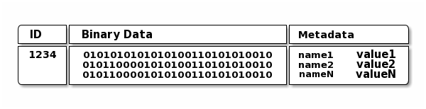
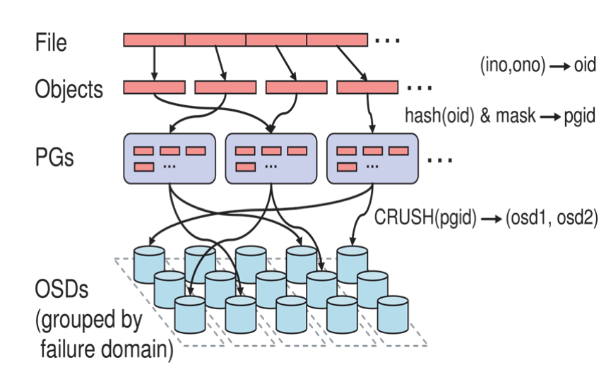

# Ceph入门到实战
---
# 第一章 存储介绍

- DAS
- NAS
- SAN
- Object Storage

## DAS存储介绍

### 1. 概念

`Direct Attached Storage` 直接附加存储

### 2. 方式

服务器使用SCSI或FC协议连接到存储阵列

### 3. 协议类型

- SCSI总线
- FC光纤

### 4. 表现形式

一块空间大小裸磁盘如`/dev/sdb`

### 5. 优点

组网简单，成本低廉，第一代

### 6. 缺点

可扩展性有限，不灵活，无法多机共享

### 7. 产品举例

目前很少使用

---

## NAS存储介绍

### 1. 概念

`Network Attached Storage` 网络附加存储

### 2. 方式

服务器使用TCP网络协议连接至文件共享存储

### 3. 协议类型

- NFS
- CIFS

### 4. 表现形式

映射到存储的一个目录，如/data

### 5. 优点

使用简单，通过IP协议实现互访，多机同时共享同个存储

### 6. 缺点

性能有限，可靠性不高

### 7. 产品举例

- NFS，samba，GlusterFS，存储厂商提供的NAS存储
- 公有云：AWS EFS，腾讯云CFS，阿里云NAS

---

## SAN存储介绍

### 1. 概念

`Storage Area Network` 存储区域网络

### 2. 方式

服务器使用一个存储区域网络IP或FC连接到存储阵列

### 3. 表现形式

一块有空间大小的裸磁盘，如/dev/sdb  
### 4. 协议类型

- IP-SAN
- FC-SAN

### 5. 优点

性能好，可扩展性

### 6. 缺点

成本高，尤其是FC存储，需要HBA卡，FC交换机，FC存储

### 7. 产品举例

- iSCSI,EMC，NetApp，HP等存储
- 公有云：AWS EBS，腾讯云CBS，阿里云块存储


---

## Object Storage存储介绍

### 1. 概念

`Object Storage`对象存储

### 2. 方式

通过网络使用API访问一个无线扩展的分布式存储系统

### 3. 表现形式

无限使用的存储空间，通过PUT/GET无限上传和下载
### 4. 协议类型

- 兼容于S3风格
- 原生PUT/GET类型

### 5. 优点

可扩展性强，使用简单，通过PUT/GET无限上传和下载

### 6. 缺点

只使用与静态不可编辑文件，无法为服务器提供块级别存储

### 7. 产品举例

- HDFC,FastDFS，swift
- 公有云：AWS S3，腾讯云COS，阿里云OSS


---
# 第二章 Ceph存储架构

## Ceph存储简介

>官网：https://ceph.io
>
>官方文档：https://docs.ceph.com

`Ceph`在一个统一的系统中是唯一可以提供对象，块和文件的存储。

- 分布式
- 高可用
- 易于管理
- 开源

## Ceph整体架构

Ceph提供了一个基于RADOS的无限扩展的Ceph存储集群.


## Ceph组件剖析

- `Ceph Monitor`：维护群集映射的主副本。如果监视器守护程序失败，则为一群Ceph监视器确保高可用性。存储群集客户端从Ceph监视器检索群集映射的副本。
- `Ceph OSD`：检查其自己的状态和其他OSD的状态，并报告回`Monitor`。
- `Ceph Manager`：充当监视，编排和插入模块的端点。
- `Ceph MDS`：当Cephfs用于提供文件服务时管理文件元数据。

Ceph集群五大表：

- `Monitor Map`：包含每个`Monitor`的群集FSID，位置，名称地址和端口。
- `OSD Map`：包含群集FSID，当创建地图并上次修改时，池列表，副本大小，PG编号，OSDS列表及其状态
- `PG Map`：包含PG版本，其时间戳，最后一个OSD表epoch，全比例和详细信息，如PG ID，UP集，作用集，PG状态（例如，Active + Clean的状态） ）和每个池的数据使用统计信息。
- `CRUSH Map`：包含存储设备列表，故障域层次结构（例如，设备，主机，机架，行，房间等）以及在存储数据时遍历层次结构的规则。
- `MDS MAP`：包含当前MDS映射epoch，当创建地图时，最后一次更改。它还包含用于存储元数据的池，元数据服务器列表，以及哪些元数据服务器始终为。

数据的存储：


`Object`数据组成：



## Ceph数据写入流程

File-->Objects(oid)-->PGs(pgid)-->CRUSH(pgid)-->OSDs



---

# 第三章 Ceph集群部署

## Ceph安装方法

- `ceph-deploy`：版本为`Nautilus`以前的适用。
- `cephadm`：通过SSH连接到来自Manager守护程序的主机部署并管理Ceph集群，以添加，删除或更新Ceph守护程序容器。版本为：`Octopus`以后的适用。
- `MANUAL`：手动安装。
- `Rook`：部署和管理在Kubernetes中运行的Ceph集群，同时还通过Kubernetes API启用存储资源和配置。

## Ceph主机规划

<table>
<thead>
    <tr>
        <th>主机名</th>   
        <th>角色</th>   
        <th>IP</th>   
        <th>组件</th>   
    </tr>
</thead>
<tbody>
    <tr>
        <td>admin-node</td>
        <td>ceph-deploy</td>
        <td>172.16.4.60</td>
        <td>ceph-deploy</td>
    </tr>
    <tr>
        <td>ceph-node-1</td>
        <td>mon.node-1<br>rgw.node-1<br>mds<br>ceph-osd</td>
        <td>172.16.4.61<br>172.16.4.62</td>
        <td></td>
    </tr>
    <tr>
        <td>ceph-node-2</td>
        <td>mon.node-1<br>rgw.node-1<br>mds<br>ceph-osd</td>
        <td>172.16.4.63<br>172.16.4.64</td>
        <td></td>
    </tr>
    <tr>
        <td>ceph-node-3</td>
        <td>mon.node-1<br>mds<br>ceph-osd</td>
        <td>172.16.4.65<br>172.16.4.66</td>
        <td></td>
    </tr>
</tbody>
</table>

## 基础环境准备

### 主机名与hosts解析

```shell
cat >>/etc/hosts<<EOF
172.16.4.61 ceph-node-1
172.16.4.63 ceph-node-2
172.16.4.65 ceph-node-3
EOF
```
### 配置SSH秘钥，免密码登录

```shell
ssh-keygen
ssh-copy-id -i /root/.ssh/id_rsa.pub ceph-node-1
ssh-copy-id -i /root/.ssh/id_rsa.pub ceph-node-2
ssh-copy-id -i /root/.ssh/id_rsa.pub ceph-node-3
```

### 关闭Selinux

### 关闭防火墙

### 时间同步

### 配置yum源

```shell
cat > /etc/yum.repos.d/ceph.repo << EOF
[norch]
name=norch
baseurl=http://mirrors.aliyun.com/ceph/rpm-nautilus/el7/noarch
enabled=1
gpgcheck=0

[x86_64]
name=x86_64
baseurl=http://mirrors.aliyun.com/ceph/rpm-nautilus/el7/x86_64/
enabled=1
gpgcheck=0
EOF
yum makecache fast
```

## `admin-node`安装`ceph-deploy`

```shell
yum install -y python-setuptools
yum install -y ceph-deploy
```

## 部署monitor节点

### 创建相关文件存放目录

```shell
mkdir ceph-cluster
cd ceph-cluster
```

### node节点安装软件

```shell
yum install ceph ceph-mon ceph-mgr ceph-radosgw ceph-mds -y
```

### 初始化集群

```shell
ceph-deploy new --public-network=172.16.4.0/24 --cluster-network=172.16.4.0/24 ceph-node-1
```

### 复制配置文件和秘钥

```shell
ceph-deploy admin ceph-node-1 ceph-node-2 ceph-node-3
```

### monitor初始化

```shell
ceph-deploy mon create-initial
```

### 到node节点上查看状态

```shell
# ceph -s
  cluster:
    id:     43279ef2-e520-47c9-8252-565a1788dad5
    health: HEALTH_OK

  services:
    mon: 1 daemons, quorum node-1 (age 4m)
    mgr: no daemons active
    osd: 0 osds: 0 up, 0 in

  data:
    pools:   0 pools, 0 pgs
    objects: 0 objects, 0 B
    usage:   0 B used, 0 B / 0 B avail
    pgs:
```

### 将node-1配置为mgr

```shell
ceph-deploy mgr create ceph-node-1
```
再次查看状态，增加了一个mgr节点
```shell
# ceph -s
  cluster:
    id:     43279ef2-e520-47c9-8252-565a1788dad5
    health: HEALTH_WARN
            OSD count 0 < osd_pool_default_size 3

  services:
    mon: 1 daemons, quorum node-1 (age 8m)
    mgr: node-1(active, since 53s)
    osd: 0 osds: 0 up, 0 in

  data:
    pools:   0 pools, 0 pgs
    objects: 0 objects, 0 B
    usage:   0 B used, 0 B / 0 B avail
    pgs:
```

## 向节点中添加OSD

查看当前磁盘分布
```shell
# lsblk
NAME   MAJ:MIN RM  SIZE RO TYPE MOUNTPOINT
sda      8:0    0   50G  0 disk
├─sda1   8:1    0    1G  0 part /boot
└─sda2   8:2    0 45.1G  0 part /
sdb      8:16   0  200G  0 disk
sdc      8:32   0  200G  0 disk
```
添加OSD磁盘
```shell
ceph-deploy osd create --data /dev/sdb ceph-node-1
ceph-deploy osd create --data /dev/sdb ceph-node-2
ceph-deploy osd create --data /dev/sdb ceph-node-3
```
到节点上检测集群状态
```shell
# ssh ceph-node-1 sudo ceph health
HEALTH_OK
# ssh ceph-node-1 sudo ceph -s
  cluster:
    id:     43279ef2-e520-47c9-8252-565a1788dad5
    health: HEALTH_OK

  services:
    mon: 1 daemons, quorum node-1 (age 18m)
    mgr: node-1(active, since 11m)
    osd: 3 osds: 3 up (since 102s), 3 in (since 102s)

  data:
    pools:   0 pools, 0 pgs
    objects: 0 objects, 0 B
    usage:   3.0 GiB used, 597 GiB / 600 GiB avail
    pgs:
# ssh ceph-node-1 sudo ceph osd tree
ID CLASS WEIGHT  TYPE NAME       STATUS REWEIGHT PRI-AFF
-1       0.58589 root default
-3       0.19530     host node-1
 0   hdd 0.19530         osd.0       up  1.00000 1.00000
-5       0.19530     host node-2
 1   hdd 0.19530         osd.1       up  1.00000 1.00000
-7       0.19530     host node-3
 2   hdd 0.19530         osd.2       up  1.00000 1.00000
```

## 扩展mon和mgr

### 扩展mon

```shell
ceph-deploy mon add ceph-node-2
ceph-deploy mon add ceph-node-3
```
查看mon集群状态
```shell
ceph quorum_status --format json-pretty
```
再次查看mon集群状态
```shell
# ssh ceph-node-1 ceph mon dump
dumped monmap epoch 3
epoch 3
fsid 5626b796-05ec-4812-9fe8-c84feabcac13
last_changed 2021-03-22 13:10:57.851312
created 2021-03-22 13:01:35.974792
min_mon_release 14 (nautilus)
0: [v2:172.16.4.61:3300/0,v1:172.16.4.61:6789/0] mon.ceph-node-1
1: [v2:172.16.4.62:3300/0,v1:172.16.4.62:6789/0] mon.ceph-node-2
2: [v2:172.16.4.63:3300/0,v1:172.16.4.63:6789/0] mon.ceph-node-3
```
### 扩展mgr

```shell
ceph-deploy mgr create ceph-node-2 ceph-node-3
```
当前集群状态为：
```shell
# ssh ceph-node-1 sudo ceph -s
  cluster:
    id:     43279ef2-e520-47c9-8252-565a1788dad5
    health: HEALTH_OK

  services:
    mon: 3 daemons, quorum node-1,node-2,node-3 (age 4m)
    mgr: node-1(active, since 23m), standbys: node-2, node-3
    osd: 3 osds: 3 up (since 13m), 3 in (since 13m)

  data:
    pools:   0 pools, 0 pgs
    objects: 0 objects, 0 B
    usage:   3.0 GiB used, 597 GiB / 600 GiB avail
    pgs:
```
---
# 第四章 RBD块存储

## 创建资源池Pool

查看当前资源池
```shell
ssh ceph-node-1 sudo ceph osd lspools
```

创建资源池
```shell
# ssh ceph-node-1 sudo ceph osd pool create ceph-demo 64 64
pool 'ceph-demo' created
```


查看资源池具体信息
```shell
ssh ceph-node-1 sudo ceph osd pool get ceph-demo -h
```

##  RBD块存储创建和映射

### RBD块存储常见操作 

1. 查看RBD块清单

```shell
rbd -p ceph-demo ls
```

2. 初始化资源池
```shell
rbd pool init ceph-demo
```

3. 创建RBD块

```shell
rbd create ceph-demo/rbd-demo.img --size=10G
```

4. 检索RBD块详情

```shell
rbd info ceph-demo/rbd-demo.img
```

5. 移除RBD块

```shell
rbd rm ceph-demo/rbd-demo-1.img
```

6. 关闭feature
   
```shell
rbd feature disable ceph-demo/rbd-demo.img deep-flatten,fast-diff,object-map,exclusive-lock
```

7. 映射RBD

```shell
rbd map ceph-demo/rbd-demo.img
```

8. 查看RBD块设备清单
   
```shell
rbd device ls
```

9. 使用RBD块设备

```shell
mkfs.ext4 /dev/rbd0
mkdir -p /mnt/rbd-demo
mount /dev/rbd0 /mnt/rbd-demo
```

## RBD块扩容

底层块扩容
```shell
rbd resize ceph-demo/rbd-demo.img --size=20G
```
文件系统扩容
```shell
resize2fs /dev/rbd0
```

## RBD块数据写入流程

查看Object落盘位置
```shell
# ceph osd map ceph-demo rbd_data.114c3b7f402f.000000000000043d
osdmap e25 pool 'ceph-demo' (1) object 'rbd_data.114c3b7f402f.000000000000043d' -> pg 1.c64ce563 (1.63) -> up ([0,2,1], p0) acting ([0,2,1], p0)
```

## Ceph告警处理

1. 查看健康详情

```shell
ceph health detail
```

2. 对告警内容打包

```shell
# 查看告警清单
ceph crash ls
# 告警打包
ceph crash archive <id>
ceph crash archive-all
```

---
# 第五章 RGW对象存储

## 部署RGW存储网关


```shell
# 安装软件包
yum install ceph-radosgw -y
# 创建存储网关
ceph-deploy --overwrite-conf rgw create ceph-node-1
```


---
# 第六章 CephFS文件存储
---
# 第七章 OSD扩容和还盘
---
# 第八章 Ceph集群运维
---
# 第九章 定制Crush map规则
---
# 第十章 RBD高级功能
---
# 第十一章 RGW高可用集群
---
# 第十二章 Ceph集群测试
---
# 第十三章 Ceph与Kubernetes集成
---
# 第十四章 Ceph与KVM集成
---
# 第十五章 Ceph与OpenStack对接
---
# 第十六章 Ceph管理与监控
---
# 第十七章 SDK开发与排障分析
---