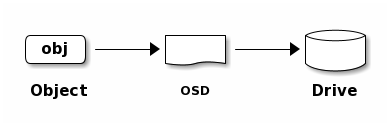

# Ceph入门到实战
---
# 初阶

## 第一章 存储介绍

- DAS
- NAS
- SAN
- Object Storage

### DAS存储介绍

#### 1. 概念

`Direct Attached Storage` 直接附加存储

#### 2. 方式

服务器使用SCSI或FC协议连接到存储阵列

#### 3. 协议类型

- SCSI总线
- FC光纤

#### 4. 表现形式

一块空间大小裸磁盘如`/dev/sdb`

#### 5. 优点

组网简单，成本低廉，第一代

#### 6. 缺点

可扩展性有限，不灵活，无法多机共享

#### 7. 产品举例

目前很少使用

---

### NAS存储介绍

#### 1. 概念

`Network Attached Storage` 网络附加存储

#### 2. 方式

服务器使用TCP网络协议连接至文件共享存储

#### 3. 协议类型

- NFS
- CIFS

#### 4. 表现形式

映射到存储的一个目录，如/data

#### 5. 优点

使用简单，通过IP协议实现互访，多机同时共享同个存储

#### 6. 缺点

性能有限，可靠性不高

#### 7. 产品举例

- NFS，samba，GlusterFS，存储厂商提供的NAS存储
- 公有云：AWS EFS，腾讯云CFS，阿里云NAS

---

### SAN存储介绍

#### 1. 概念

`Storage Area Network` 存储区域网络

#### 2. 方式

服务器使用一个存储区域网络IP或FC连接到存储阵列

#### 3. 表现形式

一块有空间大小的裸磁盘，如/dev/sdb  
#### 4. 协议类型

- IP-SAN
- FC-SAN

#### 5. 优点

性能好，可扩展性

#### 6. 缺点

成本高，尤其是FC存储，需要HBA卡，FC交换机，FC存储

#### 7. 产品举例

- iSCSI,EMC，NetApp，HP等存储
- 公有云：AWS EBS，腾讯云CBS，阿里云块存储


---

### Object Storage存储介绍

#### 1. 概念

`Object Storage`对象存储

#### 2. 方式

通过网络使用API访问一个无线扩展的分布式存储系统

#### 3. 表现形式

无限使用的存储空间，通过PUT/GET无限上传和下载
#### 4. 协议类型

- 兼容于S3风格
- 原生PUT/GET类型

#### 5. 优点

可扩展性强，使用简单，通过PUT/GET无限上传和下载

#### 6. 缺点

只使用与静态不可编辑文件，无法为服务器提供块级别存储

#### 7. 产品举例

- HDFC,FastDFS，swift
- 公有云：AWS S3，腾讯云COS，阿里云OSS


---
## 第二章 Ceph存储架构

### Ceph存储简介

>官网：https://ceph.io
>
>官方文档：https://docs.ceph.com

`Ceph`在一个统一的系统中是唯一可以提供对象，块和文件的存储。

- 分布式
- 高可用
- 易于管理
- 开源

### Ceph整体架构

Ceph提供了一个基于RADOS的无限扩展的Ceph存储集群.


### Ceph组件剖析

- `Ceph Monitor`：维护群集映射的主副本。如果监视器守护程序失败，则为一群Ceph监视器确保高可用性。存储群集客户端从Ceph监视器检索群集映射的副本。
- `Ceph OSD`：检查其自己的状态和其他OSD的状态，并报告回`Monitor`。
- `Ceph Manager`：充当监视，编排和插入模块的端点。
- `Ceph MDS`：当Cephfs用于提供文件服务时管理文件元数据。

Ceph集群五大表：

- `Monitor Map`：包含每个`Monitor`的群集FSID，位置，名称地址和端口。
- `OSD Map`：包含群集FSID，当创建地图并上次修改时，池列表，副本大小，PG编号，OSDS列表及其状态
- `PG Map`：包含PG版本，其时间戳，最后一个OSD表epoch，全比例和详细信息，如PG ID，UP集，作用集，PG状态（例如，Active + Clean的状态） ）和每个池的数据使用统计信息。
- `CRUSH Map`：包含存储设备列表，故障域层次结构（例如，设备，主机，机架，行，房间等）以及在存储数据时遍历层次结构的规则。
- `MDS MAP`：包含当前MDS映射epoch，当创建地图时，最后一次更改。它还包含用于存储元数据的池，元数据服务器列表，以及哪些元数据服务器始终为。

数据的存储：



`Object`数据组成：


### Ceph数据写入流程

File-->Objects(oid)-->PGs(pgid)-->CRUSH(pgid)-->OSDs


---

## 第三章 Ceph集群部署

### Ceph安装方法

- `ceph-deploy`：版本为`Nautilus`以前的适用。
- `cephadm`：通过SSH连接到来自Manager守护程序的主机部署并管理Ceph集群，以添加，删除或更新Ceph守护程序容器。版本为：`Octopus`以后的适用。
- `MANUAL`：手动安装。
- `Rook`：部署和管理在Kubernetes中运行的Ceph集群，同时还通过Kubernetes API启用存储资源和配置。

### Ceph主机规划

<table>
<thead>
    <tr>
        <th>主机名</th>   
        <th>角色</th>   
        <th>IP</th>   
        <th>组件</th>   
    </tr>
</thead>
<tbody>
    <tr>
        <td>admin-node</td>
        <td>ceph-deploy</td>
        <td>172.16.4.60</td>
        <td>ceph-deploy</td>
    </tr>
    <tr>
        <td>ceph-node-1</td>
        <td>mon.node-1<br>rgw.node-1<br>mds<br>ceph-osd</td>
        <td>172.16.4.61<br>172.16.4.62</td>
        <td></td>
    </tr>
    <tr>
        <td>ceph-node-2</td>
        <td>mon.node-1<br>rgw.node-1<br>mds<br>ceph-osd</td>
        <td>172.16.4.63<br>172.16.4.64</td>
        <td></td>
    </tr>
    <tr>
        <td>ceph-node-3</td>
        <td>mon.node-1<br>mds<br>ceph-osd</td>
        <td>172.16.4.65<br>172.16.4.66</td>
        <td></td>
    </tr>
</tbody>
</table>

### 基础环境准备

#### 主机名与hosts解析

```shell
cat >>/etc/hosts<<EOF
172.16.4.61 ceph-node-1
172.16.4.63 ceph-node-2
172.16.4.65 ceph-node-3
EOF
```
#### 配置SSH秘钥，免密码登录

```shell
ssh-keygen
ssh-copy-id -i /root/.ssh/id_rsa.pub ceph-node-1
ssh-copy-id -i /root/.ssh/id_rsa.pub ceph-node-2
ssh-copy-id -i /root/.ssh/id_rsa.pub ceph-node-3
```

#### 关闭Selinux

#### 关闭防火墙

#### 时间同步

#### 配置yum源

```shell
cat > /etc/yum.repos.d/ceph.repo << EOF
[norch]
name=norch
baseurl=http://mirrors.aliyun.com/ceph/rpm-nautilus/el7/noarch
enabled=1
gpgcheck=0

[x86_64]
name=x86_64
baseurl=http://mirrors.aliyun.com/ceph/rpm-nautilus/el7/x86_64/
enabled=1
gpgcheck=0
EOF
yum makecache fast
```

### 管理节点安装`ceph-deploy`

```shell
yum install -y python-setuptools
yum install -y ceph-deploy
```

### node节点部署monitor节点

### 创建相关文件存放目录

```shell
mkdir ceph-cluster
cd ceph-cluster
```

#### node节点安装软件

```shell
yum install ceph ceph-mon ceph-mgr ceph-radosgw ceph-mds -y
```

#### 初始化集群

```shell
ceph-deploy new --public-network=172.16.4.0/24 --cluster-network=172.16.4.0/24 ceph-node-1
```

#### 复制配置文件和秘钥

```shell
ceph-deploy admin ceph-node-1 ceph-node-2 ceph-node-3
```

#### monitor初始化

```shell
ceph-deploy mon create-initial
```

#### 到node节点上查看状态

```shell
# ceph -s
  cluster:
    id:     43279ef2-e520-47c9-8252-565a1788dad5
    health: HEALTH_OK

  services:
    mon: 1 daemons, quorum node-1 (age 4m)
    mgr: no daemons active
    osd: 0 osds: 0 up, 0 in

  data:
    pools:   0 pools, 0 pgs
    objects: 0 objects, 0 B
    usage:   0 B used, 0 B / 0 B avail
    pgs:
```

#### 将node-1配置为mgr

```shell
ceph-deploy mgr create ceph-node-1
```
再次查看状态，增加了一个mgr节点
```shell
# ceph -s
  cluster:
    id:     43279ef2-e520-47c9-8252-565a1788dad5
    health: HEALTH_WARN
            OSD count 0 < osd_pool_default_size 3

  services:
    mon: 1 daemons, quorum node-1 (age 8m)
    mgr: node-1(active, since 53s)
    osd: 0 osds: 0 up, 0 in

  data:
    pools:   0 pools, 0 pgs
    objects: 0 objects, 0 B
    usage:   0 B used, 0 B / 0 B avail
    pgs:
```

### 向节点中添加OSD

查看当前磁盘分布
```shell
# lsblk
NAME   MAJ:MIN RM  SIZE RO TYPE MOUNTPOINT
sda      8:0    0   50G  0 disk
├─sda1   8:1    0    1G  0 part /boot
└─sda2   8:2    0 45.1G  0 part /
sdb      8:16   0  200G  0 disk
sdc      8:32   0  200G  0 disk
```
添加OSD磁盘
```shell
ceph-deploy osd create --data /dev/sdb ceph-node-1
ceph-deploy osd create --data /dev/sdb ceph-node-2
ceph-deploy osd create --data /dev/sdb ceph-node-3
```
到节点上检测集群状态
```shell
# ssh ceph-node-1 sudo ceph health
HEALTH_OK
# ssh ceph-node-1 sudo ceph -s
  cluster:
    id:     43279ef2-e520-47c9-8252-565a1788dad5
    health: HEALTH_OK

  services:
    mon: 1 daemons, quorum node-1 (age 18m)
    mgr: node-1(active, since 11m)
    osd: 3 osds: 3 up (since 102s), 3 in (since 102s)

  data:
    pools:   0 pools, 0 pgs
    objects: 0 objects, 0 B
    usage:   3.0 GiB used, 597 GiB / 600 GiB avail
    pgs:
# ssh ceph-node-1 sudo ceph osd tree
ID CLASS WEIGHT  TYPE NAME       STATUS REWEIGHT PRI-AFF
-1       0.58589 root default
-3       0.19530     host node-1
 0   hdd 0.19530         osd.0       up  1.00000 1.00000
-5       0.19530     host node-2
 1   hdd 0.19530         osd.1       up  1.00000 1.00000
-7       0.19530     host node-3
 2   hdd 0.19530         osd.2       up  1.00000 1.00000
```

### 扩展mon和mgr

#### 扩展mon

```shell
ceph-deploy mon add ceph-node-2
ceph-deploy mon add ceph-node-3
```
查看mon集群状态
```shell
ceph quorum_status --format json-pretty
```
再次查看mon集群状态
```shell
# ssh ceph-node-1 ceph mon dump
dumped monmap epoch 3
epoch 3
fsid 5626b796-05ec-4812-9fe8-c84feabcac13
last_changed 2021-03-22 13:10:57.851312
created 2021-03-22 13:01:35.974792
min_mon_release 14 (nautilus)
0: [v2:172.16.4.61:3300/0,v1:172.16.4.61:6789/0] mon.ceph-node-1
1: [v2:172.16.4.62:3300/0,v1:172.16.4.62:6789/0] mon.ceph-node-2
2: [v2:172.16.4.63:3300/0,v1:172.16.4.63:6789/0] mon.ceph-node-3
```
#### 扩展mgr

```shell
ceph-deploy mgr create ceph-node-2 ceph-node-3
```
当前集群状态为：
```shell
# ssh ceph-node-1 sudo ceph -s
  cluster:
    id:     43279ef2-e520-47c9-8252-565a1788dad5
    health: HEALTH_OK

  services:
    mon: 3 daemons, quorum node-1,node-2,node-3 (age 4m)
    mgr: node-1(active, since 23m), standbys: node-2, node-3
    osd: 3 osds: 3 up (since 13m), 3 in (since 13m)

  data:
    pools:   0 pools, 0 pgs
    objects: 0 objects, 0 B
    usage:   3.0 GiB used, 597 GiB / 600 GiB avail
    pgs:
```
---
## 第四章 RBD块存储

### 创建资源池Pool

查看当前资源池
```shell
ssh ceph-node-1 sudo ceph osd lspools
```

创建资源池
```shell
# ssh ceph-node-1 sudo ceph osd pool create ceph-demo 64 64
pool 'ceph-demo' created
```


查看资源池具体信息
```shell
ssh ceph-node-1 sudo ceph osd pool get ceph-demo -h
```

###  RBD块存储创建和映射

#### RBD块存储常见操作 

1. 查看RBD块清单

```shell
rbd -p ceph-demo ls
```

2. 初始化资源池
```shell
rbd pool init ceph-demo
```

3. 创建RBD块

```shell
rbd create ceph-demo/rbd-demo.img --size=10G
```

4. 检索RBD块详情

```shell
rbd info ceph-demo/rbd-demo.img
```

5. 移除RBD块

```shell
rbd rm ceph-demo/rbd-demo-1.img
```

6. 关闭feature
   
```shell
rbd feature disable ceph-demo/rbd-demo.img deep-flatten,fast-diff,object-map,exclusive-lock
```

7. 映射RBD

```shell
rbd map ceph-demo/rbd-demo.img
```

8. 查看RBD块设备清单
   
```shell
rbd device ls
```

9. 使用RBD块设备

```shell
mkfs.ext4 /dev/rbd0
mkdir -p /mnt/rbd-demo
mount /dev/rbd0 /mnt/rbd-demo
```

### RBD块扩容

底层块扩容
```shell
rbd resize ceph-demo/rbd-demo.img --size=20G
```
文件系统扩容
```shell
resize2fs /dev/rbd0
```

### RBD块数据写入流程

查看Object落盘位置
```shell
# ceph osd map ceph-demo rbd_data.114c3b7f402f.000000000000043d
osdmap e25 pool 'ceph-demo' (1) object 'rbd_data.114c3b7f402f.000000000000043d' -> pg 1.c64ce563 (1.63) -> up ([0,2,1], p0) acting ([0,2,1], p0)
```

### Ceph告警处理

1. 查看健康详情

```shell
ceph health detail
```

2. 对告警内容打包

```shell
# 查看告警清单
ceph crash ls
# 告警打包
ceph crash archive <id>
ceph crash archive-all
```

---
## 第五章 RGW对象存储

### 对象存储架构


### 部署RGW存储网关

```shell
# 安装软件包
yum install ceph-radosgw -y
# 创建存储网关
ceph-deploy rgw create ceph-node-1
```

### 修改RGW默认端口

修改配置文件`/etc/ceph/ceph.conf`，在`[global]`字段下，新增配置项
```shell
[client.rgw.ceph-node-1]
rgw_frontends = "civetweb port=80"
```

推送配置文件，强制覆盖

```shell
[root@admin-node ceph-cluster]# ceph-deploy --overwrite-conf config push ceph-node-1 ceph-node-2 ceph-node-3
```

重启服务

```shell
sudo systemctl restart ceph-radosgw.target
```

验证

```shell
[root@admin-node ceph-cluster]# curl http://ceph-node-1
<?xml version="1.0" encoding="UTF-8"?><ListAllMyBucketsResult xmlns="http://s3.amazonaws.com/doc/2006-03-01/"><Owner><ID>anonymous</ID><DisplayName></DisplayName></Owner><Buckets></Buckets></ListAllMyBucketsResult>
```
---

### S3接口使用

#### S3风格

1. 创建用户

```shell
[root@ceph-node-1 ~]# radosgw-admin user create --uid ceph-s3-user --display-name "Ceph S3 User Demo"
{
    "user_id": "ceph-s3-user",
    "display_name": "Ceph S3 User Demo",
    "email": "",
    "suspended": 0,
    "max_buckets": 1000,
    "subusers": [],
    "keys": [
        {
            "user": "ceph-s3-user",
            "access_key": "ZTHAMQXC3YBPXS35C7O2",
            "secret_key": "1Cfb4mXvmqM17cOYqPi4NnyA11ccF5csGORCbSV3"
        }
    ],
    "swift_keys": [],
    "caps": [],
    "op_mask": "read, write, delete",
    "default_placement": "",
    "default_storage_class": "",
    "placement_tags": [],
    "bucket_quota": {
        "enabled": false,
        "check_on_raw": false,
        "max_size": -1,
        "max_size_kb": 0,
        "max_objects": -1
    },
    "user_quota": {
        "enabled": false,
        "check_on_raw": false,
        "max_size": -1,
        "max_size_kb": 0,
        "max_objects": -1
    },
    "temp_url_keys": [],
    "type": "rgw",
    "mfa_ids": []
}
```
查看用户信息

```shell
[root@ceph-node-1 ~]# radosgw-admin user list
[
    "ceph-s3-user"
]
[root@ceph-node-1 ~]# radosgw-admin user info --uid "ceph-s3-user"
```

2. 使用python进行连接测试

安装软件包

```shell
yum install python-boto -y
```

创建测试脚本文件`s3test.py`

```python
import boto.s3.connection

access_key = 'I0PJDPCIYZ665MW88W9R'
secret_key = 'dxaXZ8U90SXydYzyS5ivamEP20hkLSUViiaR+ZDA'
conn = boto.connect_s3(
        aws_access_key_id=access_key,
        aws_secret_access_key=secret_key,
        host='{hostname}', port={port},
        is_secure=False, calling_format=boto.s3.connection.OrdinaryCallingFormat(),
       )

bucket = conn.create_bucket('my-new-bucket')
for bucket in conn.get_all_buckets():
    print "{name} {created}".format(
        name=bucket.name,
        created=bucket.creation_date,
    )
```

测试

```shell
[root@admin-node ceph-cluster]# python s3test.py
ceph-s3-bucket 2021-04-03T07:58:34.021Z
```

3. 使用命令行工具

安装软件包

```shell
yum install s3cmd -y
```

配置认证信息

```shell
[root@admin-node ~]# s3cmd --configure

Enter new values or accept defaults in brackets with Enter.
Refer to user manual for detailed description of all options.

Access key and Secret key are your identifiers for Amazon S3. Leave them empty for using the env variables.
Access Key: ZTHAMQXC3YBPXS35C7O2
Secret Key: 1Cfb4mXvmqM17cOYqPi4NnyA11ccF5csGORCbSV3
Default Region [US]:

Use "s3.amazonaws.com" for S3 Endpoint and not modify it to the target Amazon S3.
S3 Endpoint [s3.amazonaws.com]: 172.16.4.61:80

Use "%(bucket)s.s3.amazonaws.com" to the target Amazon S3. "%(bucket)s" and "%(location)s" vars can be used
if the target S3 system supports dns based buckets.
DNS-style bucket+hostname:port template for accessing a bucket [%(bucket)s.s3.amazonaws.com]: 172.16.4.61:80/%(bucket)s

Encryption password is used to protect your files from reading
by unauthorized persons while in transfer to S3
Encryption password:
Path to GPG program [/usr/bin/gpg]:

When using secure HTTPS protocol all communication with Amazon S3
servers is protected from 3rd party eavesdropping. This method is
slower than plain HTTP, and can only be proxied with Python 2.7 or newer
Use HTTPS protocol [Yes]: no

On some networks all internet access must go through a HTTP proxy.
Try setting it here if you can't connect to S3 directly
HTTP Proxy server name:

New settings:
  Access Key: ZTHAMQXC3YBPXS35C7O2
  Secret Key: 1Cfb4mXvmqM17cOYqPi4NnyA11ccF5csGORCbSV3
  Default Region: US
  S3 Endpoint: 172.16.4.61:80
  DNS-style bucket+hostname:port template for accessing a bucket: 172.16.4.61:80/%(bucket)s
  Encryption password:
  Path to GPG program: /usr/bin/gpg
  Use HTTPS protocol: False
  HTTP Proxy server name:
  HTTP Proxy server port: 0

Test access with supplied credentials? [Y/n] y
Please wait, attempting to list all buckets...
Success. Your access key and secret key worked fine :-)

Now verifying that encryption works...
Not configured. Never mind.

Save settings? [y/N] y
Configuration saved to '/root/.s3cfg'
```
编辑配置文件`vi /root/.s3cfg`,启用v2版本

```shell
signature_v2 = True
```
查看bucket

```shell
[root@admin-node ~]# s3cmd ls
2021-04-03 07:58  s3://ceph-s3-bucket
```
创建bucket

```shell
[root@admin-node ~]# s3cmd mb s3://s3cmd-demo
Bucket 's3://s3cmd-demo/' created
[root@admin-node ~]# s3cmd ls
2021-04-03 07:58  s3://ceph-s3-bucket
2021-04-03 08:16  s3://s3cmd-demo
```
上传文件

```shell
[root@admin-node ~]# s3cmd put /etc/fstab s3://s3cmd-demo/fstab-demo
upload: '/etc/fstab' -> 's3://s3cmd-demo/fstab-demo'  [1 of 1]
 407 of 407   100% in    2s   163.07 B/s  done
[root@admin-node ~]# s3cmd ls s3://s3cmd-demo/
2021-04-03 08:17          407  s3://s3cmd-demo/fstab-demo
```
上传目录

```shell
[root@admin-node ~]# s3cmd put  --recursive /etc/ s3://s3cmd-demo/etc/
[root@admin-node ~]# s3cmd ls s3://s3cmd-demo/etc/
```
下载文件

```shell
[root@admin-node ~]# s3cmd get s3://s3cmd-demo/etc/yum.conf yum.conf.demo
download: 's3://s3cmd-demo/etc/yum.conf' -> 'yum.conf.demo'  [1 of 1]
 970 of 970   100% in    0s    38.53 KB/s  done
```
删除文件

```shell
[root@admin-node ~]# s3cmd rm s3://s3cmd-demo/fstab-demo
delete: 's3://s3cmd-demo/fstab-demo'
[root@admin-node ~]# s3cmd rm --recursive s3://s3cmd-demo/etc/
```
---

#### swift风格

1. 创建用户

```shell
[root@ceph-node-1 ~]# radosgw-admin subuser create --uid=ceph-s3-user  --subuser=ceph-s3-user:swift --access=full
{
    "user_id": "ceph-s3-user",
    "display_name": "Ceph S3 User Demo",
    "email": "",
    "suspended": 0,
    "max_buckets": 1000,
    "subusers": [
        {
            "id": "ceph-s3-user:swift",
            "permissions": "full-control"
        }
    ],
    "keys": [
        {
            "user": "ceph-s3-user",
            "access_key": "ZTHAMQXC3YBPXS35C7O2",
            "secret_key": "1Cfb4mXvmqM17cOYqPi4NnyA11ccF5csGORCbSV3"
        }
    ],
    "swift_keys": [
        {
            "user": "ceph-s3-user:swift",
            "secret_key": "Sb6RBB4389zmJK2AIwtfT18VasrxXHkBUs2Q57Uq"
        }
    ],
    "caps": [],
    "op_mask": "read, write, delete",
    "default_placement": "",
    "default_storage_class": "",
    "placement_tags": [],
    "bucket_quota": {
        "enabled": false,
        "check_on_raw": false,
        "max_size": -1,
        "max_size_kb": 0,
        "max_objects": -1
    },
    "user_quota": {
        "enabled": false,
        "check_on_raw": false,
        "max_size": -1,
        "max_size_kb": 0,
        "max_objects": -1
    },
    "temp_url_keys": [],
    "type": "rgw",
    "mfa_ids": []
}
```
生成secret_key

```shell
[root@ceph-node-1 ~]# radosgw-admin key create --subuser=ceph-s3-user:swift --key-type=swift --gen-secret
{
    "user_id": "ceph-s3-user",
    "display_name": "Ceph S3 User Demo",
    "email": "",
    "suspended": 0,
    "max_buckets": 1000,
    "subusers": [
        {
            "id": "ceph-s3-user:swift",
            "permissions": "full-control"
        }
    ],
    "keys": [
        {
            "user": "ceph-s3-user",
            "access_key": "ZTHAMQXC3YBPXS35C7O2",
            "secret_key": "1Cfb4mXvmqM17cOYqPi4NnyA11ccF5csGORCbSV3"
        }
    ],
    "swift_keys": [
        {
            "user": "ceph-s3-user:swift",
            "secret_key": "8pPr0XPwDPKQm9TSBJS05CwtytyCvL6uBorQAmri"
        }
    ],
    "caps": [],
    "op_mask": "read, write, delete",
    "default_placement": "",
    "default_storage_class": "",
    "placement_tags": [],
    "bucket_quota": {
        "enabled": false,
        "check_on_raw": false,
        "max_size": -1,
        "max_size_kb": 0,
        "max_objects": -1
    },
    "user_quota": {
        "enabled": false,
        "check_on_raw": false,
        "max_size": -1,
        "max_size_kb": 0,
        "max_objects": -1
    },
    "temp_url_keys": [],
    "type": "rgw",
    "mfa_ids": []
}
```

2. 使用python连接测试

安装软件包
```shell
yum install python-setuptools
easy_install pip
pip install --upgrade setuptools
pip install --upgrade python-swiftclient
```
连接测试

```shell
swift -V 1 -A http://{IP ADDRESS}:{port}/auth -U testuser:swift -K '{swift_secret_key}' list

```

---
## 第六章 CephFS文件存储
---

### 安装部署MDS集群

```shell
ceph-deploy --overwrite-conf mds create ceph-node-1
ceph-deploy --overwrite-conf mds create ceph-node-2
ceph-deploy --overwrite-conf mds create ceph-node-3
```

### 创建CephFS文件系统

```shell
[root@ceph-node-1 ~]# ceph osd pool create cephfs_data 32
pool 'cephfs_data' created
[root@ceph-node-1 ~]# ceph osd pool create cephfs_metadata 32
pool 'cephfs_metadata' created
[root@ceph-node-1 ~]# ceph fs new cephfs cephfs_metadata cephfs_data
new fs with metadata pool 9 and data pool 8
[root@ceph-node-1 ~]# ceph fs ls
name: cephfs, metadata pool: cephfs_metadata, data pools: [cephfs_data ]
[root@ceph-node-1 ~]# ceph mds stat
cephfs:1 {0=ceph-node-1=up:active} 2 up:standby
```

### 使用

#### 内核挂载

安装软件包

```shell
yum install ceph-common -y
```
挂载

```shell
[root@admin-node ceph-cluster]# mkdir /mnt/mycephfs
[root@admin-node ceph-cluster]# cat ceph.client.admin.keyring
[client.admin]
        key = AQCwJFhgRTscMhAA6PgCWduT4Wf0XNfG5RuQsw==
        caps mds = "allow *"
        caps mgr = "allow *"
        caps mon = "allow *"
        caps osd = "allow *"
[root@admin-node ceph-cluster]# mount -t ceph 172.16.4.61:6789:/ /mnt/mycephfs -o name=admin,secret=AQCwJFhgRTscMhAA6PgCWduT4Wf0XNfG5RuQsw==
[root@admin-node ceph-cluster]# df -h
Filesystem          Size  Used Avail Use% Mounted on
devtmpfs            2.0G     0  2.0G   0% /dev
tmpfs               2.0G     0  2.0G   0% /dev/shm
tmpfs               2.0G   20M  2.0G   1% /run
tmpfs               2.0G     0  2.0G   0% /sys/fs/cgroup
/dev/sda2            46G  2.3G   43G   6% /
/dev/sda1          1014M  154M  861M  16% /boot
tmpfs               394M     0  394M   0% /run/user/0
172.16.4.61:6789:/   94G     0   94G   0% /mnt/mycephfs
[root@admin-node ceph-cluster]# cd /mnt/mycephfs/
[root@admin-node mycephfs]# touch test
[root@admin-node mycephfs]# ll
total 0
-rw-r--r-- 1 root root 0 Apr  3 21:53 test
```
---
#### 用户态使用

```shell
[root@admin-node ceph-cluster]# ceph-fuse -n client.admin -m 172.16.4.61:6789,172.16.4.62:6789,172.16.4.63:6789 /mnt/ceph-fuse/
ceph-fuse[22094]: starting ceph client2021-04-03 22:02:36.539 7fbac479ef80 -1 init, newargv = 0x561bd1a1cc50 newargc=9

ceph-fuse[22094]: starting fuse
[root@admin-node ~]# df -T
Filesystem         Type           1K-blocks    Used Available Use% Mounted on
devtmpfs           devtmpfs         2002576       0   2002576   0% /dev
tmpfs              tmpfs            2013084       0   2013084   0% /dev/shm
tmpfs              tmpfs            2013084   19932   1993152   1% /run
tmpfs              tmpfs            2013084       0   2013084   0% /sys/fs/cgroup
/dev/sda2          xfs             47291844 2462888  44828956   6% /
/dev/sda1          xfs              1038336  157384    880952  16% /boot
tmpfs              tmpfs             402620       0    402620   0% /run/user/0
172.16.4.61:6789:/ ceph            98234368       0  98234368   0% /mnt/mycephfs
ceph-fuse          fuse.ceph-fuse  98234368       0  98234368   0% /mnt/ceph-fuse
```
---
## 第七章 OSD扩容和还盘

### 纵向扩容

查看节点磁盘状况

```shell
[root@admin-node ceph-cluster]# ceph-deploy disk list ceph-node-1
[ceph_deploy.conf][DEBUG ] found configuration file at: /root/.cephdeploy.conf
[ceph_deploy.cli][INFO  ] Invoked (2.0.1): /usr/bin/ceph-deploy disk list ceph-node-1
[ceph_deploy.cli][INFO  ] ceph-deploy options:
[ceph_deploy.cli][INFO  ]  username                      : None
[ceph_deploy.cli][INFO  ]  verbose                       : False
[ceph_deploy.cli][INFO  ]  debug                         : False
[ceph_deploy.cli][INFO  ]  overwrite_conf                : False
[ceph_deploy.cli][INFO  ]  subcommand                    : list
[ceph_deploy.cli][INFO  ]  quiet                         : False
[ceph_deploy.cli][INFO  ]  cd_conf                       : <ceph_deploy.conf.cephdeploy.Conf instance at 0x7fb79c16f518>
[ceph_deploy.cli][INFO  ]  cluster                       : ceph
[ceph_deploy.cli][INFO  ]  host                          : ['ceph-node-1']
[ceph_deploy.cli][INFO  ]  func                          : <function disk at 0x7fb79c3bc938>
[ceph_deploy.cli][INFO  ]  ceph_conf                     : None
[ceph_deploy.cli][INFO  ]  default_release               : False
[ceph-node-1][DEBUG ] connected to host: ceph-node-1
[ceph-node-1][DEBUG ] detect platform information from remote host
[ceph-node-1][DEBUG ] detect machine type
[ceph-node-1][DEBUG ] find the location of an executable
[ceph-node-1][INFO  ] Running command: fdisk -l
[ceph-node-1][INFO  ] Disk /dev/sdb: 107.4 GB, 107374182400 bytes, 209715200 sectors
[ceph-node-1][INFO  ] Disk /dev/sda: 53.7 GB, 53687091200 bytes, 104857600 sectors
[ceph-node-1][INFO  ] Disk /dev/sdc: 107.4 GB, 107374182400 bytes, 209715200 sectors
[ceph-node-1][INFO  ] Disk /dev/mapper/ceph--b164734d--393b--4a48--a5b0--b078a45a7ce4-osd--block--db70ce3b--bd01--47a8--8c13--ba775a042cf7: 107.4 GB, 107369988096 bytes, 209707008 sectors
[ceph-node-1][INFO  ] Disk /dev/rbd0: 21.5 GB, 21474836480 bytes, 41943040 sectors
```
清理节点即将挂载的磁盘的数据

```shell
[root@admin-node ceph-cluster]# ceph-deploy disk zap ceph-node-1 /dev/sdc
[ceph_deploy.conf][DEBUG ] found configuration file at: /root/.cephdeploy.conf
[ceph_deploy.cli][INFO  ] Invoked (2.0.1): /usr/bin/ceph-deploy disk zap ceph-node-1 /dev/sdc
[ceph_deploy.cli][INFO  ] ceph-deploy options:
[ceph_deploy.cli][INFO  ]  username                      : None
[ceph_deploy.cli][INFO  ]  verbose                       : False
[ceph_deploy.cli][INFO  ]  debug                         : False
[ceph_deploy.cli][INFO  ]  overwrite_conf                : False
[ceph_deploy.cli][INFO  ]  subcommand                    : zap
[ceph_deploy.cli][INFO  ]  quiet                         : False
[ceph_deploy.cli][INFO  ]  cd_conf                       : <ceph_deploy.conf.cephdeploy.Conf instance at 0x7fc361daa518>
[ceph_deploy.cli][INFO  ]  cluster                       : ceph
[ceph_deploy.cli][INFO  ]  host                          : ceph-node-1
[ceph_deploy.cli][INFO  ]  func                          : <function disk at 0x7fc361ff7938>
[ceph_deploy.cli][INFO  ]  ceph_conf                     : None
[ceph_deploy.cli][INFO  ]  default_release               : False
[ceph_deploy.cli][INFO  ]  disk                          : ['/dev/sdc']
[ceph_deploy.osd][DEBUG ] zapping /dev/sdc on ceph-node-1
[ceph-node-1][DEBUG ] connected to host: ceph-node-1
[ceph-node-1][DEBUG ] detect platform information from remote host
[ceph-node-1][DEBUG ] detect machine type
[ceph-node-1][DEBUG ] find the location of an executable
[ceph_deploy.osd][INFO  ] Distro info: CentOS Linux 7.8.2003 Core
[ceph-node-1][DEBUG ] zeroing last few blocks of device
[ceph-node-1][DEBUG ] find the location of an executable
[ceph-node-1][INFO  ] Running command: /usr/sbin/ceph-volume lvm zap /dev/sdc
[ceph-node-1][WARNIN] --> Zapping: /dev/sdc
[ceph-node-1][WARNIN] --> --destroy was not specified, but zapping a whole device will remove the partition table
[ceph-node-1][WARNIN] Running command: /bin/dd if=/dev/zero of=/dev/sdc bs=1M count=10 conv=fsync
[ceph-node-1][WARNIN]  stderr: 10+0 records in
[ceph-node-1][WARNIN] 10+0 records out
[ceph-node-1][WARNIN]  stderr: 10485760 bytes (10 MB) copied, 0.110085 s, 95.3 MB/s
[ceph-node-1][WARNIN] --> Zapping successful for: <Raw Device: /dev/sdc>
```

添加节点磁盘，开始扩容

```shell
[root@admin-node ceph-cluster]# ceph-deploy osd create --data /dev/sdc ceph-node-1
[ceph_deploy.conf][DEBUG ] found configuration file at: /root/.cephdeploy.conf
[ceph_deploy.cli][INFO  ] Invoked (2.0.1): /usr/bin/ceph-deploy osd create --data /dev/sdc ceph-node-1
[ceph_deploy.cli][INFO  ] ceph-deploy options:
[ceph_deploy.cli][INFO  ]  verbose                       : False
[ceph_deploy.cli][INFO  ]  bluestore                     : None
[ceph_deploy.cli][INFO  ]  cd_conf                       : <ceph_deploy.conf.cephdeploy.Conf instance at 0x7f3556990638>
[ceph_deploy.cli][INFO  ]  cluster                       : ceph
[ceph_deploy.cli][INFO  ]  fs_type                       : xfs
[ceph_deploy.cli][INFO  ]  block_wal                     : None
[ceph_deploy.cli][INFO  ]  default_release               : False
[ceph_deploy.cli][INFO  ]  username                      : None
[ceph_deploy.cli][INFO  ]  journal                       : None
[ceph_deploy.cli][INFO  ]  subcommand                    : create
[ceph_deploy.cli][INFO  ]  host                          : ceph-node-1
[ceph_deploy.cli][INFO  ]  filestore                     : None
[ceph_deploy.cli][INFO  ]  func                          : <function osd at 0x7f3556bd88c0>
[ceph_deploy.cli][INFO  ]  ceph_conf                     : None
[ceph_deploy.cli][INFO  ]  zap_disk                      : False
[ceph_deploy.cli][INFO  ]  data                          : /dev/sdc
[ceph_deploy.cli][INFO  ]  block_db                      : None
[ceph_deploy.cli][INFO  ]  dmcrypt                       : False
[ceph_deploy.cli][INFO  ]  overwrite_conf                : False
[ceph_deploy.cli][INFO  ]  dmcrypt_key_dir               : /etc/ceph/dmcrypt-keys
[ceph_deploy.cli][INFO  ]  quiet                         : False
[ceph_deploy.cli][INFO  ]  debug                         : False
[ceph_deploy.osd][DEBUG ] Creating OSD on cluster ceph with data device /dev/sdc
[ceph-node-1][DEBUG ] connected to host: ceph-node-1
[ceph-node-1][DEBUG ] detect platform information from remote host
[ceph-node-1][DEBUG ] detect machine type
[ceph-node-1][DEBUG ] find the location of an executable
[ceph_deploy.osd][INFO  ] Distro info: CentOS Linux 7.8.2003 Core
[ceph_deploy.osd][DEBUG ] Deploying osd to ceph-node-1
[ceph-node-1][DEBUG ] write cluster configuration to /etc/ceph/{cluster}.conf
[ceph-node-1][DEBUG ] find the location of an executable
[ceph-node-1][INFO  ] Running command: /usr/sbin/ceph-volume --cluster ceph lvm create --bluestore --data /dev/sdc
[ceph-node-1][WARNIN] Running command: /bin/ceph-authtool --gen-print-key
[ceph-node-1][WARNIN] Running command: /bin/ceph --cluster ceph --name client.bootstrap-osd --keyring /var/lib/ceph/bootstrap-osd/ceph.keyring -i - osd new 688dfd38-ed54-4080-8bea-88fdad7ee9b8
[ceph-node-1][WARNIN] Running command: /usr/sbin/vgcreate --force --yes ceph-601f9592-1391-4414-89ae-7c52b9094153 /dev/sdc
[ceph-node-1][WARNIN]  stdout: Physical volume "/dev/sdc" successfully created.
[ceph-node-1][WARNIN]  stdout: Volume group "ceph-601f9592-1391-4414-89ae-7c52b9094153" successfully created
[ceph-node-1][WARNIN] Running command: /usr/sbin/lvcreate --yes -l 25599 -n osd-block-688dfd38-ed54-4080-8bea-88fdad7ee9b8 ceph-601f9592-1391-4414-89ae-7c52b9094153
[ceph-node-1][WARNIN]  stdout: Logical volume "osd-block-688dfd38-ed54-4080-8bea-88fdad7ee9b8" created.
[ceph-node-1][WARNIN] Running command: /bin/ceph-authtool --gen-print-key
[ceph-node-1][WARNIN] Running command: /bin/mount -t tmpfs tmpfs /var/lib/ceph/osd/ceph-3
[ceph-node-1][WARNIN] Running command: /bin/chown -h ceph:ceph /dev/ceph-601f9592-1391-4414-89ae-7c52b9094153/osd-block-688dfd38-ed54-4080-8bea-88fdad7ee9b8
[ceph-node-1][WARNIN] Running command: /bin/chown -R ceph:ceph /dev/dm-1
[ceph-node-1][WARNIN] Running command: /bin/ln -s /dev/ceph-601f9592-1391-4414-89ae-7c52b9094153/osd-block-688dfd38-ed54-4080-8bea-88fdad7ee9b8 /var/lib/ceph/osd/ceph-3/block
[ceph-node-1][WARNIN] Running command: /bin/ceph --cluster ceph --name client.bootstrap-osd --keyring /var/lib/ceph/bootstrap-osd/ceph.keyring mon getmap -o /var/lib/ceph/osd/ceph-3/activate.monmap
[ceph-node-1][WARNIN]  stderr: 2021-04-03 22:21:35.488 7f053bb61700 -1 auth: unable to find a keyring on /etc/ceph/ceph.client.bootstrap-osd.keyring,/etc/ceph/ceph.keyring,/etc/ceph/keyring,/etc/ceph/keyring.bin,: (2) No such file or directory
[ceph-node-1][WARNIN] 2021-04-03 22:21:35.488 7f053bb61700 -1 AuthRegistry(0x7f0534065fe8) no keyring found at /etc/ceph/ceph.client.bootstrap-osd.keyring,/etc/ceph/ceph.keyring,/etc/ceph/keyring,/etc/ceph/keyring.bin,, disabling cephx
[ceph-node-1][WARNIN]  stderr: got monmap epoch 3
[ceph-node-1][WARNIN] Running command: /bin/ceph-authtool /var/lib/ceph/osd/ceph-3/keyring --create-keyring --name osd.3 --add-key AQDreWhgCh8YLhAASGa6yevhJYDcszGkcCv5gA==
[ceph-node-1][WARNIN]  stdout: creating /var/lib/ceph/osd/ceph-3/keyring
[ceph-node-1][WARNIN] added entity osd.3 auth(key=AQDreWhgCh8YLhAASGa6yevhJYDcszGkcCv5gA==)
[ceph-node-1][WARNIN] Running command: /bin/chown -R ceph:ceph /var/lib/ceph/osd/ceph-3/keyring
[ceph-node-1][WARNIN] Running command: /bin/chown -R ceph:ceph /var/lib/ceph/osd/ceph-3/
[ceph-node-1][WARNIN] Running command: /bin/ceph-osd --cluster ceph --osd-objectstore bluestore --mkfs -i 3 --monmap /var/lib/ceph/osd/ceph-3/activate.monmap --keyfile - --osd-data /var/lib/ceph/osd/ceph-3/ --osd-uuid 688dfd38-ed54-4080-8bea-88fdad7ee9b8 --setuser ceph --setgroup ceph
[ceph-node-1][WARNIN]  stderr: 2021-04-03 22:21:36.883 7ff59732fa80 -1 bluestore(/var/lib/ceph/osd/ceph-3/) _read_fsid unparsable uuid
[ceph-node-1][WARNIN] --> ceph-volume lvm prepare successful for: /dev/sdc
[ceph-node-1][WARNIN] Running command: /bin/chown -R ceph:ceph /var/lib/ceph/osd/ceph-3
[ceph-node-1][WARNIN] Running command: /bin/ceph-bluestore-tool --cluster=ceph prime-osd-dir --dev /dev/ceph-601f9592-1391-4414-89ae-7c52b9094153/osd-block-688dfd38-ed54-4080-8bea-88fdad7ee9b8 --path /var/lib/ceph/osd/ceph-3 --no-mon-config
[ceph-node-1][WARNIN] Running command: /bin/ln -snf /dev/ceph-601f9592-1391-4414-89ae-7c52b9094153/osd-block-688dfd38-ed54-4080-8bea-88fdad7ee9b8 /var/lib/ceph/osd/ceph-3/block
[ceph-node-1][WARNIN] Running command: /bin/chown -h ceph:ceph /var/lib/ceph/osd/ceph-3/block
[ceph-node-1][WARNIN] Running command: /bin/chown -R ceph:ceph /dev/dm-1
[ceph-node-1][WARNIN] Running command: /bin/chown -R ceph:ceph /var/lib/ceph/osd/ceph-3
[ceph-node-1][WARNIN] Running command: /bin/systemctl enable ceph-volume@lvm-3-688dfd38-ed54-4080-8bea-88fdad7ee9b8
[ceph-node-1][WARNIN]  stderr: Created symlink from /etc/systemd/system/multi-user.target.wants/ceph-volume@lvm-3-688dfd38-ed54-4080-8bea-88fdad7ee9b8.service to /usr/lib/systemd/system/ceph-volume@.service.
[ceph-node-1][WARNIN] Running command: /bin/systemctl enable --runtime ceph-osd@3
[ceph-node-1][WARNIN]  stderr: Created symlink from /run/systemd/system/ceph-osd.target.wants/ceph-osd@3.service to /usr/lib/systemd/system/ceph-osd@.service.
[ceph-node-1][WARNIN] Running command: /bin/systemctl start ceph-osd@3
[ceph-node-1][WARNIN] --> ceph-volume lvm activate successful for osd ID: 3
[ceph-node-1][WARNIN] --> ceph-volume lvm create successful for: /dev/sdc
[ceph-node-1][INFO  ] checking OSD status...
[ceph-node-1][DEBUG ] find the location of an executable
[ceph-node-1][INFO  ] Running command: /bin/ceph --cluster=ceph osd stat --format=json
[ceph_deploy.osd][DEBUG ] Host ceph-node-1 is now ready for osd use.
```

故障：OSD创建失败

```shell
[ceph4][ERROR ] RuntimeError: command returned non-zero exit status: 1
[ceph_deploy.osd][ERROR ] Failed to execute command: /usr/sbin/ceph-volume --cluster ceph lvm create --bluestore --data /dev/nvme0n1p1
[ceph_deploy][ERROR ] GenericError: Failed to create 1 OSDs
```
原因分析
OSD所依赖的lvm创建失败，lvs查看逻辑卷信息时未找到Ceph的逻辑卷，但lsblk可以发现Ceph逻辑卷，可见Ceph逻辑卷的DM映射未清除。

处理步骤
清除逻辑卷的DM映射，操作如下：

```shel
dmsetup info -C
dmsetup remove [dm_map_name]
```
---
### 临时关闭rebalance

```shell
ceph osd set norebalance
ceph osd set nobackfill
```

---

### 移除OSD

OSD延迟查看

```shell
[root@ceph-node-1 ~]# ceph osd perf
osd commit_latency(ms) apply_latency(ms)
  5                  0                 0
  4                  0                 0
  0                  0                 0
  1                  0                 0
  2                  0                 0
  3                  0                 0
```
移除操作

```shell
ceph osd out osd.5
ceph osd crush osd.5
ceph auth del osd.5
ceph osd rm osd.5
```
---

## 数据一致性检查

手动检查

```shell
[root@ceph-node-1 ~]# ceph pg scrub 1.7a
instructing pg 1.7a on osd.1 to scrub
[root@ceph-node-1 ~]# ceph pg deep-scrub 1.7a
instructing pg 1.7a on osd.1 to deep-scrub
```


---
## 第八章 Ceph集群运维
---
## 第九章 定制Crush map规则
---
## 第十章 RBD高级功能
---
## 第十一章 RGW高可用集群
---
## 第十二章 Ceph集群测试
---
## 第十三章 Ceph与Kubernetes集成
---
## 第十四章 Ceph与KVM集成
---
## 第十五章 Ceph与OpenStack对接
---
## 第十六章 Ceph管理与监控
---
## 第十七章 SDK开发与排障分析
---