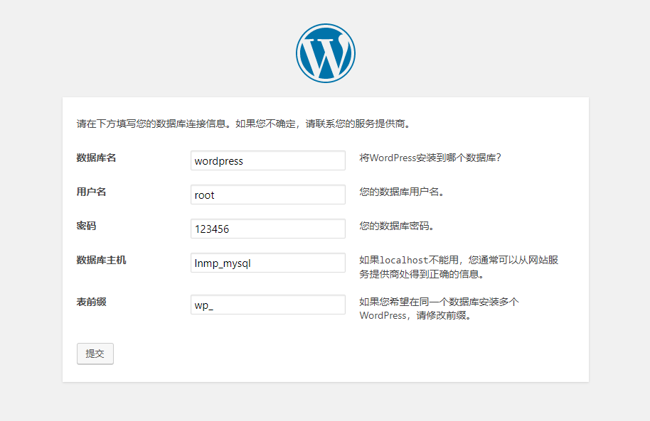

# Dockerfile定制容器镜像

**样式**
```dockerfile
FROM centos:latest
LABEL maintainer kuuun
RUN yum install gcc -y
COPY run.sh /usr/bin
EXPOSE 80
CMD ["run.sh"]
```
---

## Dockerfile常用指令

| 指令       | 描述                                                                                   |
| ---------- | -------------------------------------------------------------------------------------- |
| FORM       | 构建新镜像是基于哪个镜像                                                               |
| LABEL      | 标签                                                                                   |
| RUN        | 构建镜像时运行的Shell命令                                                              |
| COPY       | 拷贝文件或目录到镜像中                                                                 |
| ADD        | 解压压缩包并拷贝                                                                       |
| ENV        | 设置环境变量                                                                           |
| USER       | 为RUN、CMD和ENTRYPOINT执行命令指定运行用户                                             |
| EXPOSE     | 声明容器运行的服务端口                                                                 |
| WORKDIR    | 为RUN、CMD、ENTERYPOINT、COPY和ADD设置工作目录                                         |
| CMD        | 运行容器时默认执行，如果有多个CMD指令，最后一个生效                                    |
| ENTRYPOINT | 如果与CMD一起用，CMD将作为ENTRYPOINT的默认参数，如果有多个ENTRYPOINT指令，最后一个生效 |

**镜像分类**

1. 基础镜像，centos，ubuntu，alpine
2. 环境镜像，java，php，go
3. 项目镜像

### 构建镜像

**语法格式**：` docker build [OPTIONS] PATH | URL | - [flags] `

**选项**：

- -t：镜像名称
- -f：指定Dockerfile文件位置

**示例文件**
```dockerfile
FROM centos:7
LABEL maintainer kuuun
RUN yum install -y wget curl
COPY a.txt /opt
ENV NAME kuuun
WORKDIR /opt
CMD ["slepp","360000"]
```

**构建命令**
```shell
docker build -t my_centos .
```
---

## CMD与ENTRYPOINT区别

**CMD用法：**

- ` CMD ["executable","param1","param2"] `：exec形式（首选）
- ` CMD ["param1","param2"] `：作为ENTRYPOINT的默认参数 
- ` CMD command param1 param2 `：Shell形式 


**ENTRYPOINT用法：**

- ` ENTRYPOINT ["executable", "param1", "param2"] `
- ` ENTRYPOINT command param1 param2 `

**小结**

1. CMD和ENTRYPOINT指令都可以用来定义运行容器时所使用的默认命令
2. Dockerfile至少指定一个CMD或ENTRYPOINT 
3. CMD可以用作ENTRYPOINT默认参数，或者用作容器的默认命令 
4. docker run指定<command>时，将会覆盖CMD 
5. 如果是可执行文件，希望运行时传参，应该使用ENTRYPOINT

---

## 前端项目镜像制作：Nginx

**示例Dockerfile**
```dockerfile
FROM centos:7
LABEL maintainer kuuun
RUN yum install -y gcc gcc-c++ make \
    openssl-devel pcre-devel gd-devel \
    iproute net-tools telnet wget curl && \
    yum clean all && \
    rm -rf /var/cache/yum/*
ADD nginx-1.18.0.tar.gz /tmp
RUN useradd -s /sbin/nologin www && \
    cd /tmp/nginx-1.18.0 && \
    ./configure --prefix=/usr/local/nginx \
    --with-http_ssl_module \
    --with-http_stub_status_module && \
    make -j 4 && make install && \
    ln -sf /dev/stdout /usr/local/nginx/logs/access.log && \
    ln -sf /dev/stderr /usr/local/nginx/logs/error.log && \
    mkdir -p /usr/local/nginx/conf/vhost && \
    cd /tmp && rm -rf nginx* && \
    ln -sf /usr/share/zoneinfo/Asia/Shanghai /etc/localtime
ENV PATH $PATH:/usr/local/nginx/sbin
COPY nginx.conf /usr/local/nginx/conf/nginx.conf
WORKDIR /usr/local/nginx
EXPOSE 80
CMD ["nginx", "-g", "daemon off;"]
```

---

## PHP项目镜像制作：PHP

**示例Dockerfile**
```dockerfile
FROM centos:7
LABEL maintainer Kuuun
RUN yum install epel-release -y && \
    yum install -y gcc  autoconf libxml2-devel libcurl-devel libjpeg-turbo-devel libpng-devel \
    freetype-devel libmcrypt-devel libxslt-devel libtool-ltdl-devel zlib libxml libjpeg \
    freetype libpng gd curl libiconv zlib-devel gd-devel libcurl-devel libmcrypt \
    mhash mcrypt libmcrypt openssl openssl-devel && \
    yum clean all && \
    rm -rf /var/cache/yum/*
ADD php-5.6.40.tar.gz /
RUN cd php-5.6.40 && \
    ./configure --prefix=/usr/local/php --with-config-file-path=/usr/local/php/etc  \
    --enable-mysqlnd --with-mysql=mysqlnd  --with-pdo-mysql=mysqlnd --with-mysqli=mysqlnd \
    --with-iconv-dir   --with-freetype-dir  --with-jpeg-dir  --with-png-dir  --with-zlib-dir \
    --with-libxml-dir  --disable-rpath --enable-bcmath --enable-shmop  --enable-sysvsem \
    --enable-inline-optimization --with-curl --enable-mbregex --enable-fpm  --enable-mbstring  \
    --with-mcrypt   --with-gd  --enable-gd-native-ttf --with-openssl --with-mhash \
    --enable-pcntl --enable-sockets --with-xmlrpc --enable-zip --enable-soap \
    --enable-short-tags --enable-static --with-xsl --enable-ftp  \
    --enable-exif --disable-ipv6 --with-mysql-sock=/tmp/mysql.sock \
    --enable-opcache=no --with-gettext && \
    make -j 4 && make install && \
    cp php.ini-production /usr/local/php/etc/php.ini && \
    cp sapi/fpm/php-fpm.conf /usr/local/php/etc/php-fpm.conf && \
    sed -i "90a \daemonize = no" /usr/local/php/etc/php-fpm.conf && \
    mkdir /usr/local/php/log && \
    cd / && rm -rf php* && \
    ln -sf /dev/stdout /usr/local/php/var/log/php-fpm.log && \
    ln -sf /usr/share/zoneinfo/Asia/Shanghai /etc/localtime
ENV PATH $PATH:/usr/local/php/sbin
WORKDIR /usr/local/php
EXPOSE 9000
CMD ["php-fpm"]
```

---

## 案例：容器化搭建个人博客系统

**创建网络**
```shell
docker create network lnmp
```

**创建MySQL容器**
```shell
docker run -d --name lnmp_mysql --net lnmp --mount src=mysql-vol,dst=/var/lib/mysql -e MYSQL_ROOT_PASSWORD=123456 -e MYSQL_DATABASE=wordpress  mysql:5.7  --character-set-server=utf8
```

**创建PHP容器**
```shell
docker run -d --name lnmp_php --net lnmp --mount src=wwwroot,dst=/wwwroot  php:v1
```

**创建Nginx容器**
```shell
docker run -d --name lnmp_nginx --net lnmp -p 80:80 --mount src=wwwroot,dst=/wwwroot --mount type=bind,src=$PWD/www.conf,dst=/usr/local/nginx/conf/vhost/www.conf nginx:v1
```

**准备WordPress**

上传到网站根目录` wwwroot `数据卷目录上。

打开浏览器访问地址：



---

## JAVA项目镜像构建：Tomcat

**示例配置**
```dockerfile
FROM centos:7 
LABEL maintainer Kuuun
ENV VERSION=8.5.63
RUN yum install java-1.8.0-openjdk wget curl unzip iproute net-tools -y && \
    yum clean all && \
    rm -rf /var/cache/yum/*
ADD apache-tomcat-${VERSION}.tar.gz /usr/local/
RUN mv /usr/local/apache-tomcat-${VERSION} /usr/local/tomcat && \
    sed -i '1a JAVA_OPTS="-Djava.security.egd=file:/dev/./urandom"' /usr/local/tomcat/bin/catalina.sh && \
    ln -sf /usr/share/zoneinfo/Asia/Shanghai /etc/localtime
ENV PATH $PATH:/usr/local/tomcat/bin
WORKDIR /usr/local/tomcat
EXPOSE 8080
CMD ["catalina.sh", "run"]
```

---

## JAVA微服务镜像构建：Jar

**示例配置**
```shell
FROM java:8-jdk-alpine
LABEL maintainer Kuuun
ENV JAVA_OPTS="$JAVA_OPTS -Dfile.encoding=UTF8 -Duser.timezone=GMT+08"
RUN sed -i 's/dl-cdn.alpinelinux.org/mirrors.aliyun.com/g' /etc/apk/repositories && \
    apk add -U tzdata && \
    ln -sf /usr/share/zoneinfo/Asia/Shanghai /etc/localtime 
COPY hello.jar /
EXPOSE 8888
CMD ["/bin/sh", "-c", "java -jar $JAVA_OPTS /hello.jar"]
```