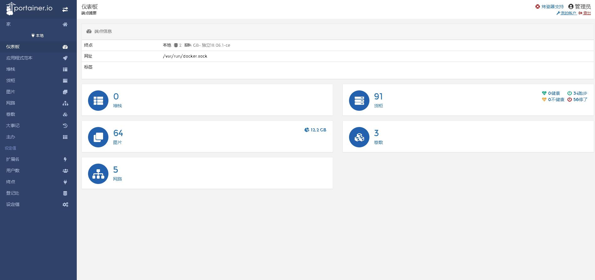

# Docker图形化管理

## Portainer概述

>Portainer 是一款开源的Docker图形管理系统。 

[官网](https://www.portainer.io)




## Portainer安装

```shell
docker run -d -p 8000:8000 -p 9000:9000 --name=portainer --restart=always -v /var/run/docker.sock:/var/run/docker.sock -v portainer_data:/data portainer/portainer-ce
```

## Portainer管理Docker

管理其他Docker主机，需要开启Docker API： 

` vi /usr/lib/systemd/system/docker.service `

```shell
ExecStart=/usr/bin/dockerd -H tcp://0.0.0.0:2375 -H unix:///var/run/docker.sock 
```

```shell
systemctl daemon-reload
systemctl restart docker
```