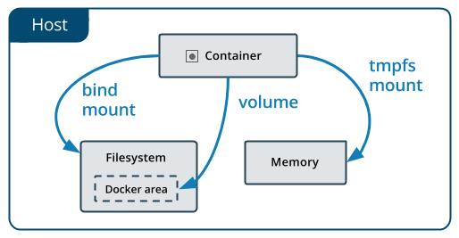

# Docker容器数据持久化

**数据从宿主机挂载容器的三种方式：**

- ` volumes `：Docker管理宿主机文件系统的一部分（` /var/lib/docker/volumes `）。保存数据的最佳方式。 
- ` bind mounts `：将宿主机上的任意位置的文件或者目录挂载到容器中。 
- ` tmpfs `：挂载存储在主机系统的内存中，而不会写入主机的文件系统。如果不希望将数据持久存储在任何位置，可以使用 tmpfs，同时避免写入容器可写层提高性能。



## 数据卷（Volume）

**查看数据卷**
```shell
docker volume ls
```

**创建数据卷**
```shell
docker volume create nginx_data
```

**查看数据卷详细信息**
```shell
docker volume inspect nginx_data
[
    {
        "CreatedAt": "2020-04-05T12:53:12+08:00",
        "Driver": "local",
        "Labels": {},
        "Mountpoint": "/var/lib/docker/volumes/nginx_data/_data",
        "Name": "nginx_data",
        "Options": {},
        "Scope": "local"
    }
]
```

**使用数据卷**
```shell
docker run -d --name web -v nginx_data:/usr/share/nginx/html -p 8080:80 nginx:1.18
48513bdd9ff1316436b8dd2feef6fbcba921059cad1fc6609770b80f71adb67a
```

**或者直接运行容器即可创建数据卷**
```shell
sudo docker run -d --name web2 -v nginx_data2:/usr/share/nginx/html -p 8081:80 nginx:1.18
6beecf6e5e51b492e5b6c173548b37583929c0ecdde5fa26fc8d4e059790f354
sudo docker volume ls
DRIVER    VOLUME NAME
local     nginx_data
local     nginx_data2
```

---

## 挂载（Bind Mounts）

**使用挂载运行一个容器**
```shell
sudo docker run -d --name web -v $PWD/wwwroot:/usr/share/nginx/html -P nginx:1.18
```

**注：**
如果源文件/目录没有存在如果挂载目标在容器中非空目录，则该目录现有内容将被隐藏。

---

## 小结

**Volume特点：** 
- 多个运行容器之间共享数据，多个容器可以同时挂载相同的卷。 
- 当容器停止或被移除时，该卷依然存在。 
- 当明确删除卷时，卷才会被删除。 
- 将容器的数据存储在远程主机或其他存储上（间接） 
- 将数据从一台Docker主机迁移到另一台时，先停止容器，然后备份卷的目录（` /var/lib/docker/volumes/ `）

**Bind Mounts特点：**
- 从主机共享配置文件到容器。默认情况下，挂载主机/etc/resolv.conf到每个容器，提供DNS解析。 
- 在Docker主机上的开发环境和容器之间共享源代码。例如，可以将Maven target目录挂载到容器中，每次在Docker主机 上构建Maven项目时，容器都可以访问构建的项目包。 
- 当Docker主机的文件或目录结构保证与容器所需的绑定挂载一致时
