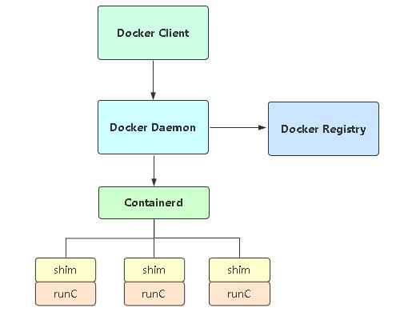

# Docker容器管理

## 创建容器常用选项

| 选项               | 描述                                                    |
| ------------------ | ------------------------------------------------------- |
| -i,--interactive   | 交互式                                                  |
| -t，--tty          | 分配一个伪终端                                          |
| -d,--detach        | 运行容器到后台                                          |
| -e，--env          | 设置环境变量                                            |
| -p，--publish list | 发布容器端口到主机                                      |
| -P,--publish-all   | 发布容器所有EXPOSE的端口到宿主机随机端口                |
| --name string      | 指定容器名称                                            |
| -h，--hostname     | 设置容器主机名                                          |
| --ip string        | 指定容器IP，只能用于自定义网络                          |
| --mount mount      | 将文件系统附加到容器                                    |
| -v,--volume list   | 绑定挂载一个卷                                          |
| --network          | 连接容器到一个网络                                      |
| --restart string   | 容器退出时重启策略，默认no，可选值：[always,on-failure] |

**运行容器**
```shell
docker run -d --name web nginx:1.18
Unable to find image 'nginx:1.18' locally
1.18: Pulling from library/nginx
a076a628af6f: Pull complete
45d7b5d3927d: Pull complete
5e326fece82e: Pull complete
30c386181b68: Pull complete
b15158e9ebbe: Pull complete
Digest: sha256:ebd0fd56eb30543a9195280eb81af2a9a8e6143496accd6a217c14b06acd1419
Status: Downloaded newer image for nginx:1.18
5cb2421fa9357a90f1ea1ec278497823f0681ee22fa816e3f3b8b0a721a52e29
```

**进入容器**
```shell
# 查看最新创建的镜像
docker ps -l
CONTAINER ID   IMAGE        COMMAND                  CREATED         STATUS         PORTS     NAMES
5cb2421fa935   nginx:1.18   "/docker-entrypoint.…"   6 seconds ago   Up 4 seconds   80/tcp    web
# 进入镜像
docker exec -it 5cb2421fa935 bash
```
或者
```shell
docker exec -it web bash
```

**示例**
```shell
docker run -d --name web -e NUMBER=100 -e NAME=docker -p 8080:80 --restart=always nginx:1.18
```

宿主机三个文件对应的相关命令：
- ` hostname `：` --hostname `
- ` hosts `：` --dns `
- ` resolv.conf `：` --add-host `

---

## 容器资源限制

>默认创建的容器使用宿主机所有资源

| 选项                        | 描述                                            |
| --------------------------- | ----------------------------------------------- |
| -m,--memory                 | 容器可以使用的最大内存量                        |
| --memory-swap               | 允许交换到磁盘的内存量                          |
| --memory-swappiness=<0-100> | 容器使用SWAP分区交换的百分比（0-100，默认为-1） |
| --oom-kill-disable          | 禁用OOM KIller                                  |
| --cpus                      | 可以使用CPU的数量                               |
| --cpuset-cpus               | 限制容器使用特定的CPU核心，如（0-3,0,1）        |
| --cpu-shares                | CPU共享（相对权重）                             |

**内存配置**
```shell
# 限制内存
docker run -d -m="512m" --name web nginx
```
**查看资源状态**
```shell
docker stats web
```

**CPU配置**
```shell
# 允许容器最多使用一个半的CPU
docker run -d --name nginx04 --cpus="1.5" nginx 
# 允许容器最多使用50%的CPU
docker run -d --name nginx05 --cpus=".5" nginx
```
---

## 容器资源配额扩容

**命令**
```shell
docker update
```

---

## 容器管理常用命令

| 选项                 | 描述                        |
| -------------------- | --------------------------- |
| ls                   | 列出容器                    |
| inspect              | 查看一个或多个容器详细信息  |
| exec                 | 在运行容器中执行命令        |
| commit               | 创建一个新镜像来自一个容器  |
| cp                   | 拷贝文件/文件目录到一个容器 |
| logs                 | 获取一个容器日志            |
| port                 | 列出或指定容器端口映射      |
| top                  | 显示一个容器运行的进程      |
| stop、start、restart | 停止、启动一个或多个容器    |
| rm                   | 删除一个或多个容器          |
| prune                | 移除已停止的容器            |

**删除容器**
```shell
docker rm web
# 强制删除正在运行的容
# docker rm -f web
```

**批量删除全部容器**
```shell
docker rm -f $(docker ps -aq)
```

**复制文件**
```shell
docker cp nginx.tar web:/opt
```

**执行命令**
```shell
docker exec web ls -l /usr/share/nginx/html
```

---

## 容器实现核心技术：Namespace

>在容器化中，一台物理计算机可以运行多个不同操作系统，那就需要解决 “隔离性”，彼此感知不到对方存在，有问题互不影响。

Linux内核从2.4.19版本开始引入了namespace概念，其目的是将特定的全局系统资源通过抽象方法使得namespace中的进程看 起来拥有自己隔离的资源。Docker就是借助这个机制实现了容器资源隔离。

操作系统中查看当前进程的命名空间

```shell
ll /proc/$$/ns
lrwxrwxrwx 1 root root 0 Mar  5 11:28 cgroup -> 'cgroup:[4026531835]'
lrwxrwxrwx 1 root root 0 Mar  5 11:28 ipc -> 'ipc:[4026531839]'
lrwxrwxrwx 1 root root 0 Mar  5 11:28 mnt -> 'mnt:[4026531840]'
lrwxrwxrwx 1 root root 0 Mar  5 11:28 net -> 'net:[4026531993]'
lrwxrwxrwx 1 root root 0 Mar  5 11:28 pid -> 'pid:[4026531836]'
lrwxrwxrwx 1 root root 0 Mar  5 11:28 pid_for_children -> 'pid:[4026531836]'
lrwxrwxrwx 1 root root 0 Mar  5 11:28 user -> 'user:[4026531837]'
lrwxrwxrwx 1 root root 0 Mar  5 11:28 uts -> 'uts:[4026531838]'
```

Linux的Namespace机制提供了6种不同命名空间： 
- IPC：隔离进程间通信 
- MOUNT：隔离文件系统挂载点 
- NET：隔离网络协议栈 
- PID：隔离进程号，进程命名空间是一个父子结构，子空间对父空间可见
- USER：隔离用户 
- UTS：隔离主机名和域名

---

## 容器实现核心技术：CGroups

Docker利用namespace实现了容器之间资源隔离，但是namespace不能对容器资源限制，比如CPU、内存。 
如果某一个容器属于CPU密集型任务，那么会影响其他容器使用CPU，导致多个容器相互影响并且抢占资源。 
如何对多个容器的资源使用进行限制就成了容器化的主要问题。 
答：**引入Control Groups（简称CGroups），限制容器资源**

` CGroups`：所有的任务就是运行在系统中的一个进程，而` CGroups `以某种标准将一组进程为目标进行资源分配和控制。 
例如CPU、内存、带宽等，并且可以动态配置。

**CGroups主要功能：**
- 限制进程组使用的资源数量（ Resource limitation ）：可以为进程组设定资源使用上限，例如内存 
- 进程组优先级控制（ Prioritization ）：可以为进程组分配特定CPU、磁盘IO吞吐量 
- 记录进程组使用的资源数量（ Accounting ）：例如使用记录某个进程组使用的CPU时间 
- 进程组控制（ Control ）：可以将进程组挂起和恢复

**查看当前限制的资源**
```shell
ls -l /sys/fs/cgroup/
total 0
dr-xr-xr-x 5 root root  0 Mar  2 14:47 blkio
lrwxrwxrwx 1 root root 11 Mar  2 14:47 cpu -> cpu,cpuacct
dr-xr-xr-x 5 root root  0 Mar  2 14:47 cpu,cpuacct
lrwxrwxrwx 1 root root 11 Mar  2 14:47 cpuacct -> cpu,cpuacct
dr-xr-xr-x 4 root root  0 Mar  2 14:47 cpuset
dr-xr-xr-x 5 root root  0 Mar  2 14:47 devices
dr-xr-xr-x 4 root root  0 Mar  2 14:47 freezer
dr-xr-xr-x 4 root root  0 Mar  2 14:47 hugetlb
dr-xr-xr-x 5 root root  0 Mar  2 14:47 memory
lrwxrwxrwx 1 root root 16 Mar  2 14:47 net_cls -> net_cls,net_prio
dr-xr-xr-x 4 root root  0 Mar  2 14:47 net_cls,net_prio
lrwxrwxrwx 1 root root 16 Mar  2 14:47 net_prio -> net_cls,net_prio
dr-xr-xr-x 4 root root  0 Mar  2 14:47 perf_event
dr-xr-xr-x 5 root root  0 Mar  2 14:47 pids
dr-xr-xr-x 2 root root  0 Mar  2 14:47 rdma
dr-xr-xr-x 6 root root  0 Mar  2 14:47 systemd
dr-xr-xr-x 6 root root  0 Mar  2 14:47 unified
```

- blkio对快设备的IO进行限制。 
- cpu：限制CPU时间片的分配，与cpuacct挂载同一目录。 
- cpuacct ：生成cgroup中的任务占用CPU资源的报告，与cpu挂载同一目录。 
- cpuset ：给cgroup中的任务分配独立的CPU（多核处理器）和内存节点。 
- devices ：允许或者拒绝 cgroup 中的任务访问设备。 
- freezer ：暂停/恢复 cgroup 中的任务。 
- hugetlb ：限制使用的内存页数量。 
- memory ：对cgroup 中任务的可用内存进行限制，并自动生成资源占用报告。 
- net_cls ：使用等级识别符（classid）标记网络数据包，这让 Linux 流量控制程序（tc）可以识别来自特定从cgroup 任务的数据包，并进行网络限制。
- net_prio：允许基于cgroup设置网络流量的优先级。 
- perf_event：允许使用perf工具来监控cgroup。 
- pids：限制任务的数量。

---

## Docker核心组件之间的关系

` Docker Daemon `：Docker守护进程，负责与Docker Client交互，并管理镜像、 容器。

` Containerd `：是一个简单的守护进程，向上给Docker Daemon提供接口，向下 通过containerd-shim结合runC管理容器。

` runC `：一个命令行工具，它根据OCI标准来创建和运行容器。



**查看进程数结构**
```shell
ps ajxf
```