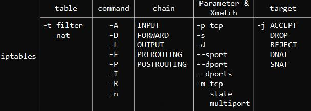

# Docker容器网络

四种网络模式

- **bridge**

` -net=bridge ` 默认网络，Docker启动后创建一个docker0网桥，默认创建的容器也是添加到这个网桥中。 也可以自定义网络，相比默认的具备内部DNS发现，可以通过容器名容器之间网络通信。

- **host**

`–net=host ` 容器不会获得一个独立的network namespace，而是与宿主机共用一个。这就意味着容器不会有自己的网卡信息，而是使用宿主机的。容器除了网络，其他都是隔离的。

- **none**

`-net=none ` 取独立的network namespace，但不为容器进行任何网络配置，需要我们手动配置。

- **container**

`–net=container:Name/ID `与指定的容器使用同一个` network namespace `，具有同样的网络配置信息，两个容器除了网络，其他都还是隔离的。

## 网络模式：bridge详解

**查看网络**
```shell
docker network ls
```

**创建网络**
```shell
docker network create test
```

**加入网络**
```shell
docker run -d --name web --network test -P nginx:1.18
```

**查看网络详情**
```shell
docker network inspect test
[
    {
        "Name": "test",
        "Id": "e0434bd8c39402acbfe02f40e33722329d9b87cee79aebc51bd651345e6b2099",
        "Created": "2021-03-05T16:14:53.606739869+08:00",
        "Scope": "local",
        "Driver": "bridge",
        "EnableIPv6": false,
        "IPAM": {
            "Driver": "default",
            "Options": {},
            "Config": [
                {
                    "Subnet": "172.18.0.0/16",
                    "Gateway": "172.18.0.1"
                }
            ]
        },
        "Internal": false,
        "Attachable": false,
        "Ingress": false,
        "ConfigFrom": {
            "Network": ""
        },
        "ConfigOnly": false,
        "Containers": {
            "a0461feb4d9d90eb3c4e11fba478f79609cdd348e40c3f3fb220dc8e455ab5c6": {
                "Name": "web",
                "EndpointID": "805af4200ff4fe906bc44a4663a05f45a8bc0588082d274c281717b7a4b7684d",
                "MacAddress": "02:42:ac:12:00:02",
                "IPv4Address": "172.18.0.2/16",
                "IPv6Address": ""
            }
        },
        "Options": {},
        "Labels": {}
    }
]
```

**注**：
当两个应用容器需要通信时，创建新的业务容器网络，并将相关容器加入到网络中，应用中就可以使用容器名称进行通信了

---

## 网络模式：host、none和container

**host**

主机模式，会与主机共用网卡信息，其他资源依然保持隔离，如果有端口，则会直接绑定到宿主机网卡
```shell
docker run -d --name web --network host nginx:1.18
```

**container**

将一个容器加入到其他容器的网络命名空间中，则两个容器共用网络命名空间，及网卡信息
```shell
# 创建容器1
docker run -dit --name test1 busybox
# 创建容器2，并加入到容器1的网络命名空间中
docker run -dit --name test2 --network container:test1 busybox
# 分别查看网卡信息
docker exec -it test1 sh
/ # ifconfig
eth0      Link encap:Ethernet  HWaddr 02:42:AC:11:00:02
          inet addr:172.17.0.2  Bcast:172.17.255.255  Mask:255.255.0.0
          UP BROADCAST RUNNING MULTICAST  MTU:1500  Metric:1
          RX packets:11 errors:0 dropped:0 overruns:0 frame:0
          TX packets:0 errors:0 dropped:0 overruns:0 carrier:0
          collisions:0 txqueuelen:0
          RX bytes:906 (906.0 B)  TX bytes:0 (0.0 B)

lo        Link encap:Local Loopback
          inet addr:127.0.0.1  Mask:255.0.0.0
          UP LOOPBACK RUNNING  MTU:65536  Metric:1
          RX packets:0 errors:0 dropped:0 overruns:0 frame:0
          TX packets:0 errors:0 dropped:0 overruns:0 carrier:0
          collisions:0 txqueuelen:1000
          RX bytes:0 (0.0 B)  TX bytes:0 (0.0 B)

/ #
docker exec -it test2 sh
/ # ifconfig
eth0      Link encap:Ethernet  HWaddr 02:42:AC:11:00:02
          inet addr:172.17.0.2  Bcast:172.17.255.255  Mask:255.255.0.0
          UP BROADCAST RUNNING MULTICAST  MTU:1500  Metric:1
          RX packets:11 errors:0 dropped:0 overruns:0 frame:0
          TX packets:0 errors:0 dropped:0 overruns:0 carrier:0
          collisions:0 txqueuelen:0
          RX bytes:906 (906.0 B)  TX bytes:0 (0.0 B)

lo        Link encap:Local Loopback
          inet addr:127.0.0.1  Mask:255.0.0.0
          UP LOOPBACK RUNNING  MTU:65536  Metric:1
          RX packets:0 errors:0 dropped:0 overruns:0 frame:0
          TX packets:0 errors:0 dropped:0 overruns:0 carrier:0
          collisions:0 txqueuelen:1000
          RX bytes:0 (0.0 B)  TX bytes:0 (0.0 B)

```

---

## Docker网络模型与容器网络访问流程

**网络模型**

veth pair：成对出现的一种虚拟网络设备，数据从一端进,从另一 端出。 用于解决网络命名空间之间隔离。 
docker0：网桥是一个二层网络设备，通过网桥可以将Linux支持的不同的端口连接起来，并实现类似交换机那样的多对多的通信。


**容器网络访问原理**

- **外部访问容器**


- **容器访问外部**


---

## 容器网络实现核心技术：iptables

- **四表五链**

| 表                         | 链                                      |
| -------------------------- | --------------------------------------- |
| filter（过滤）             | INPUT,OUTPUT,FORWARD                    |
| nat（地址转换）            | PREROUTING,POSTROUTING,OUTPUT           |
| mangle（拆包、修改、封装） | INPUT,OUT,PREROUTING,POSTROUTING,OUTPUT |
| raw（数据包状态跟踪）      | PREROUTING、OUTPUT                      |

- **iptables命令**




- **工作流程**


- INPUT链：接收的数据包是本机(入站)时，应用此链中的规则。 
- OUTPUT链：本机向外发送数据包(出站)时，应用此链中的规则。 
- FORWARD链：需要通过防火墙中转发送给其他地址的数据包(转发)时，应用测 链中的规则。 
- PREROUTING链：在对数据包做路由选择之前，应用此链中的规则。DNAT 
- POSTROUTING链：在对数据包做路由选择之后，应用此链中的规则。SNAT 

- **外部访问容器：**

```shell
iptables -t nat -vnL DOCKER 
Chain DOCKER (2 references) 
pkts bytes target     prot opt in     out     source               destination         
0     0 RETURN     all  -- docker0 *       0.0.0.0/0            0.0.0.0/0           
1    52 DNAT       tcp  -- !docker0 *       0.0.0.0/0            0.0.0.0/0            tcp dpt:8080 to:172.17.0.2:80
```

- **容器访问外部：** 

```shell
iptables -t nat -vnL POSTROUTING 
Chain POSTROUTING (policy ACCEPT 0 packets, 0 bytes) 
pkts bytes target     prot opt in     out     source               destination         0     0 MASQUERADE  all  -- *      !docker0  172.17.0.0/16        0.0.0.0/0
```


---

## 跨主机网络：实现Docker容器多主机通信

Flannel是CoreOS维护的一个网络组件，在每个主机上运行守护进程负责维护本地路由转发，Flannel使用ETCD来存储容器网络 与主机之前的关系。

**其他主流容器跨主机网络方案**

- Weave 
- Calico 
- OpenvSwitch

### 安装etcd

**安装**
```shell
yum install etcd -y
```

**配置**
```shell
vi /etc/etcd/etcd.conf
# 修改localhost为主机IP：172.16.4.13
```

**启动**
```shell
systemctl start etcd
systemctl enable etcd
```

### 安装flannel

>所有docker节点上安装

**安装**
```shell
yum install flannel -y
```

**配置** ` vim /etc/sysconfig/flanneld `
```shell
# 修改ETCD服务地址
FLANNEL_ETCD_ENDPOINTS="http://172.16.4.13:2379"
```

**写入数据**
```shell
etcdctl --endpoints="http://172.16.4.13:2379" set /atomic.io/network/config  '{ "Network": "192.168.0.0/16", "Backend": {"Type": "vxlan"}}'
```

**启动**
```shell
systemctl start flanneld
systemctl enable flanneld
```


**修改Docker配置** ` vi /usr/lib/systemd/system/docker.service `
```shell
EnvironmentFile=/run/flannel/docker
ExecStart=/usr/bin/dockerd -H fd:// --containerd=/run/containerd/containerd.sock $DOCKER_NETWORK_OPTIONS
```

**重启Docker**
```shell
systemctl daemon-reload
systemctl restart docker
```

**配置IPTABLES**
```shell
iptables -A FORWARD -o flannel.1 -m conntrack --ctstate RELATED,ESTABLISHED -j ACCEPT
iptables -A FORWARD -i flannel.1 ! -o flannel.1 -j ACCEPT
iptables -A FORWARD -i flannel.1 -o flannel.1 -j ACCEPT
```
