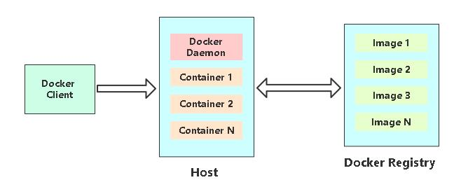
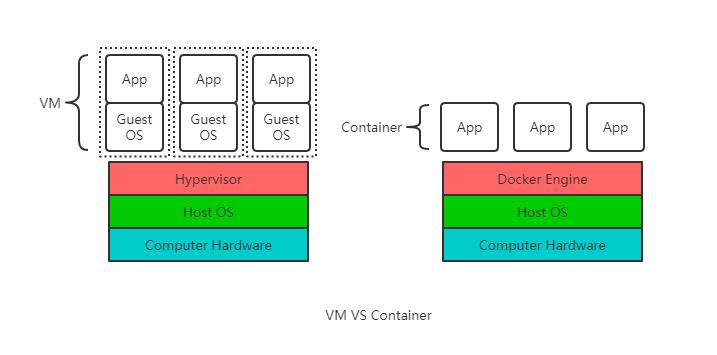

# Docker核心概念

## 为什么使用容器

**1. 上线流程繁琐**

开发->测试->申请资源->审批->部署->测试等环节

**2. 资源利用率低**

普遍服务器利用率低，造成过多浪费 

**3. 扩容/缩容不及时** 

业务高峰期扩容流程繁琐，上线不及时 

**4. 服务器环境臃肿**

服务器越来越臃肿，对维护、迁移带来困难

**5. 环境不一致性**

### Docker是什么

- **使用最广泛的开源容器引擎**
- **一种操作系统级的虚拟化技术**
- 依赖于Linux内核特性：**Namespace（资源隔离）**和**Cgroups（资源限制）**   
- 一个简单的应用程序**打包工具**

---

## Docker概述与设计目录

### Docker设计目标

- 提供简单的应用程序打包工具
- 开发人员和运维人员职责逻辑分离
- 多环境保持一致性

### Docker基本组成



---

## 容器VS虚拟机



|          | Container                                | VM             |
| -------- | ---------------------------------------- | -------------- |
| 启动速度 | 秒级                                     | 分钟级         |
| 运行性能 | 解决原生                                 | 5%左右损失     |
| 磁盘占用 | MB                                       | GB             |
| 数量     | 成百上千                                 | 一般几十台     |
| 隔离性   | 进程级                                   | 系统级         |
| 操作系统 | 主要支持Linux                            | 所有系统       |
| 封装程度 | 只打包项目代码和依赖关系，关系宿主机内核 | 完整的操作系统 |

**容器：**
1. 容器提供一个基本的独立环境，实现容器隔离、资源限制
2. 主要解决应用层面问题，应用快速部署、高效管理

**虚拟机：**
1. 提升服务器资源利用率
2. 提供一个完全隔离的环境

---

## Docker应用场景

- 应用程序打包和发布 
- 应用程序隔离 
- 持续集成 
- 部署微服务 
- 快速搭建测试环境 
- 提供PaaS产品（平台即服务）

---

## Linux安装docker

[官网文档](https://docs.docker.com/)

**Docker版本**
- 社区版（Community Edition，CE） 
- 企业版（Enterprise Edition，EE）

**支持平台**
- Linux（CentOS,Debian,Fedora,Oracle Linux,RHEL,SUSE和Ubuntu）
- Mac 
- Windows

[阿里云Docker文献](https://developer.aliyun.com/mirror/docker-ce)

1. 安装系统工具
```shell
sudo yum install -y yum-utils device-mapper-persistent-data lvm2
```

2. 添加软件源
```shell
sudo yum-config-manager --add-repo https://mirrors.aliyun.com/docker-ce/linux/centos/docker-ce.repo
```

3. 安装docker
```shell
sudo yum makecache fast
sudo yum -y install docker-ce
```

4. 启动Docker服务
```shell
sudo service docker start
```
