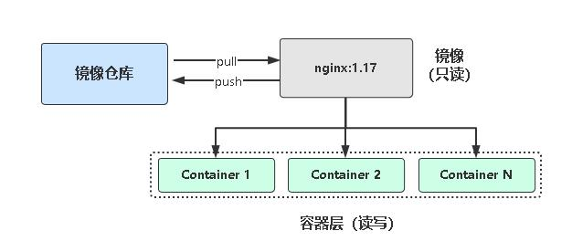
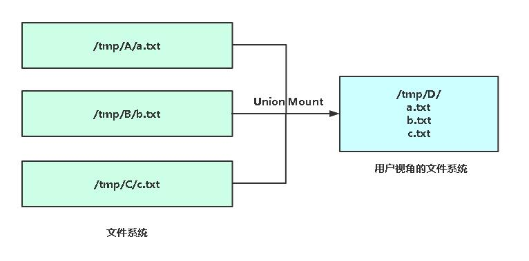
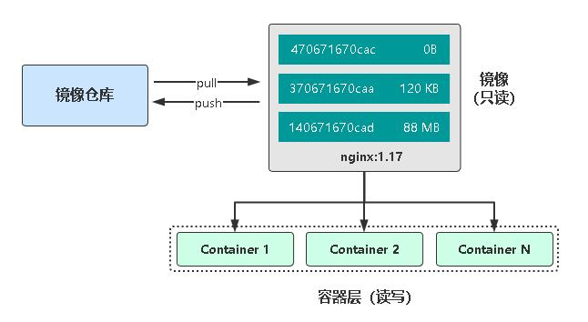
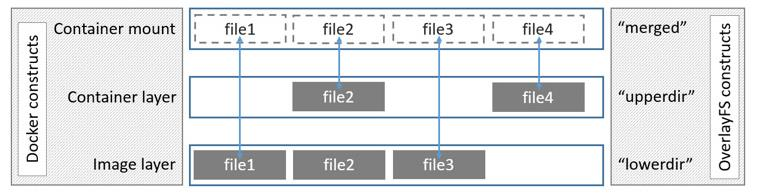

# Docker镜像管理

## 什么是镜像

- 一个分层存储的文件，不是一个单一的文件 
- 一个软件的环境 
- 一个镜像可以创建N个容器 
- 一种标准化的交付 
- 一个不包含Linux内核而又精简的Linux操作系统

## 镜像从哪里来

` Docker Hub `是由Docker公司负责维护的公共镜像仓库，包含大量的容器镜像，Docker工具默认从这个公共镜像库下载镜像。

[Docker官方仓库](https://hub.docker.com)

配置镜像加速器：

` vi /etc/docker/daemon.json `
```json
{ 
    "registry-mirrors": ["https://b9pmyelo.mirror.aliyuncs.com"] 
}
```
重启服务
```shell
systemctl restart docker
```
---

## 镜像与容器联系

- 镜像：类似于虚拟机镜像，一个只读模板
- 容器：通过镜像创建的运行实例

**拉取镜像**
```shell
docker pull nginx
```

**查看镜像**
```shell
docker images
```

**查看容器**
```shell
docker ps
```

**基于镜像创建容器**
```shell
docker run -d name web nginx
```

docker默认存储目录` /var/lib/docker `



---

## 管理镜像常用命令

` docker image --help `

| 指令    | 描述                                       |
| ------- | ------------------------------------------ |
| ls      | 列出镜像                                   |
| build   | 构建镜像来自Dockerfile                     |
| history | 查看镜像历史                               |
| inspect | 显示一个或多个镜像详细信息                 |
| pull    | 从镜像仓库拉取镜像                         |
| push    | 推送一个镜像到镜像仓库                     |
| rm      | 移除一个或多个镜像                         |
| prune   | 移除没有被标记或者没有被任何容器引用的镜像 |
| tag     | 创建一个引用源镜像标记目标镜像             |
| export  | 导出容器文件系统到tar归档文件              |
| import  | 导入tar归档文件容器文件系统tar归档创建镜像 |
| sava    | 保存一个或多个镜像到一个tar归档文件        |
| load    | 加载镜像来自tar归档或标准输入              |

---

## 镜像存储核心技术：联合文件系统（UnionFS）

镜像怎么高效存储？ 
难道像虚拟机那样一个容器对应一个独立的镜像文件？这样对于密集型容器，磁盘占用率太大！

答：**引入联合文件系统，将镜像多层文件联合挂载到容器文件系统**





---

## 镜像存储核心技术：写时复制（COW）

了解联合文件系统后，我们知道，镜像是只读的，类似共享形式让多个容器使用，如果要在容器里修改文件，即镜像里的文件，那该怎么 办呢？

答：**引入写时复制（copy-on-write），需要修改文件操作时，会先 从镜像里把要写的文件复制到自己的文件系统中进行修改。**



---

## 存储优化

- 使用SSD固态硬盘 
- 使用卷作为频繁读写文件的工作目录，绕过存储驱动，减少抽象的开销


