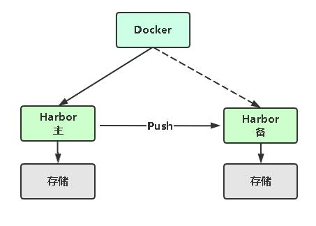
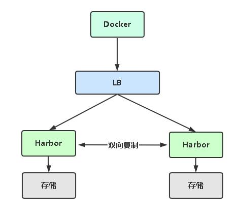
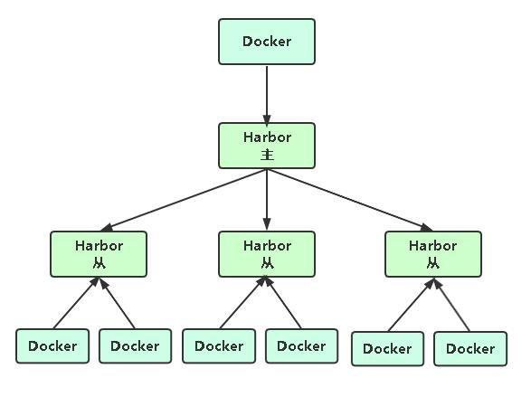

# 企业级镜像仓库Harbor

## Harbor概述

Harbor是由VMWare公司开源的容器镜像仓库。事实上，Harbor是在Docker Registry上进行了相应的企业级扩展， 从而获得了更加广泛的应用，这些新的企业级特性包括：管理用户界面，基于角色的访问控制 ，AD/LDAP集成以及 审计日志等，足以满足基本企业需求。

- 官方网站：[https://goharbor.io](https://goharbor.io)
- Github：[https://github.com/goharbor/harbor](https://github.com/goharbor/harbor)

## 准备条件要求

**硬件**

- 最低要求：CPU2核/内存4G/硬盘40GB
- 推荐：CPU4核/内存8G/硬盘160GB

**软件**

- Docker CE 17.06版本+ 
- Docker Compose 1.18版本+

**Harbor安装方式：** 

- 在线安装：从Docker Hub下载Harbor相关镜像，因此安装软件包非常小
- 离线安装：安装包包含部署的相关镜像，因此安装包比较大

## Harbor安装


**安装Docker和docker-compose**

- docker-compose：[https://github.com/docker/compose/releases](https://github.com/docker/compose/releases)

准备二进制文件：` docker-compose-Linux-x86_64 `

```shell
mv docker-compose-Linux-x86_64 /usr/bin/docker-compose
chmod +x /usr/bin/docker-compose
```

**安装Harbor**

准备离线安装包：` harbor-offline-installer-v2.2.0.tgz `

```shell
tar -xvf harbor-offline-installer-v2.2.0.tgz
cd harbor
cp harbor.yml.tmpl harbor.yml
# 配置hostname
hostname: reg.kuuun.com
# 编辑 harbor.yml，注释https相关配置
# https:
# port: 443
# certificate: /your/certificate/path
# private_key: /your/private/key/path
# 填充配置
./prepare
 ./install.sh
```
---
## Harbor基本使用

1. 配置http镜像仓库可信任 
` vi /etc/docker/daemon.json `
```json
{
    ...
    "insecure-registries":["reg.kuuun.com"]
} 
```
重启docker服务
```shell
systemctl restart docker
```
2. 打标签 
```shell
docker tag centos:7 reg.kuuun.com/library/centos:7
```
3. 登录
```shell
docker login reg.kuuun.com
```

4. 推送
```shelll
docker push reg.kuuun.com/library/centos:7
```

5. 拉取
```shell
docker pull reg.kuuun.com/library/centos:7
```

---

## 启用HTTPS

1. 生成SSL证书
2. Harbor启用HTTPS
```shell
# 生成SSL证书
# Harbor启用HTTPS
# vi harbor.yml 
https: 
port: 443 
certificate: /root/harbor/ssl/reg.kuuun.com.pem 
private_key: /root/harbor/ssl/reg.kuuun.com-key.pem 
```
3. 重新配置并部署Harbor
```shell
./prepare 
docker-compose down 
docker-compose up –d
```
4. 将数字证书复制到Docker主机 
```shell
mkdir /etc/docker/certs.d/reg.kuuun.com
cp reg.kuuun.com.pem /etc/docker/certs.d/reg.kuuun.com/reg.kuuun.com.crt 
```
5. 验证
```shell
docker login reg.kuuun.com
Username: admin
Password:
WARNING! Your password will be stored unencrypted in /root/.docker/config.json.
Configure a credential helper to remove this warning. See
https://docs.docker.com/engine/reference/commandline/login/#credentials-store
Login Succeeded
```

---

## Harbor主从复制实现高可用

**主备**

- 简单，主挂了切到备Harbor
- 同一时间只有一台提供服务
- 适合少量镜像下载



**双主**

- 双向配置复制
- 两台同时提供服务
- 前面增加负载均衡器



**一主多从**

- 多个从同步主 
- 适合多地区业务、大量镜像下载需求



---

## Harbor维护

| 容器              | 功能                                      |
| ----------------- | ----------------------------------------- |
| harbor-core       | 配置管理中心                              |
| harbor-db         | PG数据库                                  |
| harbor-jobservice | 负责镜像复制                              |
| harbor-log        | 记录操作日志                              |
| harbor-portal     | Web管理页面和API                          |
| nginx             | 前端代理，负责前端页面和镜像上传/下载转发 |
| redis             | 会话                                      |
| registryctl       | 镜像存储                                  |

容器数据持久化目录：` /data `
日志文件目录：` /var/log/harbor `
