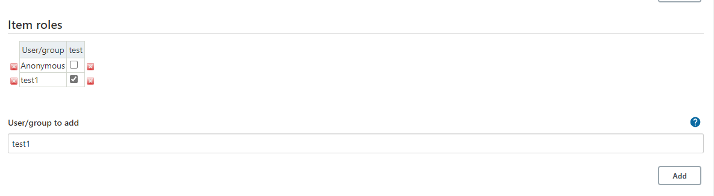
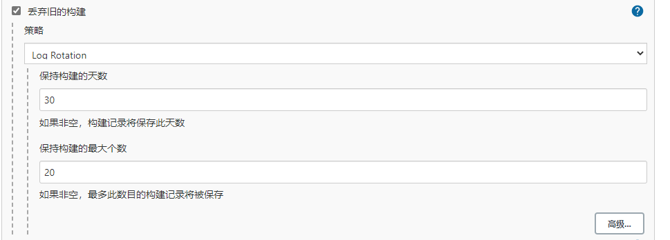
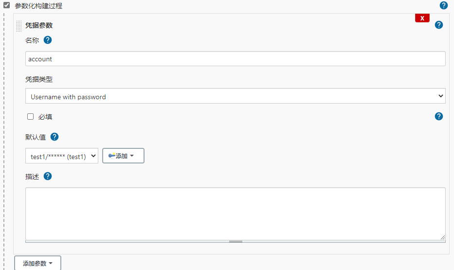
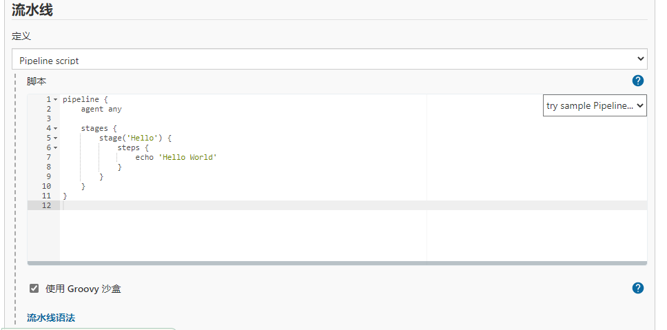

# Jenkins入门

## Jenkins安装准备

>Jenkins使用java语言开发，需要安装JDK，目前已支持jdk11，Jenkins支持跨平台安装

国内清华大学镜像站：`https://mirrors.tuna.tsinghua.edu.cn/jenkins`

### 支持的安装方式

- 基于war包部署

```shell
java -jar jenkins.war
```
>使用参数--httpPort可以指定端口，`java -jar jenkins.war --httpPort=9090`


- 基于Linux发行版安装

- 基于Windows安装

- 基于macOS安装

- 基于Docker安装

---
## Jenkins基本配置

>配置文件默认存放路径`/etc/sysconfig/jenkins`

- 配置访问端口
  
  默认：`8080`

- 配置`JENKINS_HOME`
  
  默认：`/var/lib/jenkins`

- 默认启动用户:
  
  默认：`Jenkins`

- 配置插件更新源：
  
  默认官方源
  
  修改为清华源

```
https://mirrors.tuna.tsinghua.edu.cn/jenkins/updates/update-center.json
```
---
## 解锁Jenkins

- 第一次访问Jenkins的时候，系统会要求使用自动生成的密码对其进行解锁
- 解锁秘钥可以通过`$JENKINS_HOME/`


---
## 安装插件


---
## 配置插件源

>Manage Jenkins-->Manage Plugins-->Advanced-->Update Site


---
## 配置中文语言支持插件

- `Locale`
- `Localization: Chinese (Simplified)`

---
## 安装基本插件

- `Git`
- `Pipeline`
- `Blue Ocean`

---

## 添加agent节点

### 配置代理通信端口

>系统管理-->全局安装配置-->代理

指定端口为：`8181`

### 添加agent节点

>系统管理-->节点管理-->新建节点


### 启动agent节点

>- 在节点列表点击刚才添加的节点名称，获取`agent.jar`及启动参数
>- 在节点上安装jdk

```shell
#!/bin/bash
nohup java -jar agent.jar -jnlpUrl http://172.16.4.71:8080/computer/build01/jenkins-agent.jnlp -secret 0e6dd5a23a4899d2f4f562e94d189ecefe9f1cfa737db38f7872aaed548047e2 -workDir "/var/lib/jenkins" &
```


---

## Jenkins用户管理

### 用户管理方式

- 默认Jenkins自带数据库
- LDAP集成管理
- ActiveDirectory集成管理
- Gitlab/Github集成管理

---

## Jenkins权限管理

权限管理插件：`Role-based Authorization Strategy`

### 启用ROLE权限

系统管理-->全局安全配置-->授权策略-->`Role-Base Strategy`
系统管理-->`Manage and Assign Roles`

- `Manage Roles`：负责管理角色，创建，配置权限
- `Assign Roles`：负责分配角色，将user配置指定角色下

---
### `Manage Roles`创建角色

>- `Global roles`：全局角色控制
>- `Item roles`：任务/工程/项目的角色控制
>- `Node roles`：节点角色控制

1. `Global roles`

>创建一个名为`user`角色，并分配全局只读权限,保存`save`。


2. `Item roles`

>创建一个名为`test`角色，并定义正则规则`test.*`，说明test开头的任务/工程/项目都属于这个角色下，再配置相应的权限，保存`save`。


---

### `Assign Roles`分配角色

1. `Global roles`

>添加用户`test1`，并将它授予`user`角色，那么这个用户继承`user`角色的权限，并保存`save`


2. `Item roles`

>添加用户`test1`，并将它授予`test`项目角色，那么这个用户继承`test`这个项目角色的权限，并保存`save`



---

## Jenkins凭据管理

>系统管理-->`Manage Credentials`

凭据支持的基本类型

- 用户名和密码
- SSH用户名和私钥
- 安全文件
- 安全信息
- CERT证书

---

## Jenkins项目管理-流水线

1. 创建一个流水线项目`pipeline-demo`
2. 配置历史构建保留



3. 配置构建时的参数



4. 编写pipeline脚本



5. 保存 

---

## Jenkins项目管理-文件夹

>1. 创建名为`test`的文件夹任务


>2. 将一些任务移动到这个文件夹下


---
## Jenkins项目管理-视图

>1. 创建名为`测试`的视图


>2. 指定视图收纳规则


