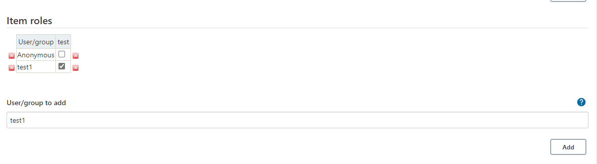
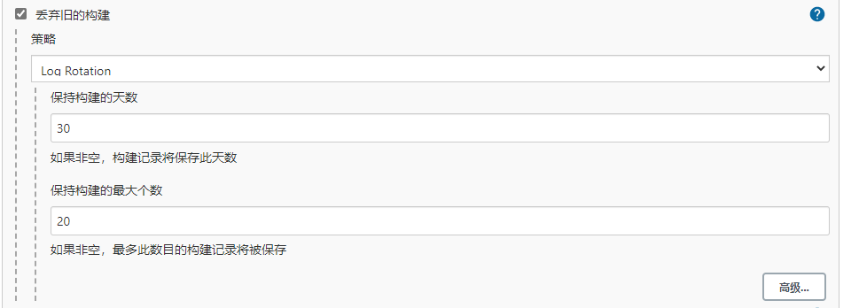

# Jenkins

## Jenkins基础

### Jenkins简介与应用

#### 简介

>Jenkins是一个自动化服务器，目前发展超过15年，比较成熟的CI工具（也可以CD）能够实现自动化集成发布。建立好流水线后，期间无需专业运维人员介入，开发人员随时发布部署。

#### 应用

- 集成svn/git客户端实现源代码下检出
- 集成maven/ant/gradle/npm等构建工具实现源码编译打包单元测试
- 集成snoarqube对源代码进行质量检查
- 集成SaltStack/Ansible实现自动化部署发布
- 集成Jmeter/Soar/Kubernetes...
- 可以自定义插件或者脚本通过Jenkins传参运行
- Jenkins插件资源丰富，灵活，可以将日常运维工作进行自动化

---

### Jenkins安装准备

>Jenkins使用java语言开发，需要安装JDK，目前已支持jdk11，Jenkins支持跨平台安装

国内清华大学镜像站：`https://mirrors.tuna.tsinghua.edu.cn/jenkins`

#### 支持的安装方式

- 基于war包部署

```shell
java -jar jenkins.war
```
>使用参数--httpPort可以指定端口，`java -jar jenkins.war --httpPort=9090`


- 基于Linux发行版安装

- 基于Windows安装

- 基于macOS安装

- 基于Docker安装

---
### Jenkins基本配置

>配置文件默认存放路径`/etc/sysconfig/jenkins`

- 配置访问端口
  
  默认：`8080`

- 配置`JENKINS_HOME`
  
  默认：`/var/lib/jenkins`

- 默认启动用户:
  
  默认：`Jenkins`

- 配置插件更新源：
  
  默认官方源
  
  修改为清华源

```
https://mirrors.tuna.tsinghua.edu.cn/jenkins/updates/update-center.json
```
---
### 解锁Jenkins

- 第一次访问Jenkins的时候，系统会要求使用自动生成的密码对其进行解锁
- 解锁秘钥可以通过`$JENKINS_HOME/`


---
### 安装插件


---
### 配置插件源

>Manage Jenkins-->Manage Plugins-->Advanced-->Update Site


---
### 配置中文语言支持插件

- `Locale`
- `Localization: Chinese (Simplified)`

---
### 安装基本插件

- `Git`
- `Pipeline`
- `Blue Ocean`

---

### 添加agent节点

#### 配置代理通信端口

>系统管理-->全局安装配置-->代理

指定端口为：`8181`

#### 添加agent节点

>系统管理-->节点管理-->新建节点


#### 启动agent节点

>- 在节点列表点击刚才添加的节点名称，获取`agent.jar`及启动参数
>- 在节点上安装jdk

```shell
#!/bin/bash
nohup java -jar agent.jar -jnlpUrl http://172.16.4.71:8080/computer/build01/jenkins-agent.jnlp -secret 0e6dd5a23a4899d2f4f562e94d189ecefe9f1cfa737db38f7872aaed548047e2 -workDir "/var/lib/jenkins" &
```


---

### Jenkins用户管理

#### 用户管理方式

- 默认Jenkins自带数据库
- LDAP集成管理
- ActiveDirectory集成管理
- Gitlab/Github集成管理

---

### Jenkins权限管理

权限管理插件：`Role-based Authorization Strategy`

#### 启用ROLE权限

系统管理-->全局安全配置-->授权策略-->`Role-Base Strategy`
系统管理-->`Manage and Assign Roles`

- `Manage Roles`：负责管理角色，创建，配置权限
- `Assign Roles`：负责分配角色，将user配置指定角色下

---
#### `Manage Roles`创建角色

>- `Global roles`：全局角色控制
>- `Item roles`：任务/工程/项目的角色控制
>- `Node roles`：节点角色控制

1. `Global roles`

>创建一个名为`user`角色，并分配全局只读权限,保存`save`。


2. `Item roles`

>创建一个名为`test`角色，并定义正则规则`test.*`，说明test开头的任务/工程/项目都属于这个角色下，再配置相应的权限，保存`save`。


---

#### `Assign Roles`分配角色

1. `Global roles`

>添加用户`test1`，并将它授予`user`角色，那么这个用户继承`user`角色的权限，并保存`save`


2. `Item roles`

>添加用户`test1`，并将它授予`test`项目角色，那么这个用户继承`test`这个项目角色的权限，并保存`save`



---

### Jenkins凭据管理

>系统管理-->`Manage Credentials`

凭据支持的基本类型

- 用户名和密码
- SSH用户名和私钥
- 安全文件
- 安全信息
- CERT证书

---

### Jenkins项目管理-流水线

1. 创建一个流水线项目`pipeline-demo`
2. 配置历史构建保留



3. 配置构建时的参数


4. 编写pipeline脚本


5. 保存 

---

### Jenkins项目管理-文件夹

>1. 创建名为`test`的文件夹任务


>2. 将一些任务移动到这个文件夹下


---
### Jenkins项目管理-视图

>1. 创建名为`测试`的视图


>2. 指定视图收纳规则


---

## Pipeline入门

>一条流水线通过Jenkinsfile进行描述

声明式插件：`Pipeline: Declarative`

Jenkinsfile文件结构

- 指定节点agent
- 指定运行的选项options
- 指定运行阶段stages
- 指定构建后操作post

### Pipeline定义-agent/options

```groovy
agent {
    node {
        label "master" // 指定运行节点的标签或者名称
        customWorkspace "${workspace}" //指定运行工作目录
    }
}
options {
    timestamps() //日志会有时间
    skipDefaultCheckout() //删除隐式checkout scm语句
    disableConcurrentBuilds() //禁止并行
    timeout(time: 1, unit: 'HOURS') //流水线超时设置1h
}
```

### Pipeline定义-stages

>指定阶段

```groovy
stages {
    stage("GetCode"){
        steps {
            timeout(time:5, unit:"MINUTES"){
                script{
                    println('获取代码')
                }
            }
        }
    }
    stage("Build"){
        steps {
            timeout(time:20, unit:"MINUTES"){
                script{
                    println('应用打包')
                }
            }
        }
    }
    stage("CodeScan"){
        steps {
            timeout(time:30, unit:"MINUTES"){
                script{
                    println('代码扫描')
                }
            }
        }
    }
}
```
### Pipeline定义-post

>构建后的操作

- `always`：总是执行的脚本片段
- `success`：成功后执行
- `failure`：失败后执行
- `aborted`：取消后执行

```groovy
post {
    always {
        script{
            println("always")
        }
    }
    success {
        script{
            currentBuild.description += "\n 构建成功"
        }
    }
    failure {
        script{
            currentBuild.description += "\n 构建失败"
        }
    }
    aborted {
        script{
            currentBuild.description += "\n 构建取消"
        }
    }
}
```

### 完整示例代码

```groovy
#!groovy

String workspace = "/opt/jenkins/workspace"

pipeline{
    //指定运行此流水线的节点
    agent { 
        node { 
            label "master"
            customWorkspace "${workspace}"
        }
        
    }
    
    options {
        timestamps() //日志会有时间
        skipDefaultCheckout() //删除隐式checkout scm语句
        disableConcurrentBuilds() //禁止并行
        timeout(time: 1, unit: 'HOURS') //流水线超时设置1h
    }
    stages {
        stage("GetCode"){
            steps {
                timeout(time:5, unit:"MINUTES"){
                    script{
                        println('获取代码')
                    }
                }
            }
        }
        stage("Build"){
            steps {
                timeout(time:20, unit:"MINUTES"){
                    script{
                        println('应用打包')
                    }
                }
            }
        }
        stage("CodeScan"){
            steps {
                timeout(time:30, unit:"MINUTES"){
                    script{
                        println('代码扫描')
                    }
                }
            }
        }
    }
    post {
        always {
            script{
                println("always")
            }
        }
        success {
            script{
                currentBuild.description += "\n 构建成功"
            }
        }
        failure {
            script{
                currentBuild.description += "\n 构建失败"
            }
        }
        aborted {
            script{
                currentBuild.description += "\n 构建取消"
            }
        }
    }
}
```
---

### Pipeline语法-agent

>agent指定流水线的执行节点

参数：

- `any`：在任何可用的节点上执行`pipeline`
- `none`：没有指定agent的时候默认
- `lable`：指定标签上的节点上运行`pipeline`
- `node`：运行额外选项

```groovy
agent { node { label 'label name'}}
// 等效于 agent { label 'label name' }
```

### Pipeline语法-post

>定义一个或多个steps，这些阶段根据流水线或阶段的完成情况而运行（取决于流水线中post部分的位置）。post支持以下post-condition块中的其中之一。

| 状态       | 描述                                       |
| ---------- | ------------------------------------------ |
| `always`   | 无论流水线或者阶段的完成状态               |
| `changed`  | 只有当流水线或者阶段完成状态与之前不同时。 |
| `failure`  | 只有当流水线或者阶段状态为`failure`运行。  |
| `success`  | 只有当流水线或者阶段状态为`success`运行。  |
| `unstable` | 只有当流水线或者阶段状态为`unstable`运行   |
| `aborted`  | 只有当流水线或者阶段状态为`aborted`运行    |

### Pipeline语法-stages

>包含一系列一个或者多个stage指令，建议stages至少包含一个stage指令用于连续交付过程的每个离散部分。

```groovy
pipeline {
    agent any
    stages {
        stage('Example'){
            steps {
                echo "Hello World"
            }
        }
    }
}
```

### Pipeline语法-steps

>step是每个阶段中要执行的每个步骤

```groovy
pipeline {
    agent any
    stages {
        stage('Example'){
            steps {
                echo "Hello World"
            }
        }
    }
}
```

### Pipeline语法-environment

>environment指令指定一个键值对序列，该序列将被定义为所有步骤的环境变量，或者是特定于阶段的步骤，这取决于environment指令在流水线内的位置。
>
>该指令支持一个特殊的方法credentials()，该方法可以用于Jenkins环境中通过标识符访问预定义的凭证。
>
>- 类型为`Secret Text`的凭证：credentials()将确保指定的环境变量包含密文的文本内容。
>- 类型为`Standart username and password`的凭证：指定的环境变量指定为username:password，并且两个额外的环境变量将被自动定义为：`MYVARNAME_USR`和`MYVARNAME_PSW`。

```groovy
pipeline {
    agent any
    environment {
        CC = 'clang'
    }
    stages{
        stage('Example'){
            environment {
                AN_ACCESS_KEY = credentials('my-prefined-secret-text')
            }
            steps {
                sh 'printenv'
            }
        }
    }
}
```

### Pipeline语法-options

options指令允许从流水线内部配置特定于流水线的选项。

| 参数                      | 描述                                                                                |
| ------------------------- | ----------------------------------------------------------------------------------- |
| `buildDiscarder`          | 为最近的流水线允许的特定数量保存组件和控制台输出                                    |
| `disableConcurrentBuilds` | 不允许同时执行流水线                                                                |
| `overrideIndexTriggers`   | 允许覆盖分支索引触发器的默认处理                                                    |
| `skipDefaultCheckout`     | 在agent指令中，跳过从源代码控制中检出代码的默认情况                                 |
| `skipStagesAfterUnstable` | 一旦构建状态变得`UNSTABLE`，跳过该阶段                                              |
| `checkotToSubdirectory`   | 在工作空间的子目录中自动地执行源代码控制检出                                        |
| `timeout`                 | 设置流水线的超时时间，在此之后，Jenkins将中止流水线                                 |
| `retry`                   | 在失败时候，整改流水线重新尝试的次数                                                |
| `timestamps`              | 预测所有流水线生成的控制台输出，与该流水线发出的时间一致。需要插件支持`Timestamper` |


### Pipeline语法-paramters

>在流水线运行时设置项目相关的参数

- string字符串类型的参数

```
paramters { string{name: 'DEPLOY_ENV', defaultValue: 'staging', description: ''}}
```

- booleanParam布尔参数

```
paramters { booleanParam{name: 'DEBUG_BUILD', defaultValue: true, description: ''}}
```

### Pipeline语法-trigger

>触发器

- cron 计划任务定期执行构建

```
triggers { cron('H */4 * * 1-5')}
```

- pollSCM与cron定义类型，但是由Jenkins定期检测源码变化

```
triggers { pollSCM('H */4 * * 1-5')}
```

- upstream 接受逗号分隔的工作字符串和阈值。当字符串中的任何作业以最小阈值结束时，流水线被重新触发。

```
triggers { upstream(upstreamProjects: 'job1,job2',threshold: hudson.model.Result.SUCCESS)}
```

### Pipeline语法-tool

>获取通过自动安装或手动放置的工具的环境变量。

```groovy
pipeline {
    agent ant
    tools {
        maven 'apace-maven-3.6.1'
    }
    stages {
        stage('Example'){
            steps{
                sh 'mvn -version'
            }
        }
    }
}
```

### Pipeline语法-input

>input用户在执行各个阶段的时候，有人工确认是否继续进行。

```groovy
pipeline {
    agent any
    stages {
        stage('Example') {
            input {
                message "Should we continue?"
                ok "Yes, we should."
                submitter "alice,bob"
                parameters {
                    string(name: 'PERSON', defaultValue: 'Mr Jenkins', description: 'Who should I say hello to?')
                }
            }
            steps {
                echo "Hello, ${PERSON}, nice to meet you."
            }
        }
    }
}
```

| 配置项             | 描述                                                                      |
| ------------------ | ------------------------------------------------------------------------- |
| message            | 必需的。 这将在用户提交 input 时呈现给用户。                              |
| id                 | input 的可选标识符， 默认为 stage 名称。                                  |
| ok                 | `input`表单上的"ok" 按钮的可选文本。                                      |
| submitter          | 可选的以逗号分隔的用户列表或允许提交 input 的外部组名。默认允许任何用户。 |
| submitterParameter | 环境变量的可选名称。如果存在，用 submitter 名称设置。                     |
| parameters         | 提示提交者提供的一个可选的参数列表。                                      |

### Pipeline语法-when

>when 指令允许流水线根据给定的条件决定是否应该执行阶段。 when 指令必须包含至少一个条件。 如果 when 指令包含多个条件, 所有的子条件必须返回True，阶段才能执行。

**内置条件**

- branch

>当正在构建的分支与模式给定的分支匹配时，执行这个阶段

```
when { branch 'master' }
```

- environment

>当指定的环境变量是给定的值时，执行这个步骤,

```
when { environment name: 'DEPLOY_TO', value: 'production' }
```

- expression

>当指定的Groovy表达式评估为true时，执行这个阶段

```
when { expression { return params.DEBUG_BUILD } }
```

- not

>当嵌套条件是错误时，执行这个阶段,必须包含一个条件

```
when { not { branch 'master' } }
```

- allOf

>当所有的嵌套条件都正确时，执行这个阶段,必须包含至少一个条件

```
when { allOf { branch 'master'; environment name: 'DEPLOY_TO', value: 'production' } }
```

- anyOf

>当至少有一个嵌套条件为真时，执行这个阶段,必须包含至少一个条件，

```
when { anyOf { branch 'master'; branch 'staging' } }
```

### Pipeline语法-parallel

>声明式流水线的阶段可以在他们内部声明多隔嵌套阶段, 它们将并行执行。 注意，一个阶段必须只有一个 steps 或 parallel 的阶段。 嵌套阶段本身不能包含进一步的 parallel 阶段, 但是其他的阶段的行为与任何其他 stage 相同。任何包含 parallel 的阶段不能包含 agent 或 tools 阶段, 因为他们没有相关 steps。
>
>另外, 通过添加 failFast true 到包含 parallel的 stage 中， 当其中一个进程失败时，你可以强制所有的 parallel 阶段都被终止。

```groovy
pipeline {
    agent any
    stages {
        stage('Non-Parallel Stage') {
            steps {
                echo 'This stage will be executed first.'
            }
        }
        stage('Parallel Stage') {
            when {
                branch 'master'
            }
            failFast true
            parallel {
                stage('Branch A') {
                    agent {
                        label "for-branch-a"
                    }
                    steps {
                        echo "On Branch A"
                    }
                }
                stage('Branch B') {
                    agent {
                        label "for-branch-b"
                    }
                    steps {
                        echo "On Branch B"
                    }
                }
            }
        }
    }
}
```

### Pipeline语法-steps

>script 步骤需要 scripted-pipeline块并在声明式流水线中执行。 对于大多数用例来说,应该声明式流水线中的“脚本”步骤是不必要的， 但是它可以提供一个有用的"逃生出口"。非平凡的规模和/或复杂性的 script 块应该被转移到 共享库 

```groovy
pipeline {
    agent any
    stages {
        stage('Example') {
            steps {
                echo 'Hello World'

                script {
                    def browsers = ['chrome', 'firefox']
                    for (int i = 0; i < browsers.size(); ++i) {
                        echo "Testing the ${browsers[i]} browser"
                    }
                }
            }
        }
    }
}
```

### JenkinsShareLibrary-概述

#### 定义共享库

>共享库通过名称，源代码检索方法，比如 SCM，以及可选的默认版本定义。名称应该是一个简短的标识符，因为它将在脚本中使用。

>该 SCM 可以理解该版本的任何内容；比如，分支、标签和提交哈希值，这些都适用于 Git。你还可以声明脚本是否需要显式地请求该库，或者在默认情况下是否存在该库。此外，如果你在 Jenkins 配置中指定了版本，则可以阻止脚本选择不同的版本。

>指定 SCM 最好的方式是使用一个专门更新的 SCM 插件，以支持新的 API 检出任意命名的版本 (Modern SCM 选项)。 在撰写本文时，最新版本的 Git 和 Subversion 插件支持这种模式；

#### 目录结构

- src:目录应该看起来像标准的 Java 源目录结构。当执行流水线时，该目录被添加到类路径下。
- vars:目录定义可从流水线访问的全局变量的脚本。
- resources:目录允许从外部库中使用 libraryResource 步骤来加载有关的非 Groovy 文件。

```
(root)
+- src                     # Groovy source files
|   +- org
|       +- foo
|           +- Bar.groovy  # for org.foo.Bar class
+- vars
|   +- foo.groovy          # for global 'foo' variable
|   +- foo.txt             # help for 'foo' variable
+- resources               # resource files (external libraries only)
|   +- org
|       +- foo
|           +- bar.json    # static helper data for org.foo.Bar
```

### JenkinsShareLibrary-使用

>标记为 Load implicitly 的共享库允许流水线立即使用任何此库定义的类或全局变量。为了访问其他共享库， Jenkinsfile 需要使用 @Library 注解， 指定库的名字：


```groovy
@Library('my-shared-library') _
/* Using a version specifier, such as branch, tag, etc */
@Library('my-shared-library@1.0') _
/* Accessing multiple libraries with one statement */
@Library(['my-shared-library', 'otherlib@abc1234']) _
```

### JenkinsShareLibrary-实践

- 实践内容：格式化输出
- 项目地址：https://gitee.com/kuuun/jenkinslibrary.git
- 依赖插件：`AnsiColor`

```groovy
package org.devops

def printMsg(msg,color){
    colors = [
        'red': "\033[31m >>>>>>>>>>>>>>>>>>>> ${msg} <<<<<<<<<<<<<<<<<<<< \033[0m",
        'blue': "\033[34m >>>>>>>>>>>>>>>>>>>> ${msg} <<<<<<<<<<<<<<<<<<<< \033[0m",
        'green': "\033[32m >>>>>>>>>>>>>>>>>>>> ${msg} <<<<<<<<<<<<<<<<<<<< \033[0m"
    ]
    ansiColor('xterm'){
        println(colors[color])
    }
}
```

Jenkinsfile引用

```groovy
@Library("jenkinslibrary") _

def tools = new org.devops.Tools()

pipeline{
    agent any
    stages{
        stage("Example"){
            steps{
                scripts{
                    tools.printMsg("This is test","red")
                }
            }
        }
    }
}
```

### 代码生成器


### 