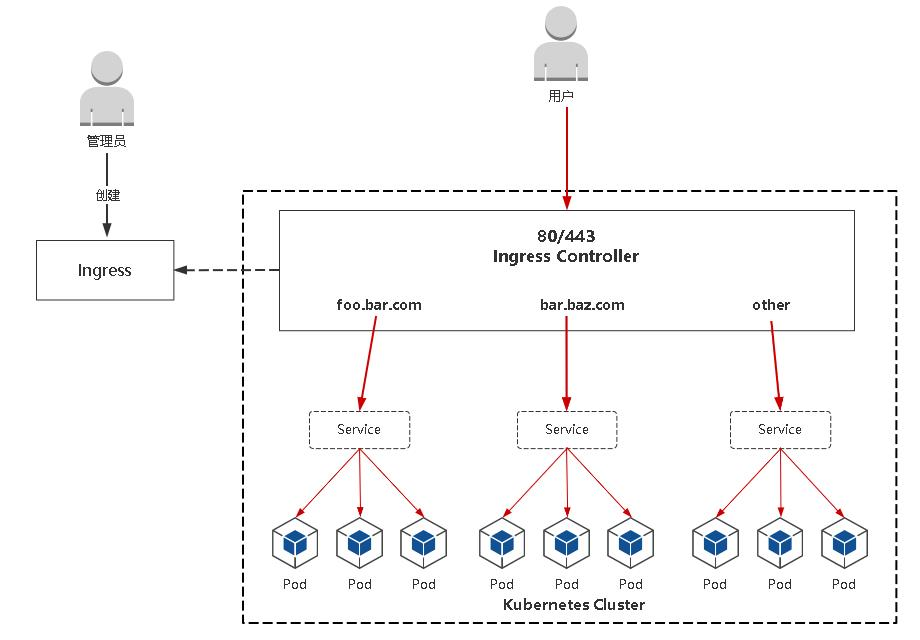

# Ingress

## Ingress是什么

NodePort存在的不足： 

- 一个端口只能一个服务使用，端口需提前规划
- 只支持4层负载均衡

Ingress公开了从集群外部到集群内服务的HTTP和HTTPS路由的规则集合，而具体实现流量路 由则是由Ingress Controller负责。



- `Ingress`：K8s中的一个抽象资源，给管理员 提供一个暴露应用的入口定义方法 
- `Ingress Controller`：根据Ingress生成具体 的路由规则，并对Pod负载均衡器

---

## `Ingress Controller`部署

Ingress Controller有很多实现，我们这里采用官方维护的Nginx控制器。

项目地址：https://github.com/kubernetes/ingress-nginx

官方文献：https://kubernetes.github.io/ingress-nginx

### 部署`Ingress`组件：
```shell
curl -o nginx-ingress.yaml https://raw.githubusercontent.com/kubernetes/ingress-nginx/controller-v0.44.0/deploy/static/provider/baremetal/deploy.yaml
kubectl apply -f nginx-ingress.yaml
```

查看状态
```shell
kubectl get pod -n ingress-nginx
NAME                                        READY   STATUS      RESTARTS   AGE
ingress-nginx-admission-create-nqhx5        0/1     Completed   0          21m
ingress-nginx-admission-patch-hcfpx         0/1     Completed   1          21m
ingress-nginx-controller-79b54d448c-l7c69   1/1     Running     0          21m
```


**注意事项：** 

- 镜像地址修改成国内的：bitnami/nginx-ingress-controller 
- 将Ingress Controller暴露，一般使用宿主机网络（hostNetwork: true）或者使用NodePort 

其他控制器：https://kubernetes.io/docs/concepts/services-networking/ingress-controllers/


### 部署`Ingress`服务

1. 创建：
` kubectl apply -f xxx.yaml `
2. 查看： 
` kubectl get ingress `

测试：本地电脑绑定hosts记录对应ingress里面配置的域名例：`<Ingress Controller Pod所在Node IP> foo.bar.com `

**示例**
```yaml
apiVersion: networking.k8s.io/v1
kind: Ingress 
metadata: 
  name: kuuun-host-ingress
spec: 
  rules: 
  - host: www.kuuun.com 
    http: 
      paths: 
      - path: "/"
        pathType: Prefix 
        backend: 
          service: 
            name: web 
            port: 
              number: 80
```