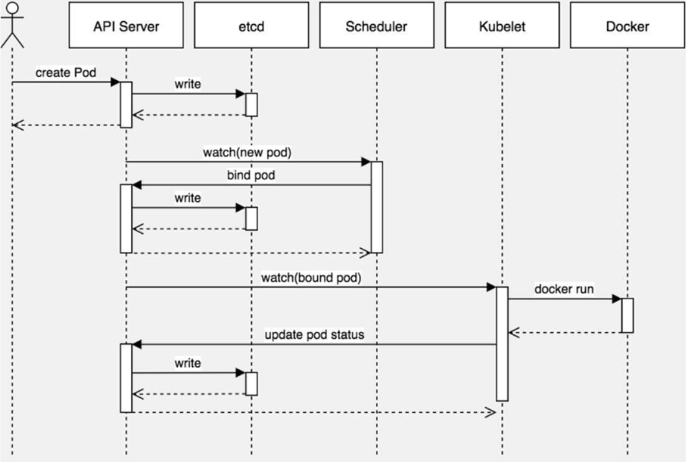

# 深入理解Pod对象：调度

## 创建一个Pod的工作流程

Kubernetes基于list-watch机制的控制器架构，实现组件间交互的解耦。其他组件监控自己负责的资源，当这些资源发生变化时，` kube apiserver `会通知这些组件，这个过程类似于发布与订阅。



## Pod中影响调度的主要属性
```yaml
apiVersion: apps/v1 
kind: Deployment 
metadata: 
  name: web 
  namespace: default 
spec: 
  ... 
  containers: 
  - image: lizhenliang/java-demo 
    name: java-demo 
    imagePullPolicy: Always 
    livenessProbe: 
      initialDelaySeconds: 30
      periodSeconds: 20 
      tcpSocket: 
        port: 8080
    # 调度资源
    resources: {}
  restartPolicy: Alway
  # 调度策略
  schedulerName: default-scheduler 
  nodeName: "" 
  nodeSelector: {} 
  affinity: {} 
  tolerations: []
```

## 资源配置对Pod的影响

**容器资源限制**
- resources.limits.cpu
- resources.limits.memory

**容器使用的最小资源需求**
作为容器调度时资 源分配的依据：
- resources.requests.cpu 
- resources.requests.memory

**示例：**
```yaml
apiVersion: v1 
kind: Pod 
metadata: 
  name: web 
spec:
  containers: 
  - name: web 
    image: nginx 
    resources:
      requests: 
        cpu: "250m"
        memory: "64Mi"
      limits:
        cpu: "500m"
        memory: "128Mi" 
```

注：
- cpu单位：1核为1，0.1=100M，例如：0.5可以写成500M

**节点资源使用情况查看**
```shell
kubectl describe nodes k8s-node1
Name:         web
Namespace:    default
Priority:     0
Node:         k8s-node1/172.16.4.11
Start Time:   Wed, 03 Mar 2021 21:31:58 +0800
Labels:       <none>
Annotations:  cni.projectcalico.org/podIP: 10.244.36.81/32
              cni.projectcalico.org/podIPs: 10.244.36.81/32
Status:       Running
IP:           10.244.36.81
IPs:
  IP:  10.244.36.81
Containers:
  web:
    Container ID:   docker://7675f31401fd68e8d8ec37d2e58b95506d98db3a77d70453aadcb19c05ad70e1
    Image:          nginx
    Image ID:       docker-pullable://nginx@sha256:10b8cc432d56da8b61b070f4c7d2543a9ed17c2b23010b43af434fd40e2ca4aa
    Port:           <none>
    Host Port:      <none>
    State:          Running
      Started:      Wed, 03 Mar 2021 21:32:00 +0800
    Ready:          True
    Restart Count:  0
    Limits:
      cpu:     500m
      memory:  128Mi
    Requests:
      cpu:        250m
      memory:     64Mi
    Environment:  <none>
    Mounts:
      /var/run/secrets/kubernetes.io/serviceaccount from default-token-nwclr (ro)
Conditions:
  Type              Status
  Initialized       True
  Ready             True
  ContainersReady   True
  PodScheduled      True
Volumes:
  default-token-nwclr:
    Type:        Secret (a volume populated by a Secret)
    SecretName:  default-token-nwclr
    Optional:    false
QoS Class:       Burstable
Node-Selectors:  <none>
Tolerations:     node.kubernetes.io/not-ready:NoExecute op=Exists for 300s
                 node.kubernetes.io/unreachable:NoExecute op=Exists for 300s
Events:
  Type    Reason     Age        From                Message
  ----    ------     ----       ----                -------
  Normal  Scheduled  13s                            Successfully assigned default/web to k8s-node1
  Normal  Pulling    <invalid>  kubelet, k8s-node1  Pulling image "nginx"
  Normal  Pulled     <invalid>  kubelet, k8s-node1  Successfully pulled image "nginx" in 745.259882ms
  Normal  Created    <invalid>  kubelet, k8s-node1  Created container web
  Normal  Started    <invalid>  kubelet, k8s-node1  Started container web
root@k8s-master:~#
root@k8s-master:~# kubectl describe nodes k8s-node1
Name:               k8s-node1
Roles:              <none>
Labels:             beta.kubernetes.io/arch=amd64
                    beta.kubernetes.io/os=linux
                    kubernetes.io/arch=amd64
                    kubernetes.io/hostname=k8s-node1
                    kubernetes.io/os=linux
Annotations:        kubeadm.alpha.kubernetes.io/cri-socket: /var/run/dockershim.sock
                    node.alpha.kubernetes.io/ttl: 0
                    projectcalico.org/IPv4Address: 172.16.4.11/24
                    projectcalico.org/IPv4IPIPTunnelAddr: 10.244.36.64
                    volumes.kubernetes.io/controller-managed-attach-detach: true
CreationTimestamp:  Tue, 02 Mar 2021 14:05:32 +0800
Taints:             <none>
Unschedulable:      false
Lease:
  HolderIdentity:  k8s-node1
  AcquireTime:     <unset>
  RenewTime:       Wed, 03 Mar 2021 21:32:54 +0800
Conditions:
  Type                 Status  LastHeartbeatTime                 LastTransitionTime                Reason                       Message
  ----                 ------  -----------------                 ------------------                ------                       -------
  NetworkUnavailable   False   Tue, 02 Mar 2021 17:40:47 +0800   Tue, 02 Mar 2021 17:40:47 +0800   CalicoIsUp                   Calico is running on this node
  MemoryPressure       False   Wed, 03 Mar 2021 21:30:54 +0800   Tue, 02 Mar 2021 14:49:17 +0800   KubeletHasSufficientMemory   kubelet has sufficient memory available
  DiskPressure         False   Wed, 03 Mar 2021 21:30:54 +0800   Tue, 02 Mar 2021 14:49:17 +0800   KubeletHasNoDiskPressure     kubelet has no disk pressure
  PIDPressure          False   Wed, 03 Mar 2021 21:30:54 +0800   Tue, 02 Mar 2021 14:49:17 +0800   KubeletHasSufficientPID      kubelet has sufficient PID available
  Ready                True    Wed, 03 Mar 2021 21:30:54 +0800   Tue, 02 Mar 2021 14:58:26 +0800   KubeletReady                 kubelet is posting ready status. AppArmor enabled
Addresses:
  InternalIP:  172.16.4.11
  Hostname:    k8s-node1
Capacity:
  cpu:                4
  ephemeral-storage:  51340768Ki
  hugepages-1Gi:      0
  hugepages-2Mi:      0
  memory:             4015844Ki
  pods:               110
Allocatable:
  cpu:                4
  ephemeral-storage:  47315651711
  hugepages-1Gi:      0
  hugepages-2Mi:      0
  memory:             3913444Ki
  pods:               110
System Info:
  Machine ID:                 f214eaa869554b7c89f6243e453580ff
  System UUID:                00F00D42-D205-251A-C711-319D2B6ECA8F
  Boot ID:                    4df7970a-68ac-43e9-a0d5-4fe09f7812e5
  Kernel Version:             4.15.0-135-generic
  OS Image:                   Ubuntu 18.04.5 LTS
  Operating System:           linux
  Architecture:               amd64
  Container Runtime Version:  docker://19.3.15
  Kubelet Version:            v1.19.0
  Kube-Proxy Version:         v1.19.0
PodCIDR:                      10.244.1.0/24
PodCIDRs:                     10.244.1.0/24
Non-terminated Pods:          (5 in total)
  Namespace                   Name                                          CPU Requests  CPU Limits  Memory Requests  Memory Limits  AGE
  ---------                   ----                                          ------------  ----------  ---------------  -------------  ---
  default                     web                                           250m (6%)     500m (12%)  64Mi (1%)        128Mi (3%)     64s
  kube-system                 calico-node-2qnqz                             250m (6%)     0 (0%)      0 (0%)           0 (0%)         30h
  kube-system                 kube-proxy-zwzsb                              0 (0%)        0 (0%)      0 (0%)           0 (0%)         31h
  kubernetes-dashboard        dashboard-metrics-scraper-7b59f7d4df-55hm5    0 (0%)        0 (0%)      0 (0%)           0 (0%)         30h
  kubernetes-dashboard        kubernetes-dashboard-5dbf55bd9d-r59fd         0 (0%)        0 (0%)      0 (0%)           0 (0%)         30h
Allocated resources:
  (Total limits may be over 100 percent, i.e., overcommitted.)
  Resource           Requests    Limits
  --------           --------    ------
  cpu                500m (12%)  500m (12%)
  memory             64Mi (1%)   128Mi (3%)
  ephemeral-storage  0 (0%)      0 (0%)
  hugepages-1Gi      0 (0%)      0 (0%)
  hugepages-2Mi      0 (0%)      0 (0%)
Events:              <none>
```

---
---

## 节点选择与节点亲和

### 节点选择（nodeSelector）

>用于将Pod调度到匹配Label的Node上，如果没有匹配的标签会调度失败。

**作用：**
- 约束Pod到特定的节点运行 
- 完全匹配节点标签 

**应用场景：** 
- 专用节点：根据业务线将Node分组管理 
- 配备特殊硬件：部分Node配有SSD硬盘、GPU

**节点标签**

添加标签：
格式：` kubectl label nodes <node-name> <label-key>=<label-value> `

例如：
```shell
kubectl label nodes k8s-node1 disktype=ssd
```
查看：
```shell
kubectl get nodes --show-labels
```
移除：
```shell
kubectl label nodes k8s-node1 disktype-
```

**示例配置**
```yaml
apiVersion: v1
kind: Pod
metadata:
  name: nginx
  labels:
    env: test
spec:
  containers:
  - name: nginx
    image: nginx
    imagePullPolicy: IfNotPresent
  nodeSelector:
    disktype: ssd
```

### 节点亲和（nodeAffinity）

>节点亲和性，与nodeSelector作用一样，但相比 更灵活，满足更多条件

**特点：**
- 匹配有更多的逻辑组合，不只是字符串的完全相等 
- 调度分为软策略和硬策略，而不是硬性要求 
  - 硬（required）：必须满足 
  - 软（preferred）：尝试满足，但不保证

操作符：In、NotIn、Exists、DoesNotExist、Gt、Lt

**示例1：**
```yaml
apiVersion: v1
kind: Pod
metadata:
  name: nginx
spec:
  affinity:
    nodeAffinity:
      preferredDuringSchedulingIgnoredDuringExecution:
      - weight: 1
        preference:
          matchExpressions:
          - key: disktype
            operator: In
            values:
            - ssd          
  containers:
  - name: nginx
    image: nginx
    imagePullPolicy: IfNotPresent
```

**示例2：**
```yaml
apiVersion: v1
kind: Pod
metadata:
  name: nginx
spec:
  affinity:
    nodeAffinity:
      requiredDuringSchedulingIgnoredDuringExecution:
        nodeSelectorTerms:
        - matchExpressions:
          - key: disktype
            operator: In
            values:
            - ssd            
  containers:
  - name: nginx
    image: nginx
    imagePullPolicy: IfNotPresent
```
---
## 污点（Taint）与容忍（Tolerations）

- ` Taint `：避免Pod调度到特定Node上。
- ` Tolerations `：允许Pod调度到持有Taint的Node上，表示了对污点的容忍。

**应用场景：**
- 专用节点：根据业务线将Node分组管理，希望在默认情况下不调度该节点，只有配置了污点容忍才允许分配 
- 配备特殊硬件：部分Node配有SSD硬盘、GPU，希望在默认情况下不调度该节点，只有配置了污点容忍才允许分配
- 基于Taint的驱逐

**查看**
```shell
# master在初始化时默认的污点
kubectl describe nodes k8s-master |grep Taint
Taints:             node-role.kubernetes.io/master:NoSchedule
```

**添加**

语法格式：
```shell
kubectl taint node [node] key=value:[effect] 
```
` effect `可选值：
- ` NoSchedule `：一定不能被调度
- ` PreferNoSchedule `：尽量不要调度，非必须配置容忍
- ` NoExecute `：不仅不会调度，还会驱逐Node上已有的Pod

示例：
```shell
kubectl taint node k8s-node1  key1=value1:NoSchedule
```

**移除**
```shell
kubectl taint node k8s-node1  key1=value1:NoSchedule-
```

**示例YAML:**
```shell
apiVersion: v1
kind: Pod
metadata:
  name: nginx
  labels:
    env: test
spec:
  containers:
  - name: nginx
    image: nginx
    imagePullPolicy: IfNotPresent
  tolerations:
  - key: "key1"
    operator: "Equal"
    effect: "value1"
```
---
## 指定调度节点

>nodeName：指定节点名称，用于将Pod调度到指定的Node上，不经过调度器

**示例YAML**
```yaml
apiVersion: v1 
kind: Pod 
metadata: 
name: pod-example labels: 
app: nginx 
spec: 
  nodeName: k8s-node2 
  containers: 
  - name: nginx 
    image: nginx:1.15
```
