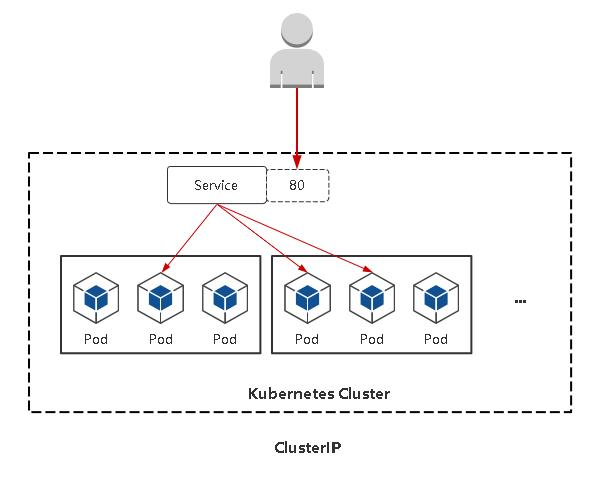
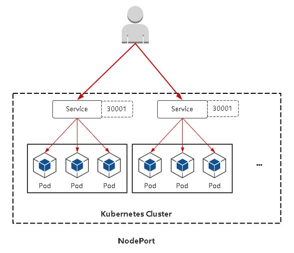
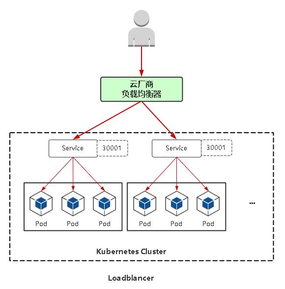

# 深入理解Service

## Service存在的意义

>Service引入主要是解决Pod的动态变化，提供统一访问入口： 

- 防止Pod失联，准备找到提供同一个服务的Pod（服务发现）
- 定义一组Pod的访问策略（负载均衡）

**Pod与Service的关系**
- Service通过标签关联一组Pod 
- Service使用iptables或者ipvs为一组Pod提供负载均衡能力


## Service定义与创建

**示例配置**
```yaml
apiVersion: v1
kind: Service
metadata:
  labels:
    app: web
  name: default
spec:
  ports:
    # 端口
  - port: 80
    # 协议
    protocol: TCP
    # 目标容器端口
    targetPort: 80
  # 标签选择器
  selector:
    # 指定关联Pod的标签
    app: nginx
  # 服务类型
  type: ClusterIP
```

**创建**
```shell
kubectl apply -f example-service.yaml
```

**查看**
```shell
kubectl get service
# 查看后端绑定的pod
# kubectl get ep
kubectl get endpoints
NAME         ENDPOINTS                                          AGE
kubernetes   172.16.4.64:6443                                   4h27m
web          10.109.131.5:80,10.109.131.6:80,10.111.156.68:80   3h39m
```

## Service使用NodePort对外暴露应用

### Service三种常用类型

- ` ClusterIP `：集群内部使用 
- ` NodePort `：对外暴露应用（集群外） 
- ` LoadBalancer `：对外暴露应用，适用公有云


**ClusterIP**

默认，分配一个稳定的IP地址，即VIP，只能在集群内部访问。

```shell
spec: 
  type: ClusterIP ports: 
  - ports: 80           
    protocol: TCP 
    targetPort: 80 
  selector: 
    app: web
```



**NodePort**

NodePort：在每个节点上启用一个端口来暴露服务，可以在集群 外部访问。也会分配一个稳定内部集群IP地址。 
访问地址：<任意NodeIP>:<NodePort> 
端口范围：30000-32767

```shell
spec:
type: NodePort
ports:
  - port: 80        
    protocol: TCP
    targetPort: 80
    nodePort: 30009
selector:
  app: web
```



` NodePort `会在每台Node上监听端口接收用户流量，在实际情况下，对用户暴露的只会有一个IP和端口，那这么多台Node该使用哪台让用户访问呢？ 这时就需要前面加一个公网负载均衡器为项目提供统一访问入口了

**LoadBalancer**

与NodePort类似，在每个节点上启用一个端口来暴 露服务。除此之外，Kubernetes会请求底层云平台（例如阿里云、腾 讯云、AWS等）上的负载均衡器，将每个Node（[NodeIP]:[NodePort]）作为后端添加进去。



## Service负载均衡实现之Iptables


## Service负载均衡实现之IPVS

iptables 转换为 IPVS

1. kubeadm方式修改ipvs模式：

```shell
# kubectl edit configmap kube-proxy -n kube-system
mode: "ipvs"
... 
# kubectl delete pod kube-proxy-btz4p -n kube-system
```
注： 
1、kube-proxy配置文件以configmap方式存储 
2、如果让所有节点生效，需要重建所有节点` kube-proxy pod `

2. 二进制方式修改ipvs模式

```shell
# vi kube-proxy-config.yml 
mode: ipvs 
ipvs: 
scheduler: "rr" 
# systemctl restart kube-proxy
```

注：参考不同资料，文件名可能不同。