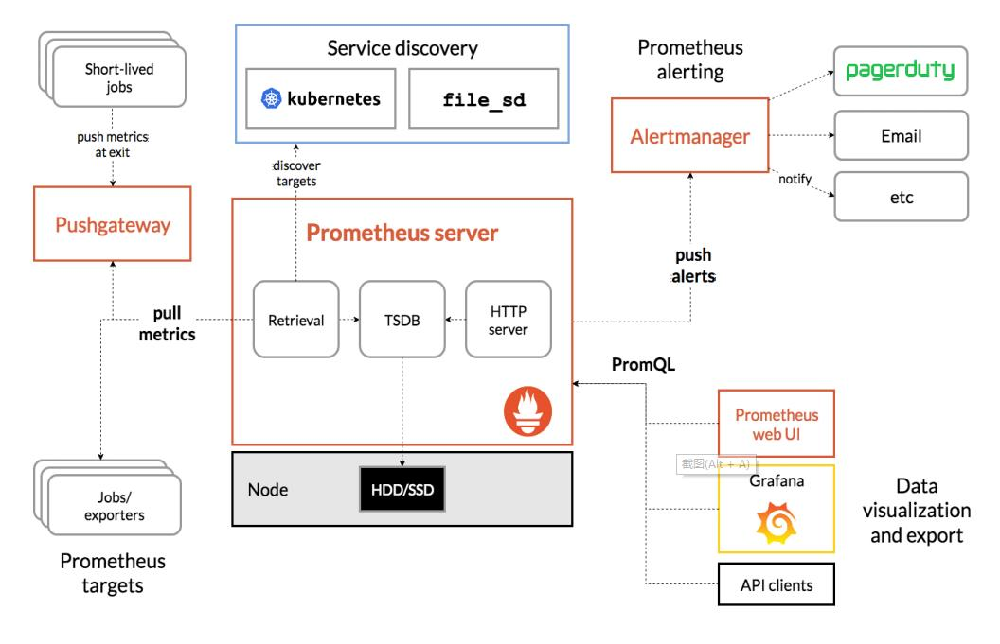
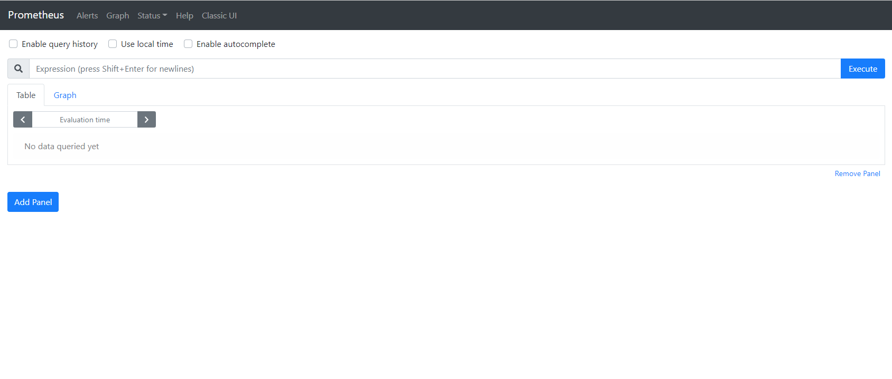
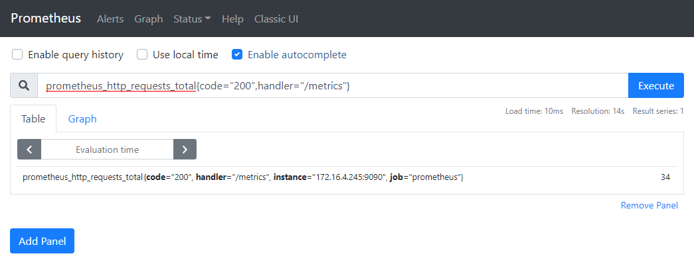
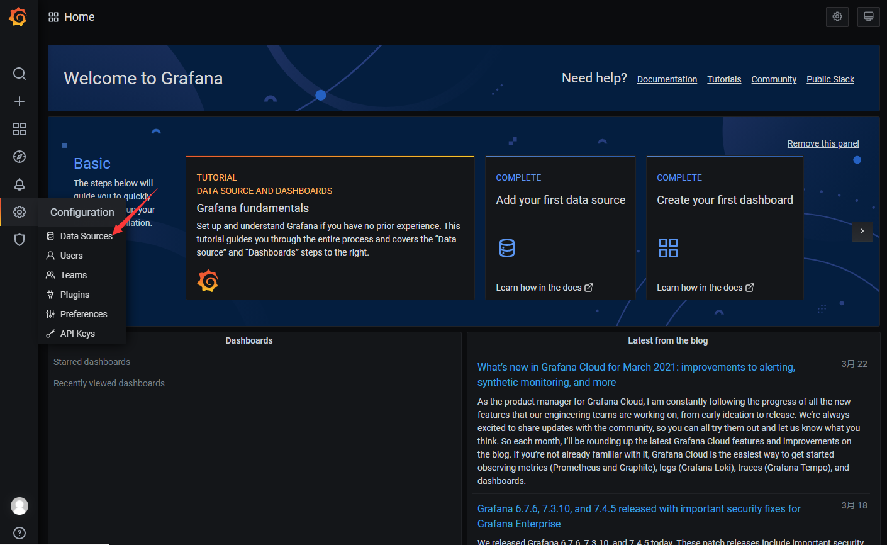
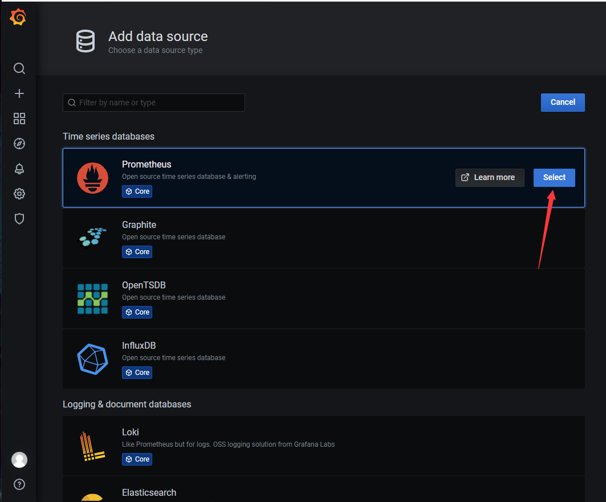
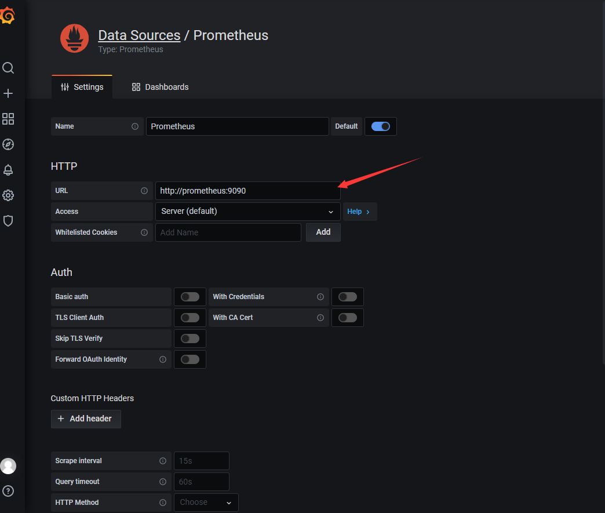
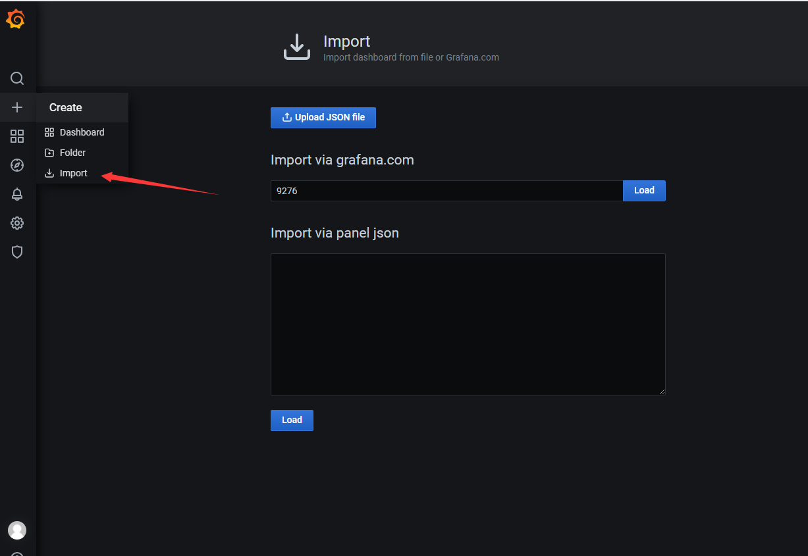
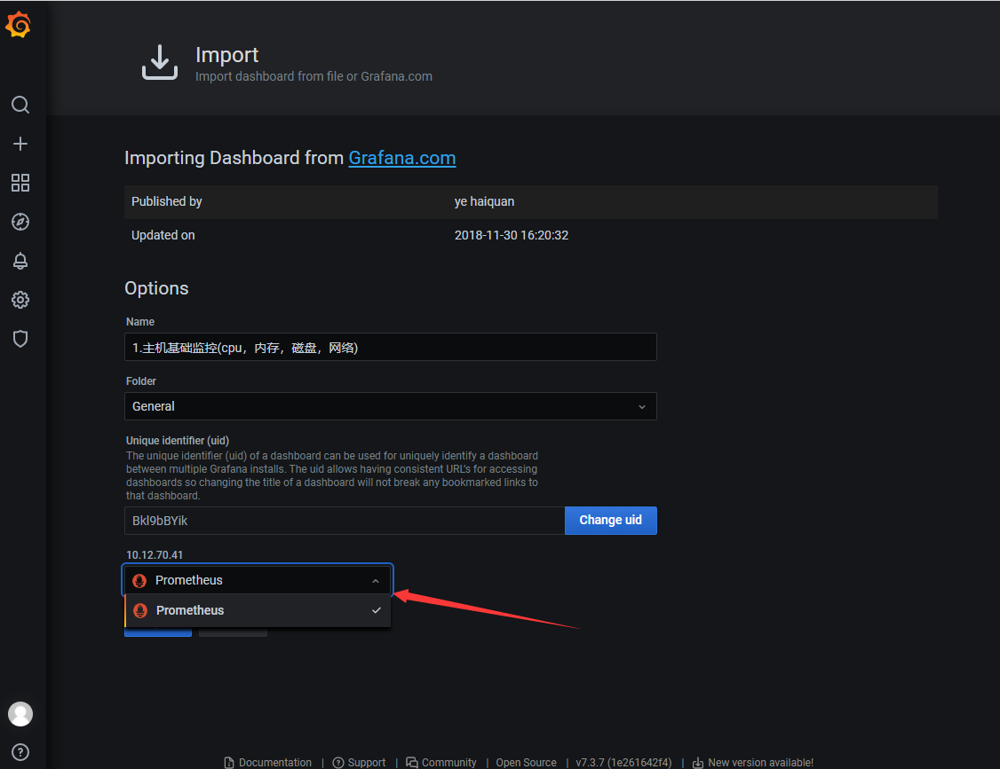
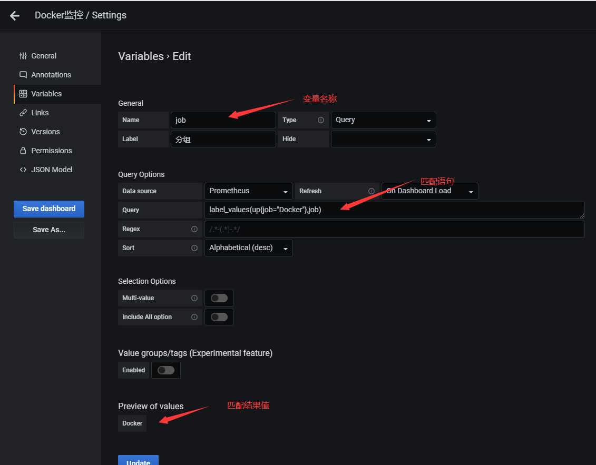

# Prometheus

普罗米修斯是一个开源系统监控和警报工具包，最初建于声云。自 2012 年成立以来，许多公司和组织都采用了 Prometheus，该项目拥有非常活跃的开发人员和用户社区。它现在是一个独立的开源项目，独立于任何公司维护。为了强调这一点，并澄清项目的治理结构，普罗米修斯于2016年加入云原生计算基金会，成为继Kubernetes之后的第二个托管项目。

官方网站：https://prometheus.io

Github：https://github.com/prometheus

# 概述与架构

## 特点

- 多维数据模型：由度量名称和键值对标识的时间序列数据 
- PromQL：一种灵活的查询语言，可以利用多维数据完成复杂的查询
- 不依赖分布式存储，单个服务器节点可直接工作 
- 基于HTTP的pull方式采集时间序列数据 
- 推送时间序列数据通过PushGateway组件支持 
- 通过服务发现或静态配置发现目标 
- 多种图形模式及仪表盘支持（grafana）


## 组件与架构



- Prometheus Server：收集指标和存储时间序列数据，并提供查询接口
- ClientLibrary：客户端库
- Push Gateway：短期存储指标数据。主要用于临时性的任务
- Exporters：采集已有的第三方服务监控指标并暴露metrics
- Alertmanager：告警
- Web UI：简单的Web控制台

---

# 部署与配置

## 部署

### 二进制部署

#### 1. 准备安装包
```shell
curl -o prometheus-2.25.2.linux-amd64.tar.gz https://github.com/prometheus/prometheus/releases/download/v2.25.2/prometheus-2.25.2.linux-amd64.tar.gz
tar xf prometheus-2.25.2.linux-amd64.tar.gz
mv prometheus-2.25.2.linux-amd64 /opt/prometheus
chmod +x /opt/prometheus/prometheus
chmod +x /opt/prometheus/promtool
ln -sf /opt/prometheus/prometheus /usr/bin/prometheus
ln -sf /opt/prometheus/promtool /usr/bin/promtool
```

#### 2. 创建相关目录
```shell
# 创建配置文件存放目录
mkdir -p /opt/prometheus/conf
# 创建数据存放目录
mkdir -p /opt/prometheus/data
```

#### 3. 配置`prometheus.yml`示例
```yaml
# 全局配置
global:
  scrape_interval:     15s
  evaluation_interval: 15s
# 告警配置
alerting:
  alertmanagers:
  - static_configs:
    - targets:
      # - alertmanager:9093
# 规则配置
rule_files:
  # - "first_rules.yml"
  # - "second_rules.yml"
# 采集配置
scrape_configs:
  - job_name: 'prometheus'
    static_configs:
    - targets: ['localhost:9090']
```

#### 4. 配置`systemd`
```shell
cat >/usr/lib/systemd/system/prometheus.service <<EOF
[Unit]
Description=prometheus
[Service]
ExecStart=/opt/prometheus/prometheus --config.file=/opt/prometheus/conf/prometheus.yml --storage.tsdb.path=/opt/prometheus/data/ --storage.tsdb.retention.time=30d
ExecReload=/bin/kill -HUP $MAINPID
KillMode=process
Restart=on-failure
[Install]
WantedBy=multi-user.target
EOF
systemctl daemon-reload 
systemctl start prometheus 
systemctl enable prometheus
```

#### 4. 验证
  
通过浏览器访问默认端口为`9090`



#### 5. `prometheus`命令常用参数选项
<br>

| 参数选项                               | 描述                   |
| -------------------------------------- | ---------------------- |
| `--config.file="prometheus.yml"`       | 指定配置文件           |
| `--web.listen-address= "0.0.0.0:9090"` | 监听地址和端口         |
| `--log.level=info`                     | 日志级别               |
| `--alertmanager.timeout=10s`           | 与报警组件的超时时间   |
| `--storage.tsdb.path="data/"`          | 数据目录               |
| `--storage.tsdb.retention.time=15d`    | 数据保存时间，默认15天 |


---
### Docker部署

#### docker命令行
```shell
docker run \
    -p 9090:9090 \
    -v $PWD/prometheus.yml:/etc/prometheus/prometheus.yml \
    prom/prometheus
```

#### docker-compose
```yaml
version: "3.6"
services:
  prometheus:
    image: prom/prometheus
    container_name: prometheus
    restart: always
    ports:
      - "9090:9090"
    command:
      - --config.file=/etc/prometheus/prometheus.yml
      - --storage.tsdb.path=/prometheus
      - --storage.tsdb.retention.time=60d
      - --web.console.libraries=/usr/share/prometheus/console_libraries
      - --web.console.templates=/usr/share/prometheus/consoles
      - --web.enable-lifecycle
    volumes:
      - ./prometheus/conf:/etc/prometheus
      - ./prometheus/data:/prometheus
```

---

## 配置文件

官方配置文献：https://prometheus.io/docs/prometheus/latest/configuration/configuration/

```yaml
global:
  # How frequently to scrape targets by default.
  [ scrape_interval: <duration> | default = 1m ]

  # How long until a scrape request times out.
  [ scrape_timeout: <duration> | default = 10s ]

  # How frequently to evaluate rules.
  [ evaluation_interval: <duration> | default = 1m ]

  # The labels to add to any time series or alerts when communicating with
  # external systems (federation, remote storage, Alertmanager).
  external_labels:
    [ <labelname>: <labelvalue> ... ]

  # File to which PromQL queries are logged.
  # Reloading the configuration will reopen the file.
  [ query_log_file: <string> ]

# Rule files specifies a list of globs. Rules and alerts are read from
# all matching files.
rule_files:
  [ - <filepath_glob> ... ]

# A list of scrape configurations.
scrape_configs:
  [ - <scrape_config> ... ]

# Alerting specifies settings related to the Alertmanager.
alerting:
  alert_relabel_configs:
    [ - <relabel_config> ... ]
  alertmanagers:
    [ - <alertmanager_config> ... ]

# Settings related to the remote write feature.
remote_write:
  [ - <remote_write> ... ]

# Settings related to the remote read feature.
remote_read:
  [ - <remote_read> ... ]
```

---

## 监控指标数据模型

### 数据模型： 
- Prometheus将所有数据存储为时间序列
- 具有相同度量名称以及标签属于同一个指标
- 每个时间序列都由度量标准名称和一组键值对（称为标签）唯一标识， 通过标签查询指定指标。 

### 指标格式： 
`<metric name>{<label name>=<label value>,...}`
**示例**
```shell
prometheus_http_requests_total{code="200",handler="/metrics"}
```


---

# Grafana

>官网地址：https://grafana.com/
>
>官方文档：https://grafana.com/docs/grafana/latest/

## 部署Grafana数据可视化

### 二进制部署

#### 1. 准备安装包

```shell
wget https://dl.grafana.com/oss/release/grafana-7.4.5.linux-amd64.tar.gz
tar -zxvf grafana-7.4.5.linux-amd64.tar.gz
```

#### 2. 配置系统服务`systemd`
```shell
cat > /usr/lib/systemd/system/grafana.service << EOF
[Unit]
Description=grafana
[Service]
ExecStart=/opt/monitor/grafana/bin/grafana-server -homepath=/opt/monitor/grafana
ExecReload=/bin/kill -HUP $MAINPID
KillMode=process
Restart=on-failure
[Install]
WantedBy=multi-user.target
EOF
systemctl daemon-reload 
systemctl start prometheus 
systemctl enable prometheus
```

### docker部署


**docker-compose.yaml示例**
```shell
version: "3.6"
services:
  grafana:
    image: grafana/grafana
    container_name: grafana
    restart: always
    ports:
      - "3000:3000"
    user: "472"
    volumes:
      - ./grafana/data:/var/lib/grafana
      - ./grafana/log:/var/log/grafana
```

## 验证

默认端口为`3000`，账号：`admin`，密码：`admin`。


## 添加数据源



`Grafana`支持大量数据来源，这里添加选择`Prometheus`



输入`Prometheus`访问地址，保存测试，返回页面




---

# 监控案例

通过安装采集插件，采集相关信息到`Prometheus`中，做数据汇总。

插件文档参考：https://prometheus.io/docs/instrumenting/exporters/
## 监控Linux服务器

安装采集插件`node_exporter`，用于监控Linux系统的指标采集器。

Github地址：https://github.com/prometheus/node_exporter

### 二进制部署

```shell
cat > /usr/lib/systemd/system/node_exporter.service << EOF
[Unit] 
Description=node_exporter
 
[Service]
ExecStart=/usr/local/node_exporter/node_exporter --web.config=/usr/local/node_exporter/web-config.yml
ExecReload=/bin/kill -HUP $MAINPID
KillMode=process
Restart=on-failure
 
[Install] 
WantedBy=multi-user.target
EOF
systemctl daemon-reload 
systemctl start node_exporter 
systemctl enable node_exporter
```


### docker部署`node_exporter`

配置密码加密访问
```yaml
# Usernames and hashed passwords that have full access to the web
# server via basic authentication. If empty, no basic authentication is
# required. Passwords are hashed with bcrypt.+
basic_auth_users:
  [ <string>: <secret> ... ]
```
加密方法
```shell
# yum install httpd-tools -y
# htpasswd -nBC 12 "" | tr -d ':\n'
# 对密码123456进行加密
New password:
Re-type new password:
$2y$12$J517vkthd0JNgIxcJ1mIgeLR/oPU06.2WvlGeMmsEbJuuSrnuYBUO
```
配置`web-config.yml`示例
```shell
cat > web-config.yml << EOF
basic_auth_users:
  prometheus: $2y$12$J517vkthd0JNgIxcJ1mIgeLR/oPU06.2WvlGeMmsEbJuuSrnuYBUO
EOF
```


`docker-compose.yaml`示例：
```shell
cat > docker-compose.yaml << EOF
version: '3.3'

services:
  node_exporter:
    image: prom/node-exporter:latest
    container_name: node_exporter
    command:
      - '--path.rootfs=/host'
      - '--web.config=/web-config.yml'
      - '--web.listen-address=:9100'
    network_mode: host
    pid: host
    restart: unless-stopped
    volumes:
      - '/:/host:ro,rslave'
      - './conf/web-config.yml:/web-config.yml:ro'
EOF
```

监听端口为：`9100`

### 配置`Prometheus`

**参考配置结构**
```yaml
... ...
scrape_configs:
  - job_name: node
    basic_auth:
      username: prometheus
      password: 123456
    static_configs:
    - targets: ['172.16.4.245:9100']
```
重启服务`docker-compose restart`

### 使用`Grafana`展示`node_exporter`数据指标

推荐使用模板ID：9276



配置数据源




### 采集系统服务

`node_exporter`插件增加参数选项
```shell
 --collector.systemd
 --collector.systemd.unit-whitelist="(docker|sshd|nginx)\.service"
#  新版本已更换参数名称
#  --collector.systemd.unit-include="(docker|sshd|nginx)\.service"
```

---

## 监控Docker容器

### cAdvisor

`cAdvisor`：用于收集正在运行的容器资源使用和性能信息。

项目地址：https://github.com/google/cadvisor

推荐仪表盘ID：193


```shell
cat > docker-compose.yaml << EOF
version: "3.6"

services:
  cadvisor:
    image: google/cadvisor:latest
    container_name: cadvisor
    restart: unless-stopped
    ports:
      - "8080:8080"
    volumes:
      - /:/rootfs:ro
      - /var/run:/var/run:ro
      - /sys:/sys:ro
      - /var/lib/docker/:/var/lib/docker:ro
      - /dev/disk/:/dev/disk:ro
EOF
```

### 变量的使用



---

## 监控MySQL

`mysqld_exporter`：MySQL数据库监控

Github地址：https://github.com/prometheus/mysqld_exporter


### 授权

```sql
CREATE USER 'exporter'@'%' IDENTIFIED BY '123456' WITH MAX_USER_CONNECTIONS 3;
GRANT PROCESS,REPLICATION CLIENT, SELECT ON *.* TO 'exporter'@'%' IDENTIFIED BY '123456' WITH MAX_USER_CONNECTIONS 3;
```

### 部署

仪表盘推荐ID：7362

`docker-compose.yaml`示例
```shell
cat > docker-compose.yml << EOF
version: "3.6"

services:
  mysqld_exporter:
    image: prom/mysqld-exporter
    container_name: mysqld-exporter
    command:
      - --config.my-cnf=/.my.cnf
    ports:
      - "9104:9104"
    volumes:
      - ./conf/.my.cnf:/.my.cnf:ro
EOF
```
`.my.cnf`配置示例
```shell
cat > .my.cnf << EOF
[client]
host=127.0.0.1
port=3306
user=exporter 
password=123456
EOF
```

---

# 服务发现

**常用的服务发现类型**

- 基于文件的服务发现：
- 基于Consul的服务发现
- 基于Kubernetes的服务发现


官方文献地址：https://prometheus.io/docs/prometheus/latest/configuration/configuration/#consul_sd_config
官方文献地址：https://prometheus.io/docs/prometheus/latest/configuration/configuration/#kubernetes_sd_config

## 基于文件的服务发现

官方文献地址：https://prometheus.io/docs/prometheus/latest/configuration/configuration/#file_sd_config

### 1. 修改`Prometheus`服务端配置文件

```yaml
... ...
  - job_name: 'file_sd' 
    file_sd_configs: 
    - files: ['/etc/prometheus/file_sd/*.yml']
      # 每隔5秒检查一次
      refresh_interval: 5s 
```

### 2. 配置服务发现文件

```shell
cat > test.yml << EOF
- targets: ['192.168.31.63:9100']
EOF
```

---

## 基于Consul的服务发现

> Consul是一个分布式的服务发现和键/值存储系统。

### 基于docker安装

`Consul`默认访问端口为8500。

```shell
docker run --name consul -d -p 8500:8500 consul
```

建议使用高可用方案搭建。

参考地址：https://gitee.com/kuuun/learn-consul-docker

### 配置`Prometheus`，启用服务发现

```yaml
- job_name: 'consul' 
  consul_sd_configs: 
  - server: 172.16.4.245:8500
    services: ['service']
```

### 服务注册

```shell
curl -X PUT -d '{
  "id": "Linux-1",
  "name": "Linux",
  "address": "172.16.4.252",
  "port": 9100,
  "tags": ["Linux"],
  "checks": [
    {
      "http":"http://172.16.4.252:9100",
      "method":"GET",
      "interval": "5s",
      "timeout": "1s"
    }]
    }' http://172.16.4.245:8500/v1/agent/service/register
```

字段说明：

- id：等同于`Promethesu`中`instance`，是一个具体实例
- name：等同于`Promethesu`中`job`，分组的概念，一个组中可以多个实例
- check：进行健康检查，支持shell脚本

### 服务删除

```shell
curl -X PUT http://172.16.4.245:8500/v1/agent/service/deregister/<ID>
```