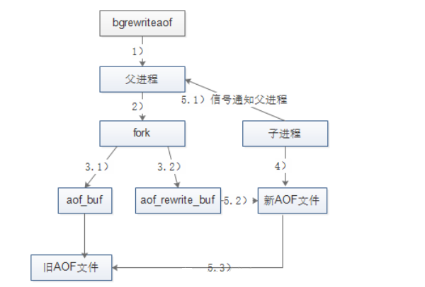

## Redis源码安装

```shell
# 编译
tar xf redis-6.2.1.tar.gz
cd redis-6.2.1
make
# 拷贝二进制文件
cp src/redis-server  /usr/bin/
cp src/redis-cli /usr/bin/
cp src/redis-sentinel /usr/bin/
# 拷贝配置文件
cp redis.conf /etc/
cp sentinel.conf /etc/
# redis前台启动
redis-server /etc/redis.conf
# redis后台启动，修改配置文件
# sed -i 's/daemonize no/daemonize yes/g' /etc/redis.conf
daemonize yes
# 关闭redis
killall -9 redis-server
```

---

## Redis二进制文件说明

- `redis-server`：Redis服务器的daemon启动程序
- `redis-cli`：Redis命令行操作工具。也可以用telnet根据其纯文本协议来操作
- `redis-benchmark`：Redis性能测试工具，测试Redis在当前系统下的读写性能
- `redis-check-aof`：数据修复
- `redis-check-dump`：检查导出工具 

---

## Redis内存分配优化

```shell
# `sysctl vm.overcommit_memory=1`或执行`echo vm.overcommit_memory=1 >>/proc/sys/vm/overcommit_memory`
echo vm.overcommit_memory=1 >> /etc/sysctl.conf
```
  
使用数字含义：
- 0，表示内核将检查是否有足够的可用内存供应用进程使用；如果有足够的可用内存，内存申请允许；否则，内存申请失败，并把错误返回给应用进程。
- 1，表示内核允许分配所有的物理内存，而不管当前的内存状态如何。
- 2，表示内核允许分配超过所有物理内存和交换空间总和的内存 

---

## Redis远程连接命令

```shell
redis-cli -h 1.1.1.1 -p 6379
```

---

## Redis配置说明

```shell
bind 127.0.0.1
# 指定redis只接收来自IP对应网卡的请求，如果不进行设置，那么将处理所有请求。
# bind绑定的是本机的IP地址，准确的说是本机的网卡对应的IP地址，每一个网卡都有一个IP地址，
# 可以设置绑定到哪块网卡上，如果指定了bind，则说明只允许来自指定网卡的Redis请求。
# 如果没有指定，就说明可以接受来自任意一个网卡的Redis请求。
# 注意，此参数不是设置redis允许来自其他计算机请求的客户端IP地址。

protected-mode yes
# 此参数是redis3.2版本之后加入的新特性，默认是yes，即开启。
# 这是为了禁止公网直接访问redis新增的设定，用于加强redis安全的。
# protected-mode在启用状态，redis无法提供对外连接。
# 
# 要启用redis对外连接功能，有如下两种方法：
# 1）关闭protected-mode模式
# 2）开启protected-mode保护模式时，必须设置访问密码或配置bind IP

tcp-backlog 511
# 此参数确定了TCP连接中已完成队列(完成三次握手之后)的长度， 默认是511。
# 当然此值不能大于Linux系统定义的/proc/sys/net/core/somaxconn值，而Linux的默认参数值是128。
# 当系统并发量大并且客户端速度缓慢的时候，可以将这二个参数一起设定为一个一样的值。
# 对于负载很大的服务程序来说，默认128太少。一般会将它修改为2048或者更大。
# 在/etc/sysctl.conf中添加:net.core.somaxconn = 2048，然后在终端中执行sysctl -p。

daemonize yes
# 是否以后台daemon方式运行。

pidfile /var/run/redis.pid
# 当Redis以守护进程方式运行时，Redis默认会把pid写入/var/run/redis.pid文件，可以通过pidfile指定。

port 6379
# 指定Redis监听端口，默认端口为6379。

timeout 300
# 当客户端闲置多长时间后关闭连接，如果指定为0，表示服务端不会主动断开连接。

loglevel verbose
# 指定日志记录级别，Redis总共支持四个级别：debug、verbose、notice、warning，默认为verbose。

Logfile
# 日志记录方式，默认为标准输出，可指定一个文件，将日志输出到这里。

databases 16
# 设置开启数据库的数量，默认数据库为0。

save 900 1
save 300 10
save 60 10000
# 持久化机制设置
# save表示在一定时间内执行一定数量的写操作时，自动保存快照。可设置多个条件。
# 900 秒内如果至少有 1 个 key 的值变化，则保存
# 300 秒内如果至少有 10 个 key 的值变化，则保存
# 60 秒内如果至少有 10000 个 key 的值变化，则保存
# 注意：也可以注释掉所有的 save 行来停用保存功能。

rdbcompression yes
# 指定存储至本地数据库时是否压缩数据，默认为yes。
# Redis采用LZF压缩，如果为了节省CPU时间，可以关闭该选项，但会导致数据库文件变的巨大

dbfilename dump.rdb
# 数据持久化文件，数据快照文件名（只是文件名，不包括目录）

dir ./ 
# 数据快照的保存目录（这个是目录）

slaveof 192.168.1.100 6379
# 设置当本机为slave服务时，设置master服务的IP地址及端口，在Redis启动时，它会自动从master进行数据同步

appendonly no
# 是否开启appendonlylog，开启的话每次写操作会记一条log，这会提高数据抗风险能力，但影响效率。
# Redis在默认情况下是异步的把数据写入磁盘，如果不开启，可能会在断电时导致一段时间内的数据丢失。
# 因为 redis本身同步数据文件是按上面save条件来同步的，所以有的数据会在一段时间内只存在于内存中。默认为no。

appendfilename appendonly.aof
# 指定更新日志文件名，默认为appendonly.aof

appendfsync  everysec
# 指定更新日志条件，共有3个可选值：
# no：表示等操作系统进行数据缓存同步到磁盘（快）
# always：表示每次更新操作后手动调用fsync()将数据写到磁盘（慢，安全）
# everysec：表示每秒同步一次（折衷，默认值）

maxmemory 8G
# 指定Redis最大内存限制，Redis在启动时会把数据加载到内存中，达到最大内存后，Redis会先尝试清除已到期或
# 即将到期的Key，当此方法处理后，仍然到达最大内存设置，将无法再进行写入操作，但仍然可以进行读取操作。
# Redis新的vm机制，会把Key存放内存，Value会存放在swap区。

maxclients 128
# 设置同一时间最大客户端连接数，默认无限制。
# Redis可以同时打开的客户端连接数为Redis进程可以打开的最大文件描述符数，如果设置 maxclients 0，表示不作限制。
# 当客户端连接数到达限制时，Redis会关闭新的连接并向客户端返回max number of clients reached错误信息。

```
---

## Redis判断客户端和服务器连接是否正常

```shell
172.16.4.64:6379> ping
PONG
```
---
## Redis状态信息查看

```shell
127.0.0.1:6379> info
```
结果会返回 `Server`、`Clients`、`Memory`、`Persistence`、`Stats`、`Replication`、`CPU`、`Keyspace` 8个部分。从info大返回结果中提取相关信息，就可以达到有效监控的目的。

| 数值                             | 描述                                                                                           |
| -------------------------------- | ---------------------------------------------------------------------------------------------- |
| **---Memory---**                 |                                                                                                |
| used_memory:821848               | 由 Redis 分配器分配的内存总量，包含了redis进程内部的开销和数据占用的内存，以字节（byte）为单位 |
| used_memory_human:802.59K        |                                                                                                |
| used_memory_rss:85532672         | 操作系统为Redis进程分配的内存总量。与 top 、 ps等命令的输出一致。                              |
| used_memory_peak:178987632       | redis的内存消耗峰值(以字节为单位)                                                              |
| used_memory_peak_human:170.70M   | 已更直观的单位展示向操作系统申请的内存大小。                                                   |
| used_memory_lua:33792            |                                                                                                |
| mem_fragmentation_ratio:104.07   | 内存碎片比率                                                                                   |
| mem_allocator:tcmalloc-2.0       |                                                                                                |
| **---Persistence---**            |                                                                                                |
| loading:0                        |                                                                                                |
| rdb_changes_since_last_save:0    | 上次RDB保存以后改变的key次数                                                                   |
| rdb_bgsave_in_progress:0         | 表示当前是否在进行bgsave操作。如何是则为1                                                      |
| rdb_last_save_time:1410848505    | 上次保存RDB文件的时间戳，以 UNIX 时间戳格式显示                                                |
| rdb_last_bgsave_status:ok        | 上次保存的状态                                                                                 |
| rdb_last_bgsave_time_sec:0       | 上次保存的耗时                                                                                 |
| rdb_current_bgsave_time_sec:-1   | 目前保存RDB文件已花费的时间                                                                    |
| aof_enabled:0                    | redis是否开启了aof                                                                             |
| aof_rewrite_in_progress:0        |                                                                                                |
| aof_rewrite_scheduled:0          |                                                                                                |
| aof_last_rewrite_time_sec:-1     |                                                                                                |
| aof_current_rewrite_time_sec:-1  |                                                                                                |
| aof_last_bgrewrite_status:ok     |                                                                                                |
| aof_last_write_status:ok         |                                                                                                |
| **---Stats---**                  |                                                                                                |
| total_connections_received:5705  | 运行以来连接过的客户端的总数量                                                                 |
| total_commands_processed:204013  | 运行以来执行过的命令的总数量                                                                   |
| instantaneous_ops_per_sec:0      |                                                                                                |
| rejected_connections:0           |                                                                                                |
| sync_full:0                      |                                                                                                |
| sync_partial_ok:0                |                                                                                                |
| sync_partial_err:0               |                                                                                                |
| expired_keys:34401               | 运行以来过期的 key 的数量                                                                      |
| evicted_keys:0                   | 运行以来删除过的key的数量                                                                      |
| keyspace_hits:2129               | 命中key 的次数                                                                                 |
| keyspace_misses:3148             | 没命中key 的次数                                                                               |
| pubsub_channels:0                | 当前使用中的频道数量                                                                           |
| pubsub_patterns:0                | 当前使用中的模式数量                                                                           |
| latest_fork_usec:4391            |                                                                                                |
| **---Replication---**            |                                                                                                |
| role:master                      | 当前实例的角色master还是slave                                                                  |
| connected_slaves:0               |                                                                                                |
| master_repl_offset:0             |                                                                                                |
| repl_backlog_active:0            |                                                                                                |
| repl_backlog_size:1048576        |                                                                                                |
| repl_backlog_first_byte_offset:0 |                                                                                                |
| repl_backlog_histlen:0           |                                                                                                |
| **---CPU---**                    |                                                                                                |
| used_cpu_sys:1551.61             |                                                                                                |
| used_cpu_user:1083.37            |                                                                                                |
| used_cpu_sys_children:2.52       |                                                                                                |
| used_cpu_user_children:16.79     |                                                                                                |
| **Keyspace**                     |                                                                                                |
| db0:keys=3,expires=0,avg_ttl=0   | 各个数据库的 key 的数量，以及带有生存期的 key 的数量                                           |

---
## Redis的内存监控

- **对redis内存使用监控**

如果 Redis 使用的内存超出了可用的物理内存大小，那么 Redis 很可能系统会被杀掉。针对这一点，可以通过 info 命令对` used_memory `和` used_memory_peak `进行监控，为使用内存量设定阀值，并设定相应的报警机制。当然，报警只是手段，重要的是你得预先计划好，当内存使用量过大后，应该做些什么，是清除一些没用的冷数据，还是把 Redis 迁移到更强大的机器上去。

- **redis持久化数据的问题**

如果因为你的机器或 Redis 本身的问题导致 Redis 崩溃了，那么你唯一的救命稻草可能就是 dump 出来的rdb文件了，所以，对 Redis dump 文件进行监控也是很重要的。可以通过对`rdb_last_save_time` 进行监控，了解最近一次 dump 数据操作的时间，还可以通过对`rdb_changes_since_last_save`进行监控来获得如果这时候出现故障，会丢失（即已改变）多少数据。


---

## redis由于内存不足导致丢失数据案例

我们的一台redis服务器，硬件配置为4核，8G内存。redis持久话方案是RDB。redis使用的最大内存配置为6GB，在一次重启之后，redis只恢复了部分数据，这时查看redis.log文件。看见了如下的错误
```shell
[23635] 25 Jul 08:30:54.059 * 10000 changes in 60 seconds. Saving...
[23635] 25 Jul 08:30:54.059 # Can't save in background: fork: Cannot allocate memory
```

**解决方法：**

1. 修改`maxmemory`为小于物理内存的一半
2. 增加服务器物理内存


---

## Redis的数据回写机制

**redis的数据回写机制分为两种：**

- 同步回写即SAVE命令。redis主进程直接写数据到磁盘。当数据量大时，这个命令将阻塞，响应时间长。
- 异步回写即BGSAVE命令。redis主进程fork一个子进程，复制主进程的内存并通过子进程回写数据到磁盘。

---

## Redis常见的数据结构

- `key-string`
- `key-hash`
- `key-list`
- `key-set`
- `key-zset`

---

##  Redis持久化方式

>持久化的功能：Redis是内存数据库，数据都是存储在内存中，为了避免进程退出导致数据的永久丢失，需要定期将Redis中的数据以某种形式(数据或命令)从内存保存到硬盘；当下次Redis重启时，利用持久化文件实现数据恢复。除此之外，为了进行灾难备份，可以将持久化文件拷贝到一个远程位置。
>
>Redis持久化分为RDB持久化和AOF持久化：前者将当前数据保存到硬盘，后者则是将每次执行的写命令保存到硬盘（类似于MySQL的binlog）；由于AOF持久化的实时性更好，即当进程意外退出时丢失的数据更少，因此AOF是目前主流的持久化方式，不过RDB持久化仍然有其用武之地。

### `RDB`

>RDB持久化是将当前进程中的数据生成快照保存到硬盘(因此也称作快照持久化)，保存的文件后缀是rdb；当Redis重新启动时，可以读取快照文件恢复数据。

### `AOF`

>RDB持久化是将进程数据写入文件，而AOF持久化(即Append Only File持久化)，则是将Redis执行的每次写命令记录到单独的日志文件中（有点像MySQL的binlog）；当Redis重启时再次执行AOF文件中的命令来恢复数据。
>
>与RDB相比，AOF的实时性更好，因此已成为主流的持久化方案。

---
## `RDB`持久化触发条件

- **手动触发(save与bgsave)**

save命令和bgsave命令都可以生成RDB文件。 

1. save命令会阻塞Redis服务器进程，直到RDB文件创建完毕为止，在Redis服务器阻塞期间，服务器不能处理任何命令请求。
2. bgsave命令会创建一个子进程，由子进程来负责创建RDB文件，父进程(即Redis主进程)则继续处理请求。

>bgsave命令执行过程中，只有fork子进程时会阻塞服务器，而对于save命令，整个过程都会阻塞服务器，因此save已基本被废弃，线上环境要杜绝save的使用；后文中也将只介绍bgsave命令。此外，在自动触发RDB持久化时，Redis也会选择bgsave而不是save来进行持久化

---

- 自动触发(bgsave)

```shell
save m n
```

自动触发最常见的情况是在配置文件中通过`save m n`，指定当m秒内发生n次变化时，会触发bgsave。 

---
## bgsave命令的执行流程

1. Redis父进程首先判断：当前是否在执行save，或bgsave/bgrewriteaof（后面会详细介绍该命令）的子进程，如果在执行则bgsave命令直接返回。bgsave/bgrewriteaof 的子进程不能同时执行，主要是基于性能方面的考虑：两个并发的子进程同时执行大量的磁盘写操作，可能引起严重的性能问题。 
2. 父进程执行fork操作创建子进程，这个过程中父进程是阻塞的，Redis不能执行来自客户端的任何命令 
3. 父进程fork后，bgsave命令返回”Background saving started”信息并不再阻塞父进程，并可以响应其他命令 
4. 子进程创建RDB文件，根据父进程内存快照生成临时快照文件，完成后对原有文件进行原子替换 
5. 子进程发送信号给父进程表示完成，父进程更新统计信息

---

## RDB文件

1. RDB文件是经过压缩的二进制文件,
2. RDB文件的存储路径既可以在启动前配置，也可以通过命令动态设定。 
3. Redis默认采用LZF算法对RDB文件进行压缩。虽然压缩耗时，但是可以大大减小RDB文件的体积，因此压缩默认开启可以通过命令关闭：`config set rdbcompression no`，需要注意的是，RDB文件的压缩并不是针对整个文件进行的，而是对数据库中的字符串进行的，且只有在字符串达到一定长度(20字节)时才会进行。

---
## RDB文件启动时加载机制

1. RDB文件的载入工作是在服务器启动时自动执行的，并没有专门的命令。
2. 由于AOF的优先级更高，因此当AOF开启时，Redis会优先载入AOF文件来恢复数据；只有当AOF关闭时，才会在Redis服务器启动时检测RDB文件，并自动载入。
3. 服务器载入RDB文件期间处于阻塞状态，直到载入完成为止。 
4. Redis载入RDB文件时，会对RDB文件进行校验，如果文件损坏，则日志中会打印错误，Redis启动失败。

---

## RDB常用配置

```shell
# bgsave自动触发的条件；
# 如果没有save m n配置，相当于自动的RDB持久化关闭，不过此时仍可以通过其他方式触发 
save m n

# 当bgsave出现错误时，Redis是否停止执行写命令；
# 设置为yes，则当硬盘出现问题时，可以及时发现，避免数据的大量丢失；
# 设置为no，则Redis无视bgsave的错误继续执行写命令，当对Redis服务器的系统(尤其是硬盘)使用了监控时，该选项考虑设置为no 
stop-writes-on-bgsave-error yes

# 是否开启RDB文件压缩 
rdbcompression yes

# 是否开启RDB文件的校验，在写入文件和读取文件时都起作用
# 关闭checksum在写入文件和启动文件时大约能带来10%的性能提升，但是数据损坏时无法发现 
rdbchecksum yes

# 持久化生成的RDB文件名
dbfilename dump.rdb

# RDB文件和AOF文件所在目录
dir ./
```
---

## AOF持久化的开启

Redis服务器默认开启RDB，关闭AOF；

要开启AOF，需要在配置文件中配置：`appendonly yes`

---

## AOF执行流程阶段

1. 命令追加(append)：
   将Redis的写命令追加到缓冲区aof_buf；Redis先将写命令追加到缓冲区，而不是直接写入文件，主要是为了避免每次有写命令都直接写入硬盘，导致硬盘IO成为Redis负载的瓶颈。

2. 文件写入(write)和文件同步(sync)：
   根据不同的同步策略将aof_buf中的内容同步到硬盘； 

3. 文件重写(rewrite)：
   定期重写AOF文件，达到压缩的目的。文件重写是指定期重写AOF文件，减小AOF文件的体积。需要注意的是，AOF重写是把Redis进程内的数据转化为写命令，同步到新的AOF文件；不会对旧的AOF文件进行任何读取、写入操作!

---

## AOF文件写入(write)和文件同步(sync)策略

- `always`：命令写入aof_buf后立即调用系统fsync操作同步到AOF文件，fsync完成后线程返回。这种情况下，每次有写命令都要同步到AOF文件，硬盘IO成为性能瓶颈，Redis只能支持大约几百TPS写入，严重降低了Redis的性能；即便是使用固态硬盘（SSD），每秒大约也只能处理几万个命令，而且会大大降低SSD的寿命。 

- `no`：命令写入aof_buf后调用系统write操作，不对AOF文件做fsync同步；同步由操作系统负责，通常同步周期为30秒。这种情况下，文件同步的时间不可控，且缓冲区中堆积的数据会很多，数据安全性无法保证。 

- `everysec`：命令写入aof_buf后调用系统write操作，write完成后线程返回；fsync同步文件操作由专门的线程每秒调用一次。everysec是前述两种策略的折中，是性能和数据安全性的平衡，因此是Redis的默认配置，也是我们推荐的配置。

---

## AOF可以对文件重写并压缩AOF文件的原因

- 过期的数据不再写入文件 
- 无效的命令不再写入文件
- 多条命令可以合并为一个

---

## AOF文件重写的触发

- **手动触发**
  
  直接调用`bgrewriteaof`命令，该命令的执行与bgsave有些类似：都是fork子进程进行具体的工作，且都只有在fork时阻塞。

- **自动触发**
  
  根据`auto-aof-rewrite-min-size`和`auto-aof-rewrite-percentage`参数，以及`aof_current_size`和`aof_base_size`状态确定触发时机。

  - `auto-aof-rewrite-min-size`：执行AOF重写时，文件的最小体积，默认值为64MB。 
  - `auto-aof-rewrite-percentage`：执行AOF重写时，当前AOF大小(即`aof_current_size`)和上一次重写时AOF大小(`aof_base_size`)的比值。 

  只有当`auto-aof-rewrite-min-size`和`auto-aof-rewrite-percentage`两个参数同时满足时，才会自动触发AOF重写，即bgrewriteaof操作。

---

## AOF文件重写流程

>重写由父进程fork子进程进行； 
>
>重写期间Redis执行的写命令，需要追加到新的AOF文件中，为此Redis引入了aof_rewrite_buf缓存。



1. Redis父进程首先判断当前是否存在正在执行 bgsave/bgrewriteaof的子进程，如果存在则bgrewriteaof命令直接返回，如果存在bgsave命令则等bgsave执行完成后再执行。前面曾介绍过，这个主要是基于性能方面的考虑。 

2. 父进程执行fork操作创建子进程，这个过程中父进程是阻塞的。

3.  3.1) 父进程fork后，bgrewriteaof命令返回”Background append only file rewrite started”信息并不再阻塞父进程，并可以响应其他命令。Redis的所有写命令依然写入AOF缓冲区，并根据appendfsync策略同步到硬盘，保证原有AOF机制的正确。 
   
   3.2) 由于fork操作使用写时复制技术，子进程只能共享fork操作时的内存数据。由于父进程依然在响应命令，因此Redis使用AOF重写缓冲区(图中的aof_rewrite_buf)保存这部分数据，防止新AOF文件生成期间丢失这部分数据。也就是说，bgrewriteaof执行期间，Redis的写命令同时追加到aof_buf和aof_rewirte_buf两个缓冲区。 

4. 子进程根据内存快照，按照命令合并规则写入到新的AOF文件。
5. 5.1) 子进程写完新的AOF文件后，向父进程发信号，父进程更新统计信息，具体可以通过info persistence查看。 
   
   5.2) 父进程把AOF重写缓冲区的数据写入到新的AOF文件，这样就保证了新AOF文件所保存的数据库状态和服务器当前状态一致。 

   5.3) 使用新的AOF文件替换老文件，完成AOF重写。

---

## AOF启动时加载机制

1. 当AOF开启时，Redis启动时会优先载入AOF文件来恢复数据；只有当AOF关闭时，才会载入RDB文件恢复数据。 
2. 当AOF开启，但AOF文件不存在时，即使RDB文件存在也不会加载(更早的一些版本可能会加载，但3.0不会)。

---
## Redis对AOF文件校验机制

Redis载入AOF文件时，会对AOF文件进行校验，如果文件损坏，则日志中会打印错误，Redis启动失败。但如果是AOF文件结尾不完整(机器突然宕机等容易导致文件尾部不完整)，且aof-load-truncated参数开启，则日志中会输出警告，Redis忽略掉AOF文件的尾部，启动成功。aof-load-truncated参数默认是开启的。

---

## AOF配置优化

```bash
# 是否开启AOF 
appendonly no

# AOF文件名
appendfilename "appendonly.aof"

# RDB文件和AOF文件所在目录 
dir ./

# fsync持久化策略
appendfsync everysec 

# AOF重写期间是否禁止fsync；
# 如果开启该选项，可以减轻文件重写时CPU和硬盘的负载（尤其是硬盘），但是可能会丢失AOF重写期间的数据；
# 需要在负载和安全性之间进行平衡
no-appendfsync-on-rewrite no

# 文件重写触发条件之一 
auto-aof-rewrite-percentage 100

# 文件重写触发提交之一 
auto-aof-rewrite-min-size 64mb

# 如果AOF文件结尾损坏，Redis启动时是否仍载入AOF文件
aof-load-truncated yes
```

---

## Redis持久化方案的选择

在介绍持久化策略之前，首先要明白无论是RDB还是AOF，持久化的开启都是要付出性能方面代价的：对于RDB持久化，一方面是bgsave在进行fork操作时Redis主进程会阻塞，另一方面，子进程向硬盘写数据也会带来IO压力；对于AOF持久化，向硬盘写数据的频率大大提高(everysec策略下为秒级)，IO压力更大，甚至可能造成AOF追加阻塞问题，此外，AOF文件的重写与RDB的bgsave类似，会有fork时的阻塞和子进程的IO压力问题。相对来说，由于AOF向硬盘中写数据的频率更高，因此对Redis主进程性能的影响会更大。

实际生产环境中，根据数据量、应用对数据的安全要求、预算限制等不同情况，会有各种各样的持久化策略；如完全不使用任何持久化、使用RDB或AOF的一种，或同时开启RDB和AOF持久化等。此外，持久化的选择必须与Redis的主从策略一起考虑，因为主从复制与持久化同样具有数据备份的功能，而且主机master和从机slave可以独立的选择持久化方案。

>（1）如果Redis中的数据可以完全丢弃也没有关系（如Redis完全用作DB层数据的cache），那么无论是单机，还是主从架构，都可以不进行任何持久化。 
>
>（2）在单机环境下（对于个人开发者，这种情况可能比较常见），如果可以接受十几分钟或更多的数据丢失，选择RDB对Redis的性能更加有利；如果只能接受秒级别的数据丢失，应该选择AOF。 
>
>（3）但在多数情况下，我们都会配置主从环境，slave的存在既可以实现数据的热备，也可以进行读写分离分担Redis读请求，以及在master宕掉后继续提供服务。

在redis主从环境下，一种可行的做法是：
 
master：完全关闭持久化（包括RDB和AOF），这样可以让master的性能达到最好。

slave：关闭RDB，开启AOF（如果对数据安全要求不高，开启RDB关闭AOF也可以），并定时对持久化文件进行备份（如备份到其他文件夹，并标记好备份的时间）；然后关闭AOF的自动重写，然后添加定时任务，在每天Redis闲时（如凌晨12点）调用bgrewriteaof。

这里需要解释一下，为什么开启了主从复制，可以实现数据的热备份，还需要设置持久化呢？因为在一些特殊情况下，主从复制仍然不足以保证数据的安全，例如： 

master和slave进程同时停止：考虑这样一种场景，如果master和slave在同一栋大楼或同一个机房，则一次停电事故就可能导致master和slave机器同时关机，Redis进程停止；如果没有持久化，则面临的是数据的完全丢失。 

master误重启：考虑这样一种场景，master服务因为故障宕掉了，如果系统中有自动拉起机制（即检测到服务停止后重启该服务）将master自动重启，由于没有持久化文件，那么master重启后数据是空的，slave同步数据也变成了空的；如果master和slave都没有持久化，同样会面临数据的完全丢失。需要注意的是，即便是使用了哨兵(关于哨兵后面会有文章介绍)进行自动的主从切换，也有可能在哨兵轮询到master之前，便被自动拉起机制重启了。因此，应尽量避免“自动拉起机制”和“不做持久化”同时出现。


---

## Redis主从复制

### 1. 全量复制
Redis全量复制一般发生在Slave初始化阶段，这时Slave需要将Master上的所有数据都复制一份。

-  从服务器连接主服务器，发送SYNC命令； 
-  主服务器接收到SYNC命名后，开始执行BGSAVE命令生成RDB文件并使用缓冲区记录此后执行的所有写命令； 
-  主服务器BGSAVE执行完后，向所有从服务器发送快照文件，并在发送期间继续记录被执行的写命令； 
-  从服务器收到快照文件后丢弃所有旧数据，载入收到的快照； 
-  主服务器快照发送完毕后开始向从服务器发送缓冲区中的写命令；
-  从服务器完成对快照的载入之后，开始接收命令请求，并执行来自主服务器缓冲区的写命令；

完成上面几个步骤后就完成了从服务器数据初始化的所有操作，从服务器此时可以接收来自用户的读请求。

---
### 2. 增量复制

Redis增量复制是指Slav初始化后开始正常工作时，主服务器发生的写操作同步到从服务器的过程。 增量复制的过程主要是主服务器每执行一个写命令就会向从服务器发送相同的写命令，从服务器接收并执行收到的写命令。

还有一种增量复制的情况是从Redis宕机,当从Redis再次启动后，也会进行增量同步，这是redis 2.8版本之后新增的一个功能，此时，增量同步的实现依赖于在master服务器内存中给每个slave服务器维护了一份同步日志和同步标识。

---
## Redis主从复制原理

主服务器端为复制流维护一个内存缓冲区（`in-memory backlog`）。主从服务器都维护一个复制偏移量（`replication offset`）和`master run id` ，当连接断开时，从服务器会重新连接上主服务器，然后请求继续复制，假如主从服务器的两个master run id相同，并且指定的偏移量在内存缓冲区中还有效，主从复制就会从上次中断的点开始继续同步。如果其中一个条件不满足，例如复制偏移量已经不再内存缓冲区中（可能由于主从之间断掉的时间比较长或者在断掉的短暂时间内master服务器接收到大量的写操作），那么，就会进行完全重新同步（在2.8版本之前就是直接进行完全重新同步）。

---
## Redis主从同步策略

- 主从刚刚连接的时候，进行全量同步；全同步结束后，进行增量同步。
- 当然，如果有需要，slave 在任何时候都可以发起全量同步。
- redis的策略是，无论如何，首先会尝试进行增量同步，如不成功，要求从机进行全量同步。

---

## Redis主从配置

假定：
master：ip：172.16.4.41
slave：ip：172.16.4.42

Master参考配置：
```shell
# 必须参数
port 6379
daemonize yes
bind 0.0.0.0
pidfile "/var/run/redis-master.pid"
logfile "/var/log/redis/redis-master.log"
```

Slave参考配置：

```shell
# 必须参数
port 6379
daemonize yes
bind 0.0.0.0
pidfile "/var/run/redis-slave.pid"
logfile "/var/log/redis/redis-slave.log"
# 5.0.0以前使用slaveof，以后使用replicaof
slaveof 172.16.4.41 6379
```

---

## Redis主从复制的特定

1. 采用异步复制；
2. 一个主redis可以含有多个从redis；
3. 每个从redis可以接收来自其他从redis服务器的连接；
4. 主从复制对于主redis服务器来说是非阻塞的，这意味着当从服务器在进行主从复制同步过程中，主redis仍然可以处理外界的访问请求；
5. 主从复制对于从redis服务器来说也是非阻塞的，这意味着，即使从redis在进行主从复制过程中也可以接受外界的查询请求，只不过这时候从redis返回的是以前老的数据，如果你不想这样，那么在启动redis时，可以在配置文件中进行设置，让redis在复制同步过程中对来自外界的查询请求都返回错误给客户端；（虽然说主从复制过程中，对于从redis是非阻塞的，但是当从redis从主redis同步过来最新的数据后，还需要将新数据加载到内存中，在加载到内存的过程中是阻塞的，在这段时间内的请求将会被阻）；
6. 主从复制提高了redis服务的扩展性，避免单个redis服务器的读写访问压力过大的问题，同时也可以给为数据备份及冗余提供一种解决方案；
7. 为了避免主redis服务器写磁盘压力带来的开销，可以配置让主redis不在将数据持久化到磁盘，而是通过连接让一个配置的从redis服务器及时的将相关数据持久化到磁盘，不过这样会存在一个问题，就是主redis服务器一旦重启，因为主redis服务器数据为空，这时候通过主从同步可能导致从redis服务器上的数据也被清空；所以要避免主redis自动重启。

---

## Redis无磁盘复制

通常来讲，一个完全重新同步需要在磁盘上创建一个RDB文件，然后加载这个文件以便为从服务器发送数据。如果使用比较低速的磁盘，这种操作会给主服务器带来较大的压力。Redis从2.8.18版本开始尝试支持无磁盘的复制。使用这种设置时，子进程直接将RDB通过网络发送给从服务器，不使用磁盘作为中间存储，避免了IO性能差问题。

可以使用`repl-diskless-sync` 配置参数来启动无磁盘复制。使用repl-diskless-sync-delay参数来配置传输开始的延迟时间，以便等待更多的从服务器连接上来。

开启无磁盘复制：`repl-diskless-sync yes`

---

## 主从复制架构中出现宕机情况，怎么办？

如果在主从复制架构中出现宕机的情况，需要分情况看：

1. **从Redis宕机**

这个相对而言比较简单，在Redis中从库重新启动后会自动加入到主从架构中，自动完成同步数据，这是因为在Redis2.8版本后就新增了增量复制功能，主从断线后恢复是通过增量复制实现的。所以这种情况无需担心。

2. **主Redis宕机**

这个情况相对而言就会复杂一些，需要以下2步才能完成：

第一步，在从数据库中执行`SLAVEOF NO ONE`命令，断开主从关系并且提升为主库继续服务；
第二步，将主库修复重新启动后，执行`SLAVEOF`命令，将其设置为其他库的从库，这时数据就能更新回来；

---

## Redis主从复制的配置优化

```shell
slaveof <masterip> <masterport>
# 复制选项，slave复制对应的master的ip和端口。5.0.0以前使用slaveof，以后使用replicaof。

masterauth <master-password>
# 如果master设置了requirepass，那么slave要连上master，需要有master的密码才行。
# masterauth就是用来配置master的密码，这样可以在连上master后进行认证。

slave-serve-stale-data yes
# 当从库同主机失去连接或者复制正在进行，从机库有两种运行方式：
# 1) 如果slave-serve-stale-data设置为yes(默认设置)，从库会继续响应客户端的请求。
# 2) 如果slave-serve-stale-data设置为no，除去INFO和SLAVOF命令之外的任何请求都会返回一个错误”SYNC with master in progress”。

slave-read-only yes
# 作为从服务器，默认情况下是只读的（yes），可以修改成NO，用于写（不建议）。

repl-diskless-sync no
# 是否使用socket方式复制数据。目前redis复制提供两种方式，disk和socket。
# 如果新的slave连上来或者重连的slave无法增量同步，就会执行全量同步，master会生成rdb文件。有2种方式：
# disk方式是master创建一个新的进程把rdb文件保存到磁盘，再把磁盘上的rdb文件传递给slave。
# socket是master创建一个新的进程，直接将RDB通过网络发送给slave，不使用磁盘作为中间存储。
# disk方式的时候，rdb是作为一个文件保存在磁盘上，因此多个slave都能共享这个rdb文件。
# socket方式的复制（无盘复制）是基于顺序的串行复制（master会等待一个repl-diskless-sync-delay的秒数，如果没slave来注册话，就直接传，后来的slave得排队等待。已注册的就可以一起传）。
# 在磁盘速度缓慢，网速快的情况下推荐用socket方式。

repl-diskless-sync-delay 5
# 无磁盘复制的延迟时间，不要设置为0。
# 因为一旦复制开始，master节点不会再接收新slave的复制请求，直到这个rdb传输完毕。
# 所以最好等待一段时间，等更多的slave注册上到master后一起传输，提供同步性能。

repl-ping-slave-period 10
# slave根据指定的时间间隔向服务器发送ping请求。
# 时间间隔可以通过 repl_ping_slave_period 来设置，默认10秒。

repl-timeout 60
# 复制连接超时时间。
# master和slave都有超时时间的设置。
# master检测到slave上次发送的时间超过repl-timeout，即认为slave离线，清除该slave信息。
# slave检测到上次和master交互的时间超过repl-timeout，则认为master离线。
# 需要注意的是repl-timeout需要设置一个比repl-ping-slave-period更大的值，不然会经常检测到超时。

repl-backlog-size 5mb
# 复制缓冲区大小，这是一个环形复制缓冲区，用来保存最新复制的命令。
# 这样在slave离线的时候，不需要完全复制master的数据。
# 如果可以执行部分同步，只需要把缓冲区的部分数据复制给slave，就能恢复正常复制状态。
# 缓冲区的大小越大，slave离线的时间可以更长，复制缓冲区只有在有slave连接的时候才分配内存。
# 没有slave的一段时间，内存会被释放出来，默认1m。

repl-backlog-ttl 3600
# master没有slave一段时间会释放复制缓冲区的内存，repl-backlog-ttl用来设置该时间长度。单位为秒。
```
---